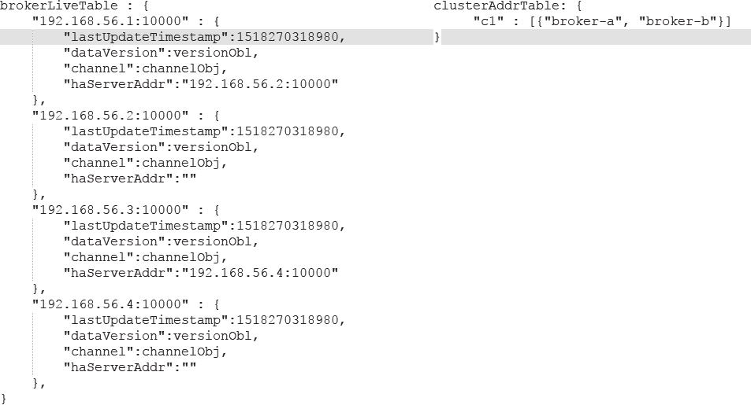

# RocketMQ
## 应用场景
### 异步解耦
#### 系统模块调用的解耦（RPC式同步->异步）
解耦：解耦上下游服务的强依赖关系。
异步：主业务执行结束后从属业务通过MQ异步执行，缩短业务的响应时间，提高用户体验。异步能提高系统的响应速度和吞吐量。

#### 改进前（下单会受到其他系统模块的影响，其间有故障下单就失败；增删其他系统需要改动订单系统的代码）


#### 改进后（其他模块故障，不会影响订单系统；订阅-分发模式,可实现一对多的数据分发；降低代码耦合性）


### 流量削峰
将瞬间猛增的请求流量缓存下来，系统慢慢处理，而不用对系统的性能进行提升，系统完全不用改变（达成经济考量目的）

改进前（系统无法承受大量流量而崩溃，接下来的请求都会失败）


改进后（系统稳定性和用户体验提升）


## 引入MQ带来的问题
● 可用性降低-->如何保证MQ高可用

● 一致性问题-->如何保证数据一致性

● 复杂性提高-->如何处理消息丢失、重复（幂等性）、顺序问题

## MQ选型
### 


#### 


##### 单机吞吐量是十万级别，
延迟是毫秒级别，
经过参数配置，消息可以做到零丢失
###### kafka
性能高，功能单一，主要用于大数据和日志分析

###### RocketMQ
性能略次于Kafka，功能全面，用于大规模吞吐、复杂业务中

##### 单机吞吐量是万级别
RabbitMQ

ActiveMQ

## 如何保证消息不丢失
### 哪些环节会造成消息丢失


### 怎么防止消息丢失
1、MQ生产者发送消息不丢失：1）事务消息 2）消息发送+回调

4、MQ消费者消费不丢失：ACK确认机制

2、MQ主从复制不丢失：1）同步复制与异步复制的选择

3、MQ消息存盘不丢失：1）同步刷盘与异步刷盘的选择

## 如何设计一个MQ
两个误区：1.放飞自我，漫无边际 2.纠结技术细节
好的方式：1.从整体到细节，从业务场景到技术实现 2.以现有产品为基础
答题思路：
1.实现1个单机的队列数据结构。高效，可扩展
2.将单机队列扩展为分布式队列。分布式集群管理
3.基于topic定制消息路由策略
4.实现高效的网络通信Netty 
5.规划日志文件，实现文件高效读写。服务重启后，快速还原运行现场。零拷贝，顺序写。
6.定制高级功能，死信队列，延迟队列，事务消息等。贴合实际，随意发挥。

## Docker搭建RocketMQ
1. 从github上面拉取项目（https://github.com/modouxiansheng/about-docker）
2. 修改broker.conf中的brokerIP1 参数，修改为本机IP
3. 进入docker-compose.yml文件所在路径，执行docker-compose up命令即可

#查看docker进程
sudo docker ps
#杀死docker进程
sudo docker kill xxx(进程号)
ls
cd about-docker-master
ls
cd RocketMQ
pwd			#/home/zlz/about-docker-master/RockertMQ
ls
cd conf
vi broker.conf #按i进入编辑模式，按Esc推出编辑模式，:wq进行保存退出
sudo systemctl start docker
sudo docker-compose up & 		#后面加&，使Linux命令在后台运行，可以继续执行其它命令

## 组件角色


心跳总结：Broker向建立长连接的所有NameSever发送心跳；Producer向建立长连接的Broker的Master发送心跳；Consumer向建立长连接的Broker的Master或Slave发送心跳。

### 4种角色
#### Producer
从NameServer集群随机选一个建立长连接，定期获取Topic路由信息，
并向提供Topic的Broker Master建立长连接，且定时向那个Master发心跳。
Producer集群间无数据的同步，无状态。

#### Consumer
 从NameServer集群随机选一个建立长连接，定期获取Topic路由信息，
并向提供Topic服务的Master、Slave建立长连接，且定时向Master、Slave发送心跳。Consumer既可以从Master订阅消息，也可以从Slave订阅消息，订阅规则由Broker配置决定。Consumer获取消息，有Push、Pull两种方式，可以是由Broker推送（此种需要知道Consumer是否正常，所以需要Consumer发送心跳），也可以是自己去Broker获取。

#### NameServer
几乎无状态，各NameServer间互不通信，Brocker向每个NameServer汇报。

##### 两大功能
       1. Broker管理，接收Broker注册信息并提供心跳机制检测Broker是否存活   

       2. 路由信息管理（路由控制中心），每个NameServer都保存完整的Broker集群的路由信息

Note：NameServer检测到Broker宕机，则从路由注册表中删除，但是NameServer不会马上通知消息生产者路由发生了变化。这样设计的目的是为了降低NameServer实现的复杂度，在消息发送端提供容错机制保证消息发送的可用性。

Note：NameServer服务器之间在某一个时刻的数据并不完全相同，但这对消息发送并不会造成任何影响，这也是NameServer设计的一个亮点，总之，RocketMQ设计NameServer追求简单高效。

#### Broker
Brocker可以有多组，每组又分主节点（1个）和从节点（0-n个）。    

多组：通过BrokerName区分。

##### 每组：BrokerName相同，BrokerId不同，主节点BrokerId为0，从节点BrokerId为非0。每一组	中，Master要向Slave复制信息（可异步复制，可同步复制）
 主节点Master：负责读和写，主要处理写操作（写操作：接收Producer信息，并保存到自己节点中）

 从节点Slave：负责读，主要处理读操作（读操作：Consumer向从节点读取信息）

Note：Master角色的Broker支持读和写，Slave角色的Broker仅支持读，也就是Producer只能和Master角色的Broker连接写入消息；Consumer可以连接 Master角色的Broker，也可以连接Slave角色的Broker来读取消息。

##### 扩展
Broker负责消息的存储、读写及高可用保证（消息有2副本或3副本，灾备、报警机制都有），含以下子模块:
       1. Remoting Module: Broker的实体，处理Client请求
       2. Client Manager: 管理Client及维护Consumer的Topic订阅信息
       3. Store Service: 提供消息存储和查询的API
       4. HA Service: 提供Broker主从之间的数据同步(同步异步都可)，通过主从保证高可用
       5. Index Service: 根据特定Message key(索引)快速查询消息


## 集群模式
### 集群模式
Broker是集群搭建的重点。NameServer、Producer、Consumer的集群搭建，只要启动多个就可以，因为互相之间无需同步，无需复制。重点就是Broker集群的搭建，根据Broker集群搭建的不同方式，分成了不同的集群模式。

#### 模式
##### 单Master模式（单M-0S）
风险较大，不建议线上环境使用

##### 多Master模式（多M-0S）
优点: 配置简单，容错且性能最高（磁盘非常可靠，异步刷盘丢失少量消息，同步刷盘一条不丢）

缺点: 宕机期间未被消费的消息不可订阅，消息实时性会受到影响

##### 多Master多Slave模式（同步刷盘，异步复制）
主从备份方式采用异步，Producer发给Master，Master存盘，就给Producer反馈消息，然后异步复制到Slave（效率高，安全性低）

优点: 性能高，且消息实时性不受影响（Master宕机，Consumer仍然可以从Slave消费）

缺点: Master宕机且磁盘损坏情况下会丢失少量消息

##### 多Master多Slave模式（同步刷盘，同步复制）
适用场景: 对消息安全性(一致性)要求高的场景

主从备份方式采用同步(只有主备都写成功才向client返回成功)，Producer发给Master，Master存盘，并同步复制到Slave，然后才给Producer反馈消息（效率低，安全性高）

优点: 高可用，Master宕机消息无延迟（服务可用性与数据可用性都非常高）

缺点: 性能比异步低大概10%，发送单个消息RT略高

###### 2M-2S 同步集群搭建
####### 集群工作流程:
1. 启动NameServer
2. 启动Broker，跟所有NameServer保持长连接，定时发心跳(心跳包=当前Broker的IP:Port + Topic信息)，注册成功后，NameServer保存Broker和Topic的映射信息
3. 创建Topic，指定该Topic要存在哪些Broker上
4. Producer发消息先长连接到某个NameServer，查当前Topic对应的Broker，轮询从queue列表中选择一个queue，然后长连接queue所在的Broker开始发消息
5. Consumer发消息先长连接到某个NameServer，查当前订阅Topic对应Broker，然后长连接Broker消费消息


### 集群管理
#### mqadmin管理工具（集群管理命令）
了解即可

使用方式：进入RocketMQ安装位置，在bin目录下执行./mqadmin {command} {args}

#### 集群监控平台（rocketmq-console）
在服务器启动rocketmq-console成功后，可通过浏览器访问http://localhost:8080进入控制台界面

## 消息发送
### 步骤
1.创建Producer，指定Producer组名
2.指定Nameserver地址
3.启动Producer
4.创建消息对象，指定Topic、Tag和消息体Body
5.发送消息

### 类型

Note：三者仅在第5步发送消息有区别
#### 同步消息
有返回值，等MQ返回才能继续

适用：重要的消息，有可靠性要求的情形

SendResult result = producer.send(msg);

#### 异步消息
设置回调函数，MQ执行完，回调消费者

适用：对响应时间敏感的业务场景


#### 单向消息
没有返回值，也没有回调函数
适用：不特别关心发送结果的场景，例如日志发送

producer.sendOneway(msg);

## 消息消费
### 步骤
1.创建Consumer，指定Consumer组名
Note：DefaultMQPushConsumer中的push是mq的broker去推送消息到消费者，而不是消费者自己去mq上拉
2.指定Nameserver地址
3.订阅Topic和Tag
4.设置回调函数，处理消息
5.启动Consumer

### 类型

Note：两者仅在setMessageModel处有区别
#### 负载均衡模式（集群模式，默认消费模式）
多个消费者共同消费队列消息，每个消费者处理的消息不同

consumer.setMessageModel(MessageModel.CLUSTERING);

#### 广播模式
每个消费者消费的消息都是相同的，消费所有消息

consumer.setMessageModel(MessageModel.BROADCASTING);

## 特定消息
### 顺序消息
消息有序：指的是按照消息的发送顺序来消费(FIFO)，分为：局部有序(分区有序)和全局有序。
全局有序处理：消除所有的并发处理，各部分都设置成单线程处理。虽然实现了，但完全牺牲了RocketMQ的高并发、高吞吐的特性了。
Note：全局有序（张三、李四总体的消息发送顺序）是没有必要的，只要保证局部有序（张三下订单的顺序）即可。 
Producer轮询放入Broker的多个队列，Consumer多线程消费，所以可能出现不按发送的顺序消费。
顺序消费的原理解析，在默认的情况下消息发送会采取Round Robin轮询方式把消息发送到不同的queue(分区队列)；而消费消息的时候从多个queue上拉取消息，这种情况发送和消费是不能保证顺序。但是如果控制发送的顺序消息只依次发送到同一个queue中，消费的时候，消费端不并发处理，则就保证了顺序。
实现：同一个订单，发送消息时都放在一个队列里。消费消息时一个队列的消息 用一个线程去处理（MessageListenerOrderly）。

#### 顺序生产消息
Producer第5步发送消息有变动，用消息队列选择器来指定同样orderID的在同一个队列中，保证了局部有序


#### 顺序消费消息
注册消息监听时，用MessageListenerOrderly替代MessageListenerConcurrently


### 事务消息
#### 


##### 


事务消息的大致方案，其中分为两个流程：正常事务消息的发送及提交、事务消息的补偿流程

#### 事务消息发送及提交
(1) 发送消息（half消息）

(2) 服务端响应消息写入结果 

(3) 根据发送结果执行本地事务（如果写入失败，此时half消息对业务不可见，本地逻辑不执行）。

(4) 根据本地事务状态执行Commit或者Rollback（Commit操作生成消息索引，消息对消费者可见）

#### 事务补偿
(1) 对没有Commit/Rollback的事务消息（pending状态的消息），从服务端发起一次“回查”
(2) Producer收到回查消息，检查回查消息对应的本地事务的状态
(3) 根据本地事务状态，重新Commit或者Rollback
其中，补偿阶段用于解决消息Commit或者Rollback发生超时或者失败的情况。

### 延时消息
延时消息会放到Broker的延迟队列中，等到时间到了，再放入普通队列

#### 延迟生产消息
//设置延时等级3，这个消息将在5s后发送
msg.setDelayTimeLevel(2);

#### 使用限制
现在RocketMq并不支持任意时间的延时，需要设置几个固定的延时等级，从1s到2h分别对应着等级1到18

private String messageDelayLevel = "1s 5s 10s 30s 1m 2m 3m 4m 5m 6m 7m 8m 9m 10m 20m 30m 1h 2h";

#### 实现逻辑
概括：临时存储+定时任务

Broker收到延时消息了，会先发送到主题（SCHEDULE_TOPIC_XXXX）的相应时间段的Message Queue中，然后通过一个定时任务轮询这些队列，到期后，把消息投递到目标Topic的队列中，然后消费者就可以正常消费这些消息。


### 批量消息
批量发送消息能显著提高传递小消息的性能。限制是这些批量消息应该有相同的topic，相同的waitStoreMsgOK，而且不能是延时消息。此外，这一批消息的总大小不应超过4MB，如果消息的总长度可能大于4MB时，这时候最好把消息进行分割。


### 过滤消息
2种方式：用Tag过滤；用sql过滤

#### 分类
##### Tag过滤消息
//订阅Topic和Tag，通过指定Tag来过滤，*代表所有Tag
consumer.subscribe("FilterTagTopic", "Tag1 || Tag2 ");

##### SQL过滤消息
###### SQL过滤生产消息
发送消息时，你能通过putUserProperty来设置消息的属性

msg.putUserProperty("i",String.valueOf(i));

###### SQL过滤消费消息
用MessageSelector.bySql来使用sql筛选消息

consumer.subscribe("zlz", MessageSelector.bySql("i>5"));

Note：需在broker.conf中加入enablePropertyFilter=true

####### 扩展


## 高级功能
### 消息存储
#### 为什么需要消息存储？
分布式队列因为有高可靠性的要求，所以数据要进行持久化存储。


#### 消息存储：顺序写
RocketMQ的消息用顺序写，保证了消息存储的速度。
磁盘如果使用得当，磁盘的速度完全可以匹配上网络的数据传输速度。目前的高性能磁盘，顺序写速度可以达到600MB/s， 超过了一般网卡的传输速度。
顺序写：600MB/s，是随机写的6000倍。
随机写：100KB/s。

#### 消息发送：零拷贝
##### RocketMQ充分利用“零拷贝”技术，提高消息存盘和网络发送的速度。
Linux操作系统分为【用户态】和【内核态】，文件操作、网络操作需要涉及这两种形态的切换，免不了进行数据复制。
一台服务器把本机磁盘文件的内容发送到客户端，进行了4 次数据复制，分别是：
1.从磁盘复制数据到内核态内存；
2.从内核态内存复制到用户态内存；
3.然后从用户态内存复制到网络驱动的内核态内存；
4.最后是从网络驱动的内核态内存复制到网卡中进行传输。


通过使用mmap的方式，可以省去向用户态的内存复制，提高速度。这种机制在Java中是通过MappedByteBuffer实现的。

采用MappedByteBuffer这种内存映射的方式有几个限制，其中之一是一次只能映射1.5~2G 的文件至用户态的虚拟内存，这也是为何RocketMQ默认设置单个CommitLog日志数据文件为1G的原因了。

#### 消息存储结构
##### 


RocketMQ消息的存储是由ConsumeQueue和CommitLog配合完成的，消息真正的物理存储文件是CommitLog，ConsumeQueue是消息的逻辑队列，类似数据库的索引文件，存储的是指向物理存储的地址。每 个Topic下的每个Message Queue都有一个对应的ConsumeQueue文件。
CommitLog：存储消息的元数据
ConsumerQueue：存储消息在CommitLog的索引，存储了CommitLog的偏移量
IndexFile：提供了其他的查找消息的方式，通过key或时间区间来查询

#### 刷盘机制（安全性和性能的trade off）
同步刷盘：可靠
异步刷盘：高效


配置：通过Broker配置文件里的flushDiskType参数设置的（SYNC_FLUSH、ASYNC_FLUSH）

### 高可用性机制
#### 消息发送高可用（多个Broker组存同样消息）
一个Topic对应多个Broker组，这样当一个Broker组的Master不可用后，其他组的Master仍然可用，Producer仍然可以发送消息。 
RocketMQ目前还不支持把Slave自动转成Master，如果机器资源不足， 需要把Slave转成Master，则要手动停止Slave角色的Broker，更改配置文件，用新的配置文件启动Broker。


#### 消息消费高可用（自动切换Consumer主从读）
在Consumer的配置文件中，并不需要设置是从Master读还是从Slave读，当Master不可用或者繁忙的时候，Consumer会被自动切换到从Slave 读。有了自动切换Consumer这种机制，当一个Master角色的机器出现故障后，Consumer仍然可以从Slave读取消息，不影响Consumer程序。这就达到了消费端的高可用性。

#### 消息主从复制
如果一个Broker组有Master和Slave，消息需要从Master复制到Slave 上，有同步和异步两种复制方式。
同步复制：等Master和Slave均写 成功后才反馈给客户端写成功状态（安全）
异步复制：只要Master写成功即可反馈给客户端写成功状态（高效，较低的延迟和较高的吞吐量）
配置：通过Broker配置文件里的brokerRole参数对Master进行设置（ASYNC_MASTER、 SYNC_MASTER）来区分同步和异步复制，Slave均设为SLAVE。

#### 刷盘与主从复制的选择
刷盘：异步刷盘
主从复制：同步复制
实际应用中要结合业务场景，合理设置刷盘方式和主从复制方式， 尤其是SYNC_FLUSH方式，由于频繁地触发磁盘写动作，会明显降低性能。通常情况下，应该把Master和Slave的刷盘配置成ASYNC_FLUSH的刷盘方式以提高性能，主从复制配置成SYNC_MASTER的复制方式，这样即使有一台机器出故障，仍然能保证数据不丢，是个不错的选择。

### 负载均衡
#### Producer负载均衡
默认会轮询所有message queue发送（所有message queue：topic订阅的一个或多个Broker）


#### Consumer负载均衡
只有在集群模式下会涉及负载均衡，广播模式下每个消费者都消费所有消息，不会涉及负载均衡。

默认的分配算法是AllocateMessageQueueAveragely


还有另外一种平均的算法是AllocateMessageQueueAveragelyByCircle，也是平均分摊每一条queue，只是以环状轮流分queue的形式


集群模式下，一个queue只分给一个consumer实例，一个consumer实例可以允许同时分到不同的queue。
通过增加consumer实例去分摊queue的消费，可以起到水平扩展的消费能力的作用。
每当实例的数量有变更，都会触发一次所有实例的负载均衡，这时候会按照queue的数量和实例的数量平均分配queue给每个实例。
但是如果consumer实例的数量比message queue的总数量还多的话，多出来的consumer实例将无法分到queue，也就无法消费到消息，也就无法起到分摊负载的作用了。所以需要控制让queue的总数量大于等于consumer的数量。

### 消息重试
导致因素：网络抖动、消费者代码异常、数据异常

#### 顺序消息的重试
对于顺序消息，当消费者消费消息失败后，消息队列 RocketMQ 会自动不断进行消息重试（每次间隔时间为 1 秒），这时，应用会出现消息消费被阻塞的情况。因此，在使用顺序消息时，务必保证应用能够及时监控并处理消费失败的情况，避免阻塞现象的发生。

#### 无序消息的重试
对于无序消息（普通、定时、延时、事务消息），当消费者消费消息失败时，您可以通过设置返回状态达到消息重试的结果。

无序消息的重试只针对集群消费方式生效；广播方式不提供失败重试特性，即消费失败后，失败消息不再重试，继续消费新的消息。

##### 重试次数(默认16次)
消息队列 RocketMQ 默认允许每条消息最多重试 16 次，每次重试的间隔时间如图


如果消息重试 16 次后仍然失败，消息将不再投递。如果严格按照上述重试时间间隔计算，某条消息在一直消费失败的前提下，将会在接下来的 4 小时 46 分钟之内进行 16 次重试，超过这个时间范围消息将不再重试投递。
注意： 一条消息无论重试多少次，这些重试消息的 Message ID 不会改变。

##### 配置方式
###### 消费失败后，重试配置方式
集群消费方式下，消息消费失败后期望消息重试，需要在消息监听器接口的实现中明确进行配置（三种方式任选一种）：
● 返回 Action.ReconsumeLater （推荐）
● 返回 Null
● 抛出异常


###### 消费失败后，不重试配置方式
集群消费方式下，消息失败后期望消息不重试，需要捕获消费逻辑中可能抛出的异常，最终返回 Action.CommitMessage，此后这条消息将不会再重试。


###### 自定义消息最大重试次数
消息队列 RocketMQ 允许 Consumer 启动的时候设置最大重试次数，重试时间间隔将按照如下策略：
● 最大重试次数小于等于 16 次，则重试时间间隔同上表描述。
● 最大重试次数大于 16 次，超过 16 次的重试时间间隔均为每次 2 小时。


注意：
● 消息最大重试次数的设置对相同 Group ID 下的所有 Consumer 实例有效。
● 如果只对相同 Group ID 下两个 Consumer 实例中的其中一个设置了 MaxReconsumeTimes，那么该配置对两个 Consumer 实例均生效。
● 配置采用覆盖的方式生效，即最后启动的 Consumer 实例会覆盖之前的启动实例的配置

###### 获取消息重试次数
消费者收到消息后，可按照如下方式获取消息已经重试的次数


### 死信队列
#### 死信消息与死信队列
消息重试达到最大重试次数依旧失败，RocketMQ 不会立刻将消息丢弃，而是将其发送到该消费者对应的特殊队列中。
在消息队列 RocketMQ 中，这种正常情况下无法被消费的消息称为死信消息（Dead-Letter Message），存储死信消息的特殊队列称为死信队列（Dead-Letter Queue）。

#### 死信特性
死信消息具有以下特性：
● 不会再被消费者正常消费。
● 有效期与正常消息相同，均为 3 天，3 天后会被自动删除。因此，请在死信消息产生后的 3 天内及时处理。
死信队列具有以下特性：
● 一个死信队列对应一个 Group ID， 而不是对应单个消费者实例。
● 如果一个 Group ID 未产生死信消息，消息队列 RocketMQ 不会为其创建相应的死信队列。
● 一个死信队列包含了对应 Group ID 产生的所有死信消息，不论该消息属于哪个 Topic。

#### 控制台操作
1.在控制台查询出现死信队列的主题信息
2.在消息界面根据主题查询死信消息
3.选择重新发送消息

### 消费幂等
#### 消息重复的情形（消费幂等的必要性）
##### Producer因网络闪断或宕机没接到MQ消息发送成功的回应
发送时消息重复当一条消息已被成功发送到服务端并完成持久化，此时出现了网络闪断或者客户端宕机，导致服务端对客户端应答失败。 如果此时生产者意识到消息发送失败并尝试再次发送消息，消费者后续会收到两条内容相同并且 Message ID 也相同的消息。

##### MQ因网络闪断没有接到Consumer消息消费成功的回应
投递时消息重复消息消费的场景下，消息已投递到消费者并完成业务处理，当客户端给服务端反馈应答的时候网络闪断。 为了保证消息至少被消费一次，消息队列 RocketMQ 的服务端将在网络恢复后再次尝试投递之前已被处理过的消息，消费者后续会收到两条内容相同并且 Message ID 也相同的消息。

##### 负载均衡时消息重复（包括但不限于网络抖动、Broker 重启以及订阅方应用重启）
当消息队列 RocketMQ 的 Broker 或客户端重启、扩容或缩容时，会触发 Rebalance，此时消费者可能会收到重复消息。

#### 处理方式
##### 因为 Message ID 有可能出现冲突（重复）的情况，所以真正安全的幂等处理，不建议以 Message ID 作为处理依据。 最好的方式是以业务唯一标识作为幂等处理的关键依据，而业务的唯一标识可以通过消息 Key 进行设置


##### 订阅方收到消息时可以根据消息的 Key 进行幂等处理


### 处理消息积压
发生了消息积压，这时候就得想办法赶紧把积压的消息消费完，就得考虑提高消费能力，一般有两种办法


#### 处理方式
##### 消费者扩容
如果当前Topic的Message Queue的数量大于消费者数量，就可以对消费者进行扩容，增加消费者，来提高消费能力，尽快把积压的消息消费玩。

##### 消息迁移Queue扩容
如果当前Topic的Message Queue的数量小于或者等于消费者数量，这种情况，再扩容消费者就没什么用，就得考虑扩容Message Queue。可以新建一个临时的Topic，临时的Topic多设置一些Message Queue，然后先用一些消费者把消费的数据丢到临时的Topic，因为不用业务处理，只是转发一下消息，还是很快的。接下来用扩容的消费者去消费新的Topic里的数据，消费完了之后，恢复原状。


## 源码
### NameServer源码
#### 启动流程
启动类：NamesrvStartup
核心类：NamesrvController（用于接收请求做出响应）


##### 步骤
###### Step1：创建NamesrvController
解析配置文件，填充NameServerConfig、NettyServerConfig属性值，并创建NamesrvController

####### 代码：NamesrvController#createNamesrvController
//创建NamesrvConfig
final NamesrvConfig namesrvConfig = new NamesrvConfig();
//创建NettyServerConfig
final NettyServerConfig nettyServerConfig = new NettyServerConfig();
//设置启动端口号
nettyServerConfig.setListenPort(9876);
//解析启动-c参数
if (commandLine.hasOption('c')) {
    String file = commandLine.getOptionValue('c');
    if (file != null) {
        InputStream in = new BufferedInputStream(new FileInputStream(file));
        properties = new Properties();
        properties.load(in);
        MixAll.properties2Object(properties, namesrvConfig);
        MixAll.properties2Object(properties, nettyServerConfig);

        namesrvConfig.setConfigStorePath(file);

        System.out.printf("load config properties file OK, %s%n", file);
        in.close();
    }
}
//解析启动-p参数
if (commandLine.hasOption('p')) {
    InternalLogger console = InternalLoggerFactory.getLogger(LoggerName.NAMESRV_CONSOLE_NAME);
    MixAll.printObjectProperties(console, namesrvConfig);
    MixAll.printObjectProperties(console, nettyServerConfig);
    System.exit(0);
}
//将启动参数填充到namesrvConfig,nettyServerConfig
MixAll.properties2Object(ServerUtil.commandLine2Properties(commandLine), namesrvConfig);

//创建NameServerController
final NamesrvController controller = new NamesrvController(namesrvConfig, nettyServerConfig);


###### Step2：初始化NamesrvController
根据启动属性创建NamesrvController实例，并初始化该实例。NameServerController实例为NameServer核心控制器

Step3：释放资源，启动NamesrvController

#### 路由管理


##### 步骤
###### 路由元信息(主要是4个KV表)
####### 代码：RouteInfoManager
```
private final HashMap<String/* topic */, List<QueueData>> topicQueueTable;
private final HashMap<String/* brokerName */, BrokerData> brokerAddrTable;
private final HashMap<String/* clusterName */, Set<String/* brokerName */>> clusterAddrTable;
private final HashMap<String/* brokerAddr */, BrokerLiveInfo> brokerLiveTable;
private final HashMap<String/* brokerAddr */, List<String>/* Filter Server */> filterServerTable;
```




###### 处理心跳包
NameServer收到Broker心跳包后，更新BrokerLiveTable中的信息，特别记录心跳时间lastUpdateTime


###### 路由删除


###### 路由发现
RocketMQ路由发现是非实时的，当Topic路由出现变化后，NameServer不会主动推送给客户端，而是由客户端定时拉取主题最新的路由。

### Broker源码
#### 路由注册
RocketMQ路由注册是通过Broker与NameServer的心跳功能实现的。Broker启动时向集群中所有的NameServer发送心跳信息，每隔30s向集群中所有NameServer发送心跳包，心跳包包含BrokerId，Broker地址，Broker名称，Broker所属集群名称、Broker关联的FilterServer列表。


Step1：创建BrokerController
解析配置文件，填充BrokerConfig、NettyServerConfig、NettyClientConfig属性值，并创建BrokerController
Step2：初始化BrokerController
Step3：释放资源，启动BrokerController，注册路由信息

### 官方仓库
 https://github.com/apache/rocketmq

### 项目目录结构
● broker: broker 模块（broke 启动进程） 
● client ：消息客户端，包含消息生产者、消息消费者相关类 
● common ：公共包  
● distribution ：部署实例文件夹（非源代码） 
● example: RocketMQ 例代码 
● filter ：消息过滤相关基础类
● filtersrv：消息过滤服务器实现相关类（Filter启动进程）
● logappender：日志实现相关类
● namesrv：NameServer实现相关类（NameServer启动进程）
● openmessageing：消息开放标准
● remoting：远程通信模块，给予Netty
● srvutil：服务工具类
● store：消息存储实现相关类
● style：checkstyle相关实现
● test：测试相关类
● tools：工具类，监控命令相关实现类

### 调试
#### 创建conf配置文件夹
从distribution拷贝broker.conf和logback_broker.xml和logback_namesrv.xml


##### 在broker.conf配置文件添加如下内容
# namesrvAddr地址
namesrvAddr=127.0.0.1:9876
# 预先不指定MQ的topic也不会报错
autoCreateTopicEnable=true
    
# 存储路径
storePathRootDir=E:\\RocketMQ\\data\\rocketmq\\dataDir
# commitLog路径
storePathCommitLog=E:\\RocketMQ\\data\\rocketmq\\dataDir\\commitlog
# 消息队列存储路径
storePathConsumeQueue=E:\\RocketMQ\\data\\rocketmq\\dataDir\\consumequeue
# 消息索引存储路径
storePathIndex=E:\\RocketMQ\\data\\rocketmq\\dataDir\\index
# checkpoint文件路径
storeCheckpoint=E:\\RocketMQ\\data\\rocketmq\\dataDir\\checkpoint
# abort文件存储路径
abortFile=E:\\RocketMQ\\data\\rocketmq\\dataDir\\abort

#### 启动NameServer
##### 展开namesrv模块，直接运行NamesrvStartup.java会报错，需要配置ROCKETMQ_HOME


● 重新启动控制台打印结果
The Name Server boot success. serializeType=JSON


#### 启动Broker
##### 启动BrokerStartup.java，配置broker.conf和ROCKETMQ_HOME


#### 发送消息
进入example模块的org.apache.rocketmq.example.quickstart

##### 代码指定Namesrv地址
producer.setNamesrvAddr("127.0.0.1:9876");

运行main方法，发送消息

#### 消费消息
进入example模块的org.apache.rocketmq.example.quickstart

##### 代码指定Namesrv地址
consumer.setNamesrvAddr("127.0.0.1:9876");

运行main方法，消费消息

