# MySQL
## 架构图

## 存储引擎
### 存储引擎概述
作用：负责对表中数据进行读取和写入

MySQL 存储引擎采⽤的是插件式架构，⽀持多种存储引擎

存储引擎是基于表的，⽽不是数据库。我们甚⾄可以为不同的表设置不同的存储引擎以适应不同场景的需要

### 常用存储引擎
#### MyISAM
Mysql5.5版本之前的默认存储引擎

只支持表级锁（不支持行级锁和事务）

适用：以读为主的应用场景

##### 非聚簇索引
数据文件和索引文件分开存放。
数据文件按插入顺序放，不进行排序，以.MYD为后缀。
索引文件以.MYI为后缀，底层数据结构也是B+树，但都是非聚簇索引，主键索引和辅助索引在结构上没有任何区别。
（B+树同样非叶子节点只存索引值，叶子节点存索引值+实际数据的地址值（使用索引指向了实际数据），叶子节点用双向链表连接）

数据文件和索引文件分开存放

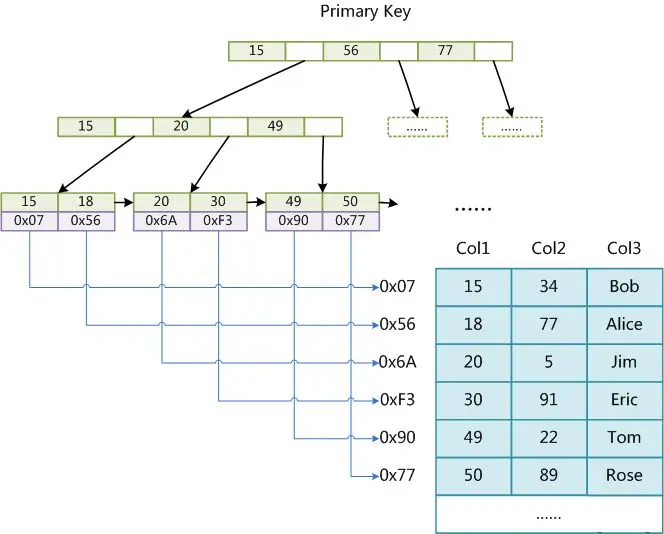

#### InnoDB
Mysql5.5版本之后的默认存储引擎

##### 支持行级锁（并发度高），事务，外键，
XA事务，savePoints
支持ACID属性（原子性、一致性、隔离性和持久性）。它使用多版本并发控制（MVCC）来实现事务的隔离性，可以提供更高的并发性能。

适用：读写混合的应用场景，特别是对于事务和并发性能要求高的场景

##### 聚簇索引
###### InnoDB
数据文件就是主键索引，是聚簇索引

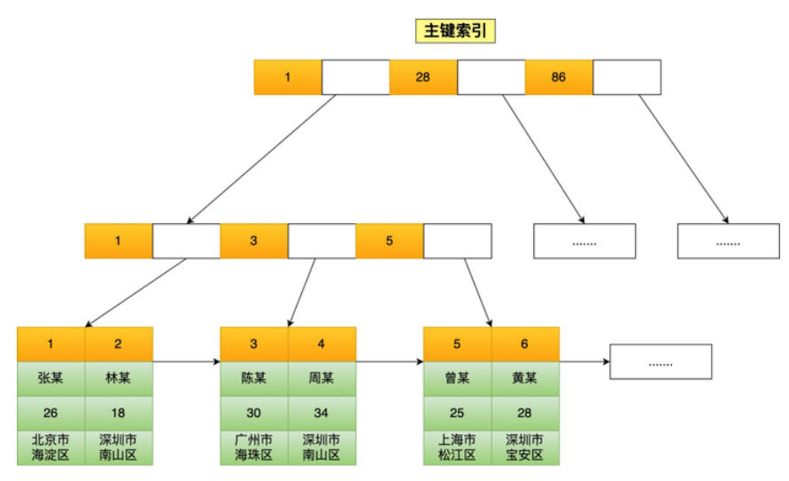

其他索引是非聚簇索引

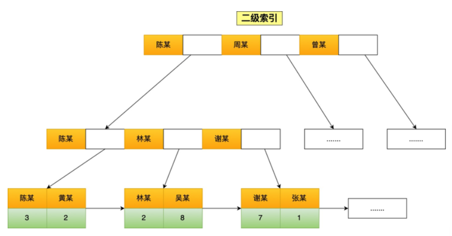

表数据文件本身就是按B+树组织的一个索引结构（按主键排序存放），这棵树的叶节点保存了完整的数据记录。

### 索引结构的演变
Hash->二叉排序树->AVL树->红黑树->B树->B+树

#### B树与B+树比较
共同点：多叉树，矮胖，聚簇索引，适合范围查询和模糊查询，支持多列联合索引。

##### 不同点
###### B树
每个节点key和value放一起，没有冗余（任何一个关键字只出现在一个节点中）

每页关键字少，层数高，IO次数多。检索效率波动比较大。

###### B+树
非叶子节点存key，叶子节点存key+data，叶子节点用指针连通。有两个头指针，一个指向根节点，一个指向关键字最小的叶节点。 有冗余（同一个数字会在不同节点中重复出现）

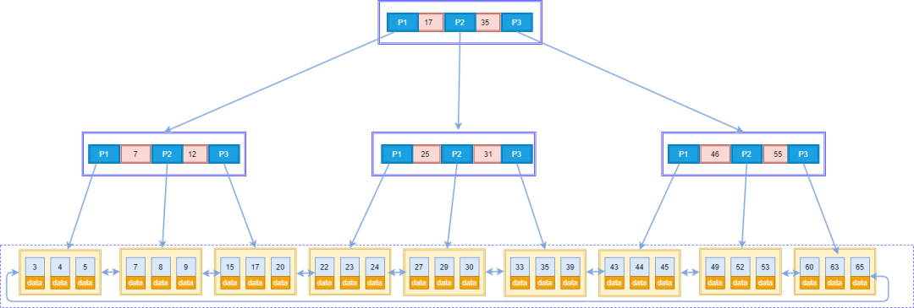

每页可放更多的关键字，空间利用率高，层数低，可减少IO次数。检索效率更稳定。

#### Hash索引与B+树比较
B+树：支持范围查询，模糊查询，多列联合索引

hash索引：只支持等值查询（Hash索引在等值查询上比B+树效率高）

### B+树细节
#### 页结构与局部性原理
##### 背景
数据达到上亿级别，MySQL读写会很慢，是因为b+树的行变高，搜索的IO操作更频繁。

在InnoDB中，数据会存储到磁盘上，在真正处理数据时需要先将数据加载到内存，表中读取某些记录时，InnoDB存储引擎不需要一条条从磁盘读到内存，而是将数据划分成若干页，以页作为磁盘和内存之间交互的基本单位。

b+树，每个节点是页

##### 局部性原理
按页加载（认为相邻数据马上也会用到，多取出相邻数据放入内存）

##### 页
###### 页结构
####### File Header（文件头部）
页的一些通用信息，包括上一页指针和下一页指针

####### Page Header（页面头部）
数据页专有的一些信息

####### Infimum+Supremum Records
（当前页最小记录和最大记录）
可以快速查数据在不在当前页，而无需遍历所有数据

####### Page Directory（页面目录）
当前页数据的索引，每隔6条数据就会有一个 Slot，可进行二分查找

####### User Records（用户记录）
实际存储的行记录内容

Free Space（空闲空间）

####### File Trailer（文件尾部）
校验页是否完整

页的大小：一般为16KB（16384字节）

###### 页与页之间是通过一个双向链表连接起来。
而存储在页中的一行一行的数据则是通过单链表连接起来的。
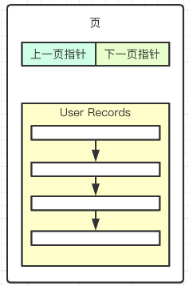

####### 
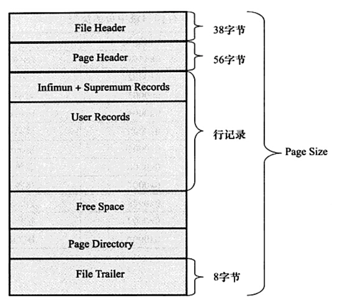

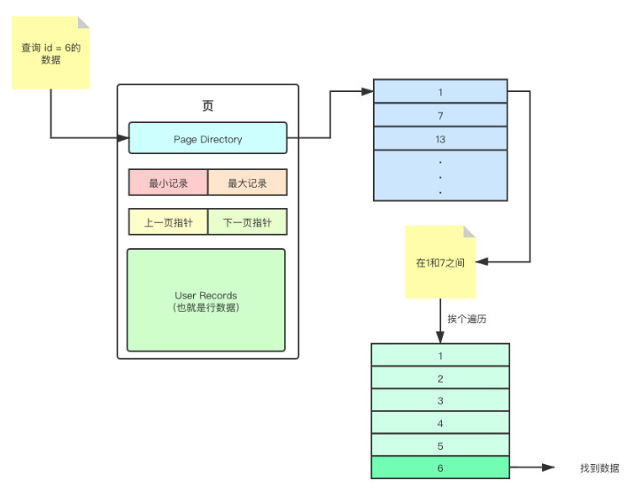

#### 行格式与行溢出

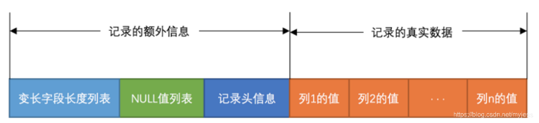

##### 细节
###### 变长字段长度列表
逆序记录每一个列的长度，如果列的长度小于 255 字节，则使用一个字节，否则使用 2 个字节。该字段的实际长度取决于列数和每一列的长度，因此是变长的。

###### NULL 标志位
一个字节，表示该行是否有 NULL 值

###### 记录头信息
五个字节，其中 next_record 记录了下一条记录的相对位置，一个页中的所有记录使用这个字段形成了一条单链表。

###### 隐藏列
详见MVCC实现原理

真实数据列

##### 行溢出
一页存放不下一行，分成多页存，需跨页查找

Note：行的大小：除BLOBS外，其他不能超过65535字节。

##### 4种行格式
不同行格式类似，只在处理行溢出数据时有区别

一行记录可以以不同格式存在InnoDB中，行格式分别为Compact、Redundant、Dynamic和Compress

默认是Dynamic行格式

###### Compact和Redundant对行溢出的处理
本页存部分数据和下页地址

###### Dynamic和Compress对行溢出的处理
本页仅存下页地址（对索引有利，存放更多行，更少的页）

## 索引
### 分类
#### 聚簇索引和非聚簇索引
聚簇索引：数据和索引在一块
非聚簇索引：数据和索引不在一块

聚簇索引的数据物理存放顺序和索引顺序是一致的，所以一个表只能有一个聚簇索引，而非聚簇索引可以有多个

InnoDB中选择聚簇索引的列优先级：主键（有主键）> unique列（无主键，有unique列）> row_id隐藏列（无主键，无unique列，创建row_id隐藏列）

#### 单列索引和多列联合索引
单列索引：主键索引、唯一索引、普通索引

多列联合索引：最左匹配原则

##### 从上图可看出，name 是有序的，age 是无序的。当 name 相等的时候， age 才是有序的
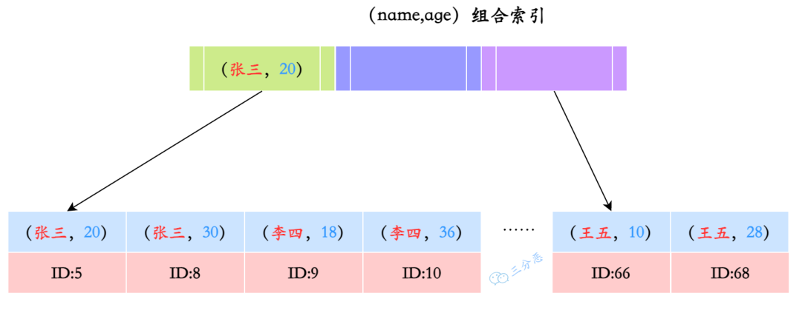

使用 where name= ‘张三‘ and age = ‘20 ‘去查询数据的时候， B+Tree 会优先比较 name 来确定下一步应该搜索的方向，往左还是往右。如果 name 相同的时候再比较 age。但是如果查询条件没有 name，就不知道下一步应该查哪个 节点，因为建立搜索树的时候 name 是第一个比较因子，所以就没用上索引

#### 主键索引和辅助索引
主键索引：主键作为索引，是聚簇索引

辅助索引/二级索引：除了主键索引的其他索引，是非聚簇索引。存的是主键，先找到主键，再去主键索引里找完整数据，这个过程叫做回表。

回表：辅助索引多扫描了一棵索引树

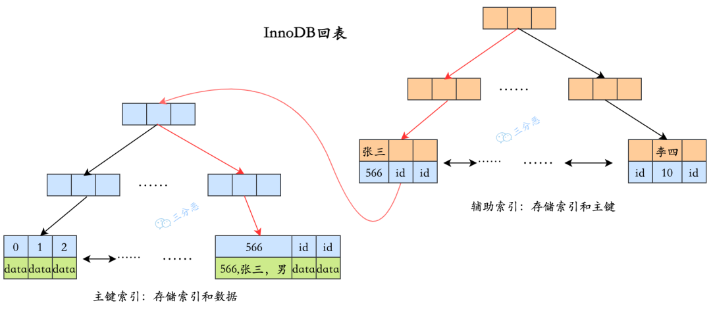

 覆盖索引：在辅助索引里就能获取到需要的数据，避免了回表

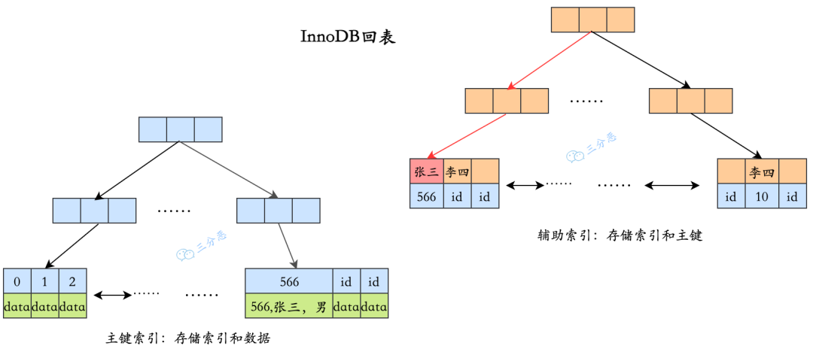

### 索引设计原则
#### 适合建索引的列
##### 查询频繁的列
在用于 where 判断、 order 排序和 join 的(on)字段上创建索引，有外键的列

##### 有区分度的列
unique列

#### 不适合建索引的列
查询很少涉及的列

区分度太低的列，如性别

##### 更新频繁的列
维护索引文件需要成本

定义为text、image和bit数据类型的列

#### 主键索引用int的auto_increment，而不要用UUID
原因1：不建议用无序的值(例如身份证、UUID )作为索引，当主键具有不确定性，会造成叶子节点频繁分裂，出现磁盘存储的碎片化
原因2：不建议用过长的值，主键索引比较大会导致辅助索引比较大，因为辅助索引存储主键值会占用更多的物理空间，会使B+树更高，查询变慢

#### 使用短索引，过长的字段，使用前缀索引
当字段值比较长的时候，建立索引会消耗很多的空间，搜索起来也会很慢。我们可以通过截取字段的前面一部分内容建立索引，这个就叫前缀索引

#### 不要过度索引
索引需要额外空间

维护索引，会降低写操作性能

#### 尽量扩展索引，不要新建新索引
尽量修改原索引为联合索引，而不要每列各自建索引

建立组合索引时要考虑最左匹配原则

#### 利用覆盖索引，避免回表查

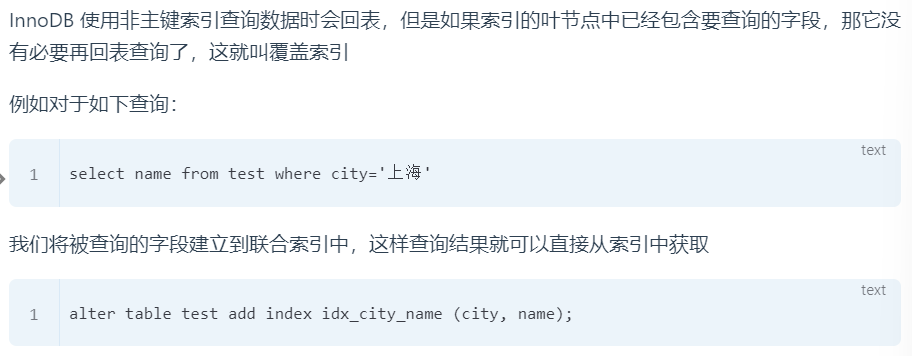

### explain分析
目的：使用explain命令分析SELECT语句的执行计划，进而做进一步性能优化

Note：explain 只能解析 Select 查询，对于 update，insert 等都不支持，我们可以使用 select 来模拟 update 操作，近似获取 update 的执行过程

#### 重要字段
##### type
查询的类型

提供了判断查询是否高效的重要依据，可以判断出此次查询是全表扫描还是索引扫描

性能从最优到最差分别为：system > const > eq_ref > ref > fulltext > ref_or_null > index_merge > unique_subquery > index_subquery > range > index > ALL

###### 细节
####### system
该表只有一行（相当于系统表），system是const类型的特例

####### const
主键或唯一索引的等值查询扫描，只返回一行数据

####### eq_ref
命中主键primary key 或者 unique key索引

####### ref
命中非唯一索引

####### ref_or_null
类似于 ref，区别在于 MySQL会额外搜索包含NULL值的行

####### index_merge
使用了索引合并优化方法，查询使用了两个以上的索引

####### unique_subquery
使用了IN子查询，且子查询是主键索引或唯一索引

####### index_subquery
类似于unique_subquery，区别在于子查询不是主键索引或唯一索引

####### range
范围扫描

####### index
全索引扫描。index通常比ALL快，因为索引的大小通常小于表·数据

####### ALL
全表扫描，性能最差

##### key
确切使用到的索引

##### key_len
使用了索引的字节数

这个字段可以评估组合索引是否完全被使用, 或只有最左部分字段被使用到

##### rows
估算的扫描的行数

这个字段非常直观显示 SQL 的效率好坏, 原则上 rows 越少越好

##### extra
额外信息（虽然叫额外信息，但也有一些重要的信息）
- Using index：表示 MySQL 将使用覆盖索引，以避免回表
- Using where：表示会在存储引擎检索之后再进行过滤
- Using temporary ：表示对查询结果排序时会使用一个临时表

### 索引失效的情况
#### 对索引列使用左或左右模糊匹配
like %xx 或者 like %xx%
因为索引只能根据前缀进行比较

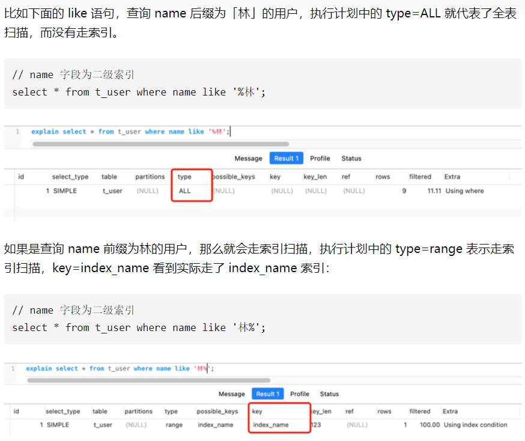

#### 对索引列使用函数
因为索引保存的是索引字段的原始值，而不是经过函数计算后的值，自然就没办法走索引了。

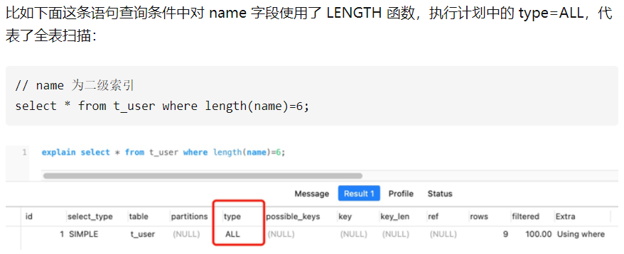

从 MySQL 8.0 开始，索引特性增加了函数索引，即可以针对函数计算后的值建立一个索引，也就是说该索引的值是函数计算后的值

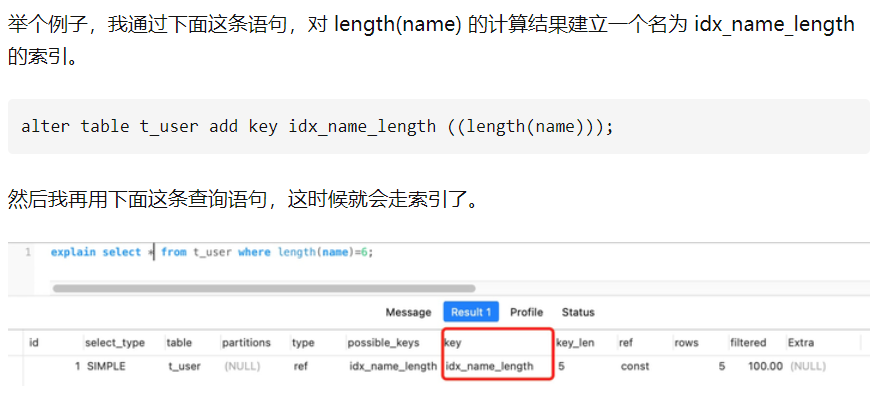

#### 对索引列进行表达式计算

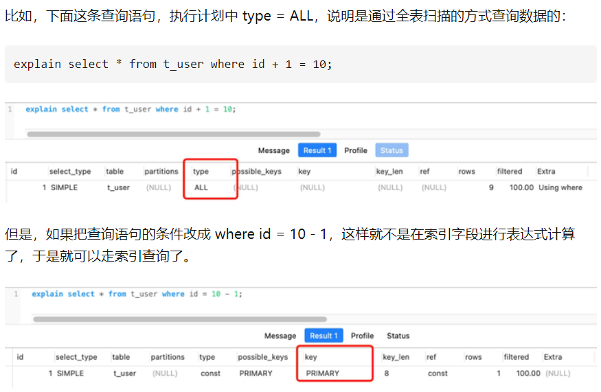

#### 对索引列隐式类型转换

索引列是字符串，而条件语句中输入参数是数字
MySQL隐式转换规则：在遇到字符串和数字比较的时候，会自动把字符串转为数字，然后再进行比较

Note：为什么不是把数字转为字符串？
根据mysql官网上解释，数字1对应的字符串有’1’、' 1 '、'1a’多种，不知道该转成哪种。而字符串转成数字只有一种，所以没有歧义。

索引列会发生隐式类型转换，由于隐式类型转换是通过 CAST 函数实现的，等同于对索引列使用了函数
这条语句相当于：
select * from t_user where CAST(phone AS signed int) = 1300000001;

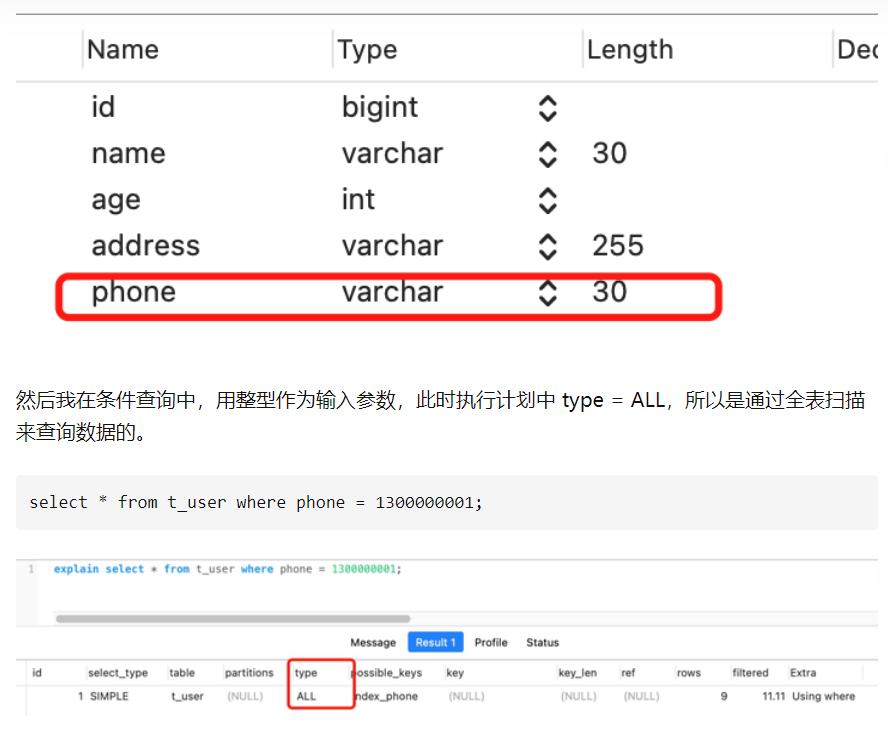

Note：索引列是数字，而条件语句中输入参数是字符串，因为不会对索引列进行隐式类型转换，CAST 函数是用在了输入参数，所以不会导致索引失效
这条语句相当于：
select * from t_user where id = CAST("1" AS signed int);

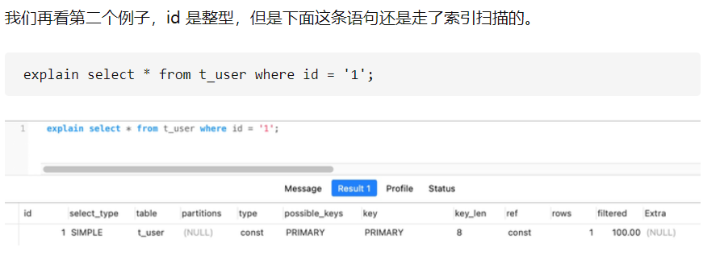

#### 联合索引非最左匹配
创建联合索引时，我们需要注意创建时的顺序问题，因为联合索引 (a, b, c) 和 (c, b, a) 在使用的时候会存在差别。

联合索引要能正确使用需要遵循最左匹配原则，也就是按照最左优先的方式进行索引的匹配。因为在联合索引的情况下，数据是按照索引第一列排序，第一列数据相同时才会按照第二列排序。

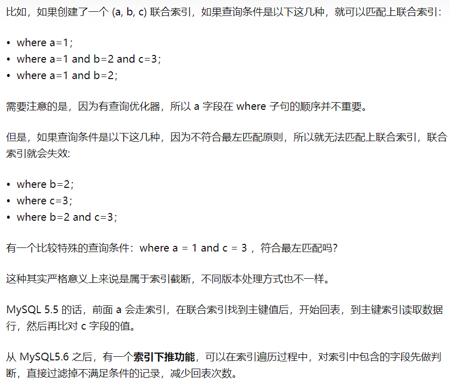

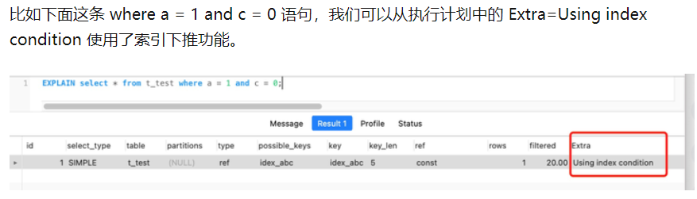

#### WHERE 子句中的 OR

所有使用OR的列都要有索引才生效
使用OR的任意列没有索引则都失效
id列和height列是索引列，address是非索引列，所有索引全部失效

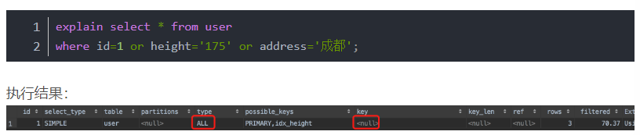

##### 低版本避免使用OR
在 MySQL 5.0 之前的版本要尽量避免使用 or 查询，可以使用 union 或者子查询来替代，因为早期的 MySQL 版本使用 or 查询可能会导致索引失效，高版本引入了索引合并，解决了这个问题

#### 使用不等于操作符（ ！=  或  <>）
SQL 中，不等于操作符会导致查询引擎放弃查询索引，引起全表扫描，即使比较的字段上有索引

解决方法：通过把不等于操作符改成 or，可以使用索引，避免全表扫描

例如，把column<>’aaa’，改成column>’aaa’ or column<’aaa’，就可以使用索引了

### 索引下推优化
索引条件下推优化（Index Condition Pushdown (ICP) ）是 MySQL5.6 添加的，用于优化数据查询。
MySQL Server 将筛选的行为下推给存储引擎

#### 优化前：先回表，后筛选
优化后：先筛选，后回表，减少了回表的次数

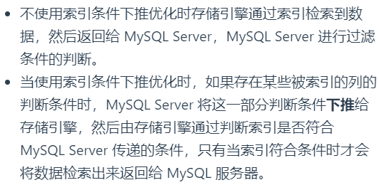

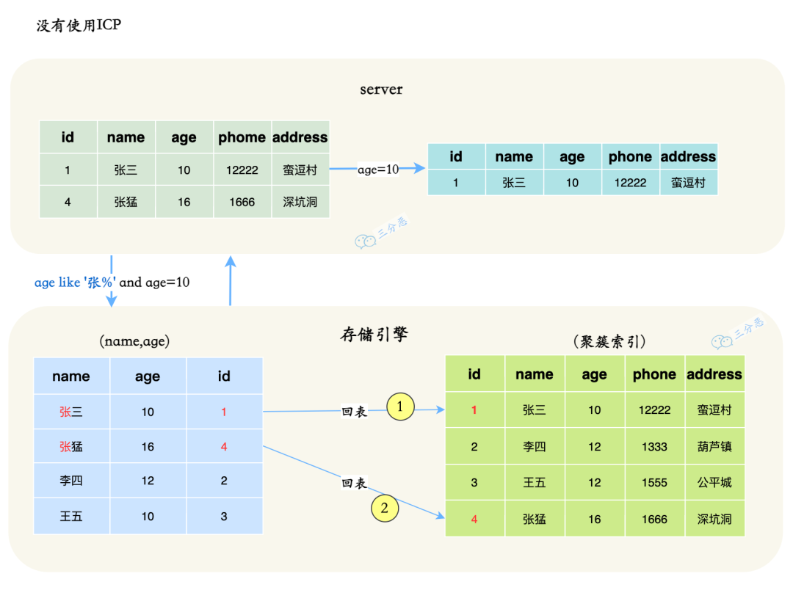

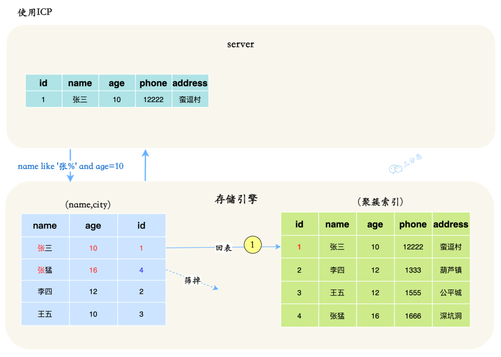

## 锁
### 锁的分类
#### 按属性分（读写锁）
读锁/共享锁/S锁/Share Lock

写锁/排他锁/X锁/Exclusive Lock

#### 按状态分（意向锁）
目的：快速判断表中的记录没有⾏锁；快速判断是否可以对某个表使用表锁

Note：之前想加表锁，需对每行检查一次是否有用到行锁，非常耗时，引入意向锁之后，只需检查意向锁

意向锁是InnoDB自动加的，不需用户干预

意向锁是表锁

##### 分类
###### 意向共享锁/IS锁/Intention Shared Lock
加S锁前必须获得IS锁

###### 意向排他锁/IX锁/Intention Exclusive Lock
加X锁前必须获得IX锁

#### 按粒度分
##### 行锁/行级锁（1行或多行）
InnoDB默认是行级锁，仅对相关的记录上锁（对一行或多行记录加锁）

优：锁粒度小，并发度高
缺：加锁开销大，加锁慢，会出现死锁

InnoDB执行UPDATE 、 DELETE 语句时，如果用上了索引，就会进行索引扫描，仅对相关记录上锁

###### 细分
####### 记录锁  Record Lock（1行）
执⾏ delete 和 update 操作的时候，可以直接对记录加锁，保证事务安全

进行等值查询且精准匹配到一条记录

####### 间隙锁  Gap Lock（左开右开）
锁定一个范围，不包括记录本身

####### 临键锁  Next-Key Lock（左开右闭）
临键锁=记录锁+间隙锁

锁定一个范围，包括记录本身

insert 操作的时候需要依赖临键锁，避免其他事务插入新纪录，来保证不出现幻读

页级锁

##### 表锁/表级锁
锁整张表

优：加锁开销小，加锁快，不会出现死锁
缺：锁粒度大，并发度低

InnoDB执行UPDATE 、 DELETE 语句时，如果没有用上索引，就会进行全表扫描，对整张表上锁

#### 按认为是否安全
##### 悲观锁
数据库中的行锁，表锁，读锁，写锁均为悲观锁

##### 乐观锁
乐观锁通常是由开发者实现的，在表中增加一个版本version或时间戳timestamp的字段来实现，其中，加版本version最为常用

### 锁的关系
不论是表级锁还是行级锁，都存在共享锁和排他锁

排他锁与任何的锁都不兼容，共享锁仅和共享锁兼容
换句话说，加了读锁，其他事务可以读，但不能写；加了写锁，其他事务不能读也不能写

意向锁之间是互相兼容的

意向锁与表级别的共享锁和排他锁是互斥的

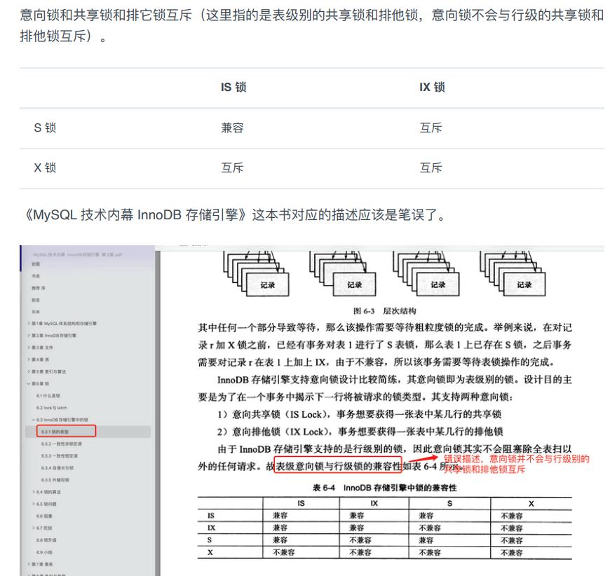

### 权衡
锁开销 vs 并发程度

### Mysql排查死锁问题

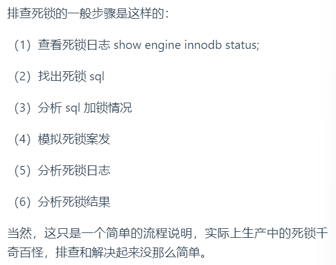

## 事务
事务是逻辑上的一组操作，要么都执行，要么都不执行

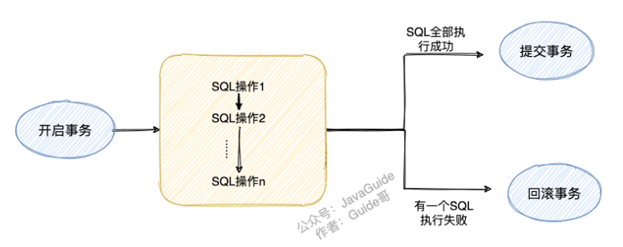

### 事务的基本特性 ACID

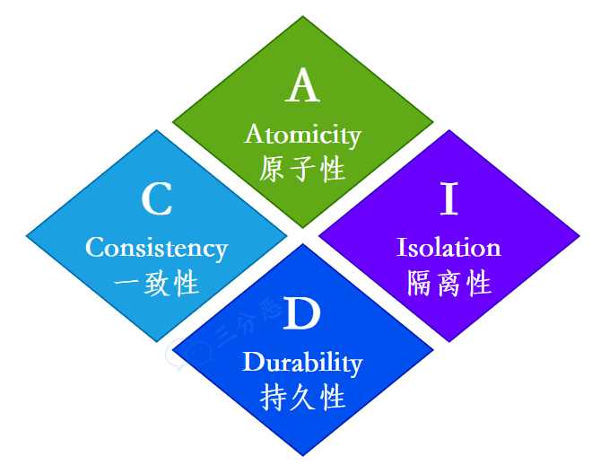

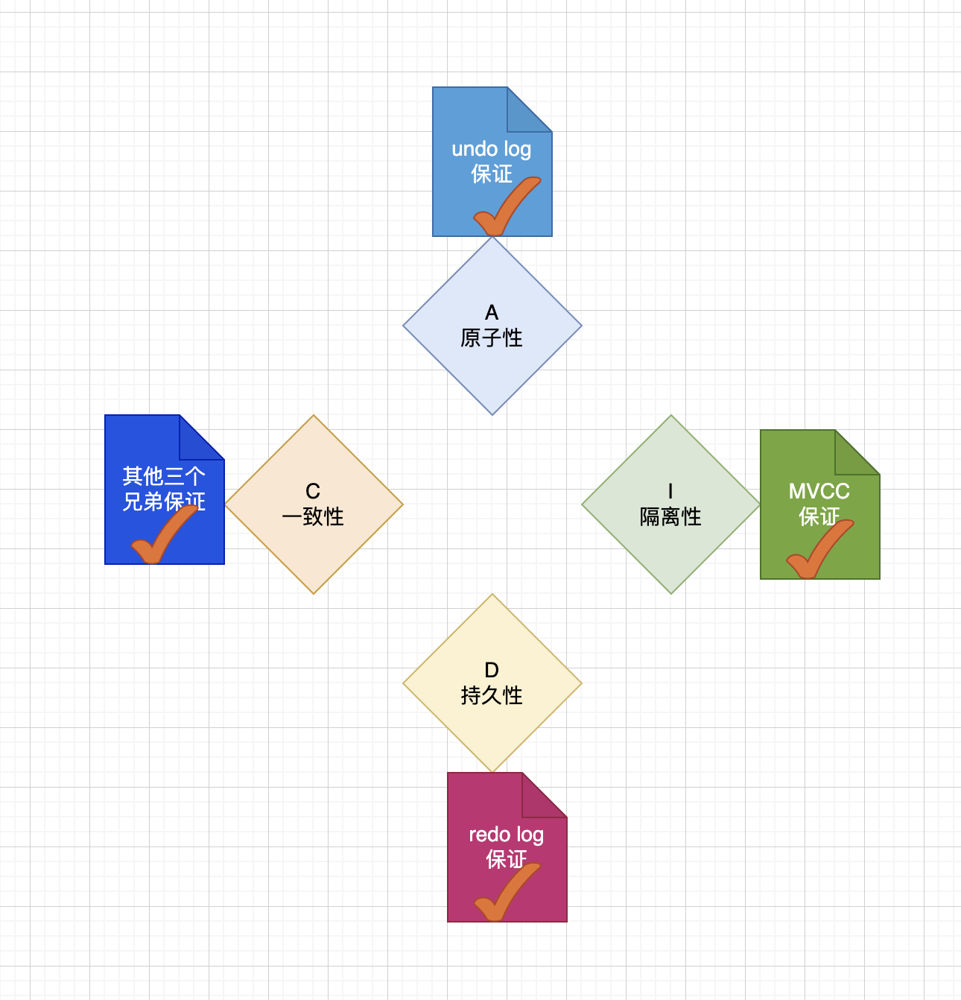

AID是手段，C是目的
只有保证了事务的原子性、隔离性、持久性之后，一致性才能得到保障

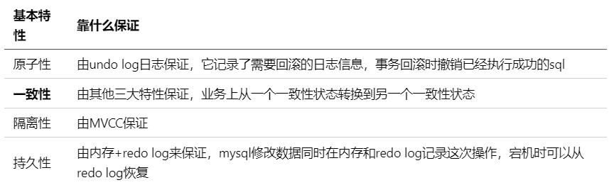

#### 原子性（Atomicity）
事务是最小的执行单元，不可分割。要么都执行，要么都不执行

#### 一致性（Consistency）
执行事务是从一致性状态变为另一个一致性状态

#### 隔离性（Isolation）
并发访问时，一个用户的事务不被其他事务所干扰

#### 持久性（Durability）
一个事务被提交后，数据库保证数据的改变是持久的，即使数据库发生故障也不应有任何影响

### 隔离级别
#### 读未提交
存在问题：脏读，不可重复读，幻读

#### 读已提交
oracle是读已提交隔离级别

存在问题：不可重复读，幻读

#### 可重复读
mysql是可重复读隔离级别，是可以解决幻读问题发生的（基于MVCC和临键锁Next-Key Lock）

存在问题：幻读

思考：为什么要可重复读，每次读出最新的数据不好吗，读个历史数据有啥用？
可重复读保证在开启事务/第一次查询后，查询到的都是相同的版本，开启事务那一刻的数据的版本。可重复读也经常用在数据库备份过程中，备份截止到某一刻的数据，在备份过程中的更改并不要备份。

什么时候需要使用事务：1.多个写操作 2.需要可重复读的多个读操作

串行化

### 传播机制
MySQL事务传播机制指的是在多个事务嵌套执行时，事务之间的行为和相互影响。

某一个事务传播行为修饰的方法并不是必须要在开启事务的外围方法中调用

#### 场景
##### 外围方法不开启事务

A方法调B方法，A方法没有事务，B方法的事务情况
 public void methodA(){
    methodB();
    //doSomething
 }
 
 @Transactional(Propagation=XXX)
 public void methodB(){
    //doSomething
 }

Note：methodA()方法嵌套调用了methodB()方法，methodB()的事务传播行为由@Transactional(Propagation=XXX)设置决定

##### 外围方法开启事务

A方法调B方法，A方法有事务，B方法的事务情况
 @Transactional 
public void methodA(){
    methodB();
    //doSomething
 }
 
 @Transactional(Propagation=XXX)
 public void methodB(){
    //doSomething
 }

#### A方法有事务
##### join
加入A所在事务

##### new
创建新事务

##### no
没有事务

throw

#### A方法无事务
new

no

throw

## 并发场景
### 并发场景问题
#### 读-读
不存在任何问题，不需要并发控制

#### 读-写
##### 有线程安全问题，会造成事务隔离性问题，可能遇到脏读、不可重复读、幻读

###### 脏读（回滚导致）
一个事务读到另外一个事务还没有提交的数据

###### 不可重复读（update或delete导致）
一个事务内，先后执行同一条 SQL，但两次读取到的数据不同
换句话说，读取到了其他事务已经提交的数据，导致前后两次读取的结果不同

对已存在的数据进行操作

###### 幻读（insert导致）
一个事务前后多次读取，数据总量不一致，多了⼀些原本不存在的记录，就好像发⽣了幻觉⼀样

插入了不存在的数据

#### 写-写
##### 有线程安全问题，可能会存在更新丢失问题
更新丢失：两个事务同时更新一条记录
例如：事务 1 读取某表中的数据 A=20，事务 2 也读取A=20，事务 1 修改 A=A-1，事务 2 也修改 A=A-1，最终结果 A=19，事务 1 的修改被丢失。

### 隔离级别的实现
MySQL 的隔离级别基于 锁 和 MVCC 机制共同实现

#### 细节
##### 读未提交
读和写都不加锁，其他事务可读可写

##### 读已提交
每次读取数据前都生成一个 ReadView

##### 可重复读
在事务开始时（即第一次读取数据时）生成一个 ReadView

##### 串行化
读加读锁，其他事务可读不可写

写加写锁，其他事务不可读不可写

### 并发处理组合
#### MVCC+悲观锁
MVCC解决读写冲突

悲观锁解决写写冲突

#### MVCC+乐观锁

这种组合方式可以最大程度的提高数据库并发性能
MVCC解决读写冲突

乐观锁解决写写冲突

## MVCC（多版本并发控制）
关键词：版本链、快照读

目的：提升并发性能，避免加锁，开销更低（是一种用来解决读写冲突的无锁并发控制，提高数据库并发性能）

读取数据时通过一种类似快照的方式将数据保存下来，通过版本链，实现多版本，不同的事务session会看到自己特定版本的数据。通过ReadView生成策略的不同，可以实现读已提交和可重复读的隔离级别。

### 当前读与快照读

#### 当前读（一致性锁定读）

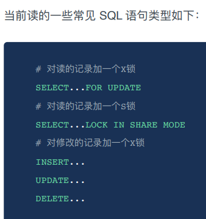

给⾏记录加 X 锁或 S 锁

#### 快照读（一致性非锁定读）
单纯的SELECT语句

快照即记录的历史版本，每⾏记录可能存在多个历史版本（多版本技术）

快照读的情况下，如果读取的记录正在执⾏ UPDATE/DELETE 操作，读取操作不会因此去等待记录上 X 锁的释放，⽽是会去读取⾏的⼀个快照

快照读⽐较适合对于数据⼀致性要求不是特别⾼且追求极致性能的业务场景。

### 实现原理
主要依赖记录中的3个隐式字段（3个隐藏列），undo日志，ReadView来实现

版本链由{回滚指针字段和update undo日志}实现
快照读由{ReadView}实现

#### 细节
##### 隐式字段（隐藏列）
###### 隐藏主键（隐含的自增ID，DB_ROW_ID，
row_id）
6 byte

如果没有主键，InnoDB会自动以此列产生一个聚簇索引

###### 事务ID（DB_TRX_ID，Transaction ID）
6 byte

记录最后一次操作该记录的事务ID

###### 回滚指针（DB_ROLL_PTR，Roll Pointer）
7 byte

指向该记录的上一个版本，也就是undo日志地址

版本链：回滚指针将修改日志串联了起来，形成了一个版本链，版本链的头节点就是当前记录的最新的值

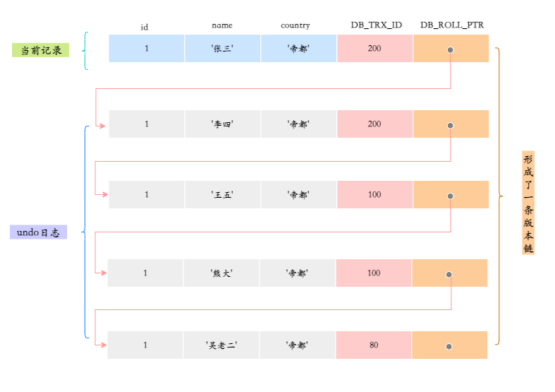

##### undo日志
###### insert undo log
代表事务在insert新记录时产生的undo log，只在事务回滚时需要，并且在事务提交后可以被立即丢弃

###### update undo log
事务在进行update或delete时产生的undo log，不仅在事务回滚时需要，在快照读时也需要。所以不能随便删除，只有在快照读和事务回滚不涉及该日志时，对应的日志才会被purge线程统一清除。

##### ReadView（读视图）
Read View主要是用来做可见性判断的，即判断当前事务可见哪个版本的数据

ReadView遵循一个可见性算法。

## SQL优化
### 慢SQL如何定位
#### 主要通过两种途径

##### 慢查询日志
开启 MySQL 的慢查询日志，再通过一些工具比如 mysqldumpslow 去分析对应的慢查询日志，当然现在一般的云厂商都提供了可视化的平台

##### 服务监控
可以在业务的基建中加入对慢 SQL 的监控，常见的方案有字节码插桩、连接池扩展、ORM 框架过程，对服务运行中的慢 SQL 进行监控和告警

### 慢SQL如何优化

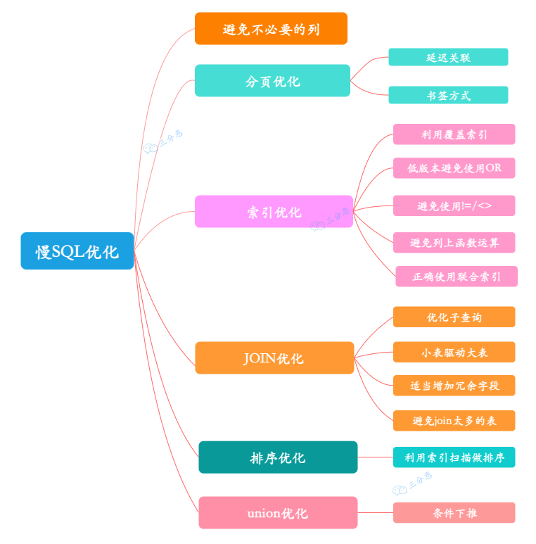

#### 细分
##### 索引优化
（详见上）
使用explain查看执行计划

避免索引失效情况

使用索引下推优化

##### 避免不必要的列
只查询需要的列，而不要包含额外的列，像select * 应尽量避免

##### join优化
###### 优化子查询
尽量使用 Join 语句来替代子查询，因为子查询是嵌套查询，而嵌套查询会新创建一张临时表，而临时表的创建与销毁会占用一定的系统资源以及花费一定的时间，同时对于返回结果集比较大的子查询，其对查询性能的影响更大

###### 小表驱动大表
关联查询的时候要拿小表去驱动大表，因为关联的时候，MySQL 内部会遍历驱动表，再去连接被驱动表。

比如 left join，左表就是驱动表，A 表小于 B 表，建立连接的次数就少，查询速度就被加快了。

 select name from A left join B ;

###### 适当增加冗余字段
建表需要权衡数据冗余和连接代价

增加冗余字段可以减少大量的连表查询，因为多张表的连表查询性能很低，所有可以适当的增加冗余字段，以减少多张表的关联查询，这是以空间换时间的优化策略

###### 避免join太多的表
《阿里巴巴 Java 开发手册》规定不要 join 超过三张表，第一 join 太多降低查询的速度，第二 join 的 buffer 会占用更多的内存。

如果不可避免要 join 多张表，可以考虑使用数据异构的方式异构到 ES 中查询。

##### union优化
###### 条件下推
MySQL 处理 union 的策略是先创建临时表，然后将各个查询结果填充到临时表中最后再来做查询，很多优化策略在 union 查询中都会失效，因为它无法利用索引

最好手工将 where、limit 等子句下推到 union 的各个子查询中，以便优化器可以充分利用这些条件进行优化

此外，除非确实需要服务器去重，一定要使用 union all，如果不加 all 关键字，MySQL 会给临时表加上 distinct 选项，这会导致对整个临时表做唯一性检查，代价很高。

## 连接池
C3P0,DBCP

setMaxPoolSize
setMinPoolSize
setInitialPoolSize
setMaxConnectionAge	最大生存时间
setMaxIdleTime	最大空闲时间

### 池化好处
复用连接，无须断开物理连接，加快连接速度

统一管理监控

数量限定在一定范围内

## 高可用/性能
### 数据量过大情景
#### 读写分离
经典的数据库拆分⽅案，主库负责写，从库负责读

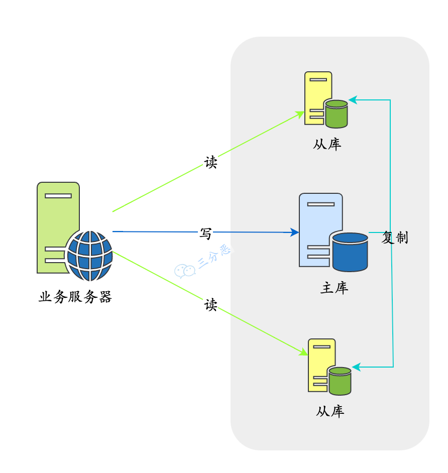

##### 实现
搭建主从集群（一主一从/一主多从）

###### 主库和从库都存储所有数据，主从同步
主从复制

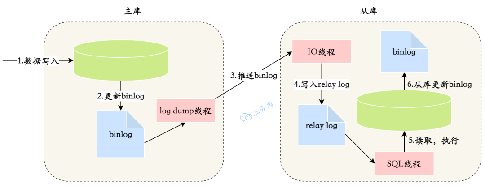

####### 主从同步延迟解决方案
######## 写操作后的读操作指定发给数据库主服务器
例如，注册账号完成后，登录时读取账号的读操作也发给数据库主服务器。这种方式和业务强绑定，对业务的侵入和影响较大，如果哪个新来的程序员不知道这样写代码，就会导致一个 bug

######## 读从机失败后再读一次主机
这就是通常所说的 "二次读取" ，二次读取和业务无绑定，只需要对底层数据库访问的 API 进行封装即可，实现代价较小，不足之处在于如果有很多二次读取，将大大增加主机的读操作压力。例如，黑客暴力破解账号，会导致大量的二次读取操作，主机可能顶不住读操作的压力从而崩溃

######## 关键业务读写操作全部指向主机，非关键业务采用读写分离
例如，对于一个用户管理系统来说，注册 + 登录的业务读写操作全部访问主机，用户的介绍、爰好、等级等业务，可以采用读写分离，因为即使用户改了自己的自我介绍，在查询时却看到了自我介绍还是旧的，业务影响与不能登录相比就小很多，还可以忍受

##### 读写分离的分配一般有2种方式：程序代码封装和中间件封装
业务代码封装
目前开源的实现方案中，淘宝的 TDDL (Taobao Distributed Data Layer, 外号：头都大了）是比较有名的。

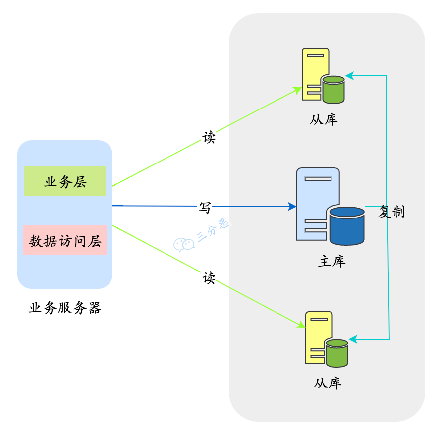

中间件封装

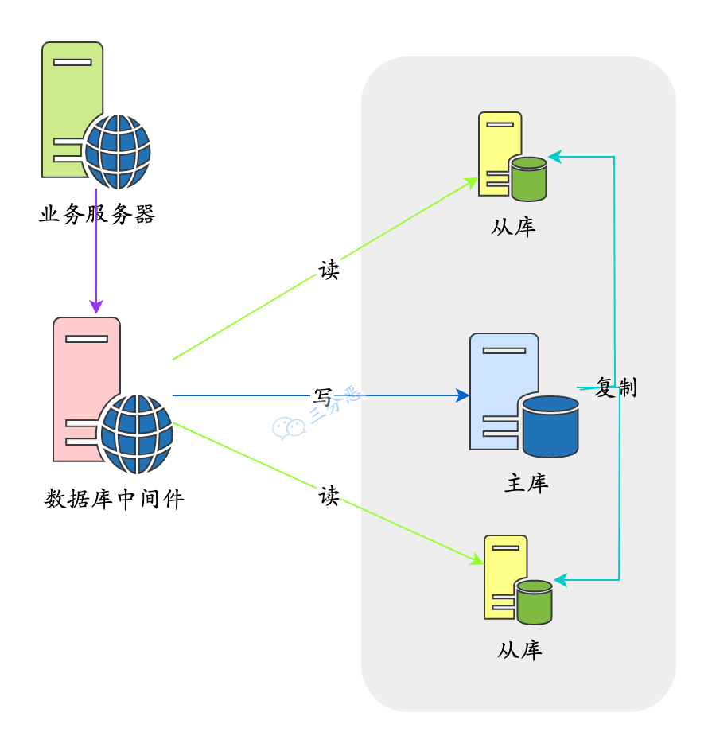

#### 分库分表
##### 分库
###### 垂直分库
以表为依据，按照业务归属不同，将不同的表拆分到不同的库中

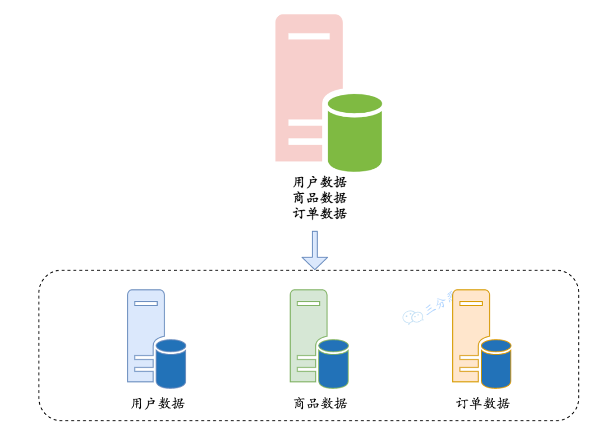

###### 水平分库
以字段为依据，按照一定策略（hash、range 等），将一个库中的数据拆分到多个库中

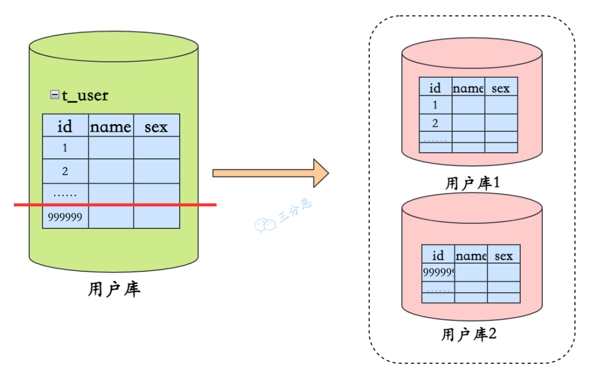

###### 分库带来的问题
####### 事务的问题
使用关系型数据库，有很大一点在于它保证事务完整性。

而分库之后单机事务就用不上了，必须使用分布式事务来解决。

####### 跨库join问题

##### 分表
###### 水平分表
以字段为依据，按照一定策略（hash、range 等），将一个表中的数据拆分到多个表中

###### 垂直分表
以字段为依据，按照字段的活跃性，将表中字段拆到不同的表（主表和扩展表）中

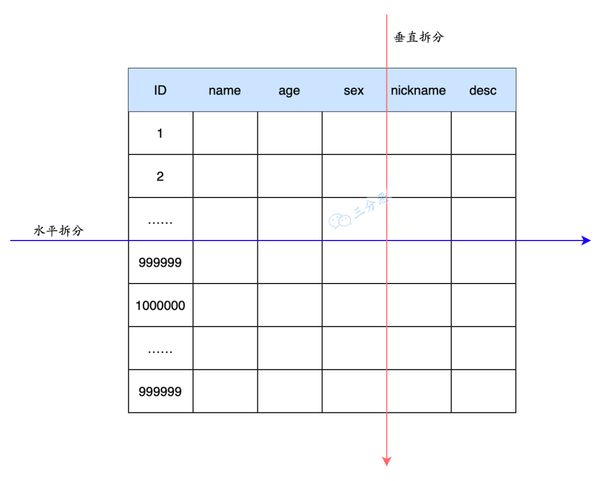

###### 分表带来的问题
####### 跨节点的count,order by,group by以及聚合函数问题
只能由业务代码来实现或者用中间件将各表中的数据汇总、排序、分页然后返回

####### 数据迁移，容量规划，扩容等问题
数据的迁移，容量如何规划，未来是否可能再次需要扩容，等等，都是需要考虑的问题

####### id问题

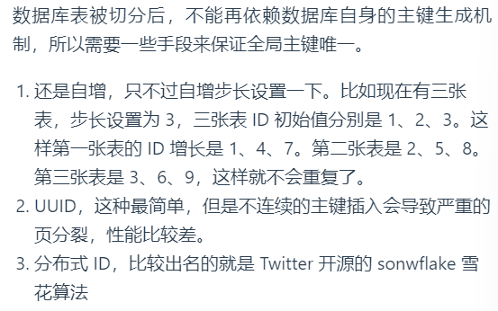

##### 分库分表
###### 垂直分区
（按列拆分）
优：可以使得列数据变⼩，在查询时减少读取的Block数，减少I/O次数。此外， 垂直分区可以简化表的结构，易于维护

缺：主键会出现冗余，需要管理冗余列，并会引起Join操作，可以通过在应⽤层进⾏Join来解决。此外，垂直分区会让事务变得更加复杂

###### 水平分区
（按行拆分，数据分片）
优：⽀持⾮常⼤的数据量存储，应⽤端改造也少

缺：分⽚事务难以解决，跨节点Join性能较差，逻辑复杂
《Java⼯程师修炼之道》的作者推荐尽量不要对数据进⾏分⽚，因为拆分会带来逻辑、部署、运维的各种复杂度 ，⼀般的数据表在优化得当的情况下⽀撑千万以下的数据量是没有太⼤ 问题的。如果实在要分⽚，尽量选择客户端分⽚架构，这样可以减少⼀次和中间件的⽹络I/O。

####### 方案
######## 客户端代理
 分⽚逻辑在应⽤端，封装在jar包中，通过修改或者封装JDBC层来实现。 当当⽹的 Sharding-JDBC 、阿⾥的TDDL是两种⽐较常⽤的实现。

######## 中间件代理
在应⽤和数据中间加了⼀个代理层。分⽚逻辑统⼀维护在中间件服务中。 我们现在谈的 Mycat 、360的Atlas、⽹易的DDB等等都是这种架构的实现。

Note：⽔平拆分最好分库。
分表仅仅是解决了单⼀表数据过⼤的问题，但由于表的数据还是在同⼀台机器上，其实对于提升MySQL并发能⼒没有什么意义，所以⽔平拆分最好分库 。

####### 路由方式
什么是路由呢？就是数据应该分到哪一张表

######## 3种
######### 范围路由
选取有序的数据列 （例如，整形、时间戳等） 作为路由的条件，不同分段分散到不同的数据库表中

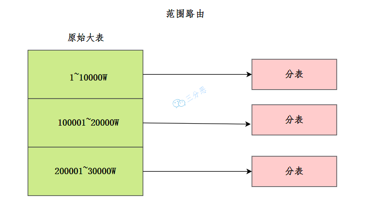

范围路由设计的复杂点主要体现在分段大小的选取上，分段太小会导致切分后子表数量过多，增加维护复杂度；分段太大可能会导致单表依然存在性能问题，一般建议分段大小在 100 万至 2000 万之间，具体需要根据业务选取合适的分段大小。

范围路由的优点是可以随着数据的增加平滑地扩充新的表。例如，现在的用户是 100 万，如果增加到 1000 万，只需要增加新的表就可以了，原有的数据不需要动。范围路由的一个比较隐含的缺点是分布不均匀，假如按照 1000 万来进行分表，有可能某个分段实际存储的数据量只有 1000 条，而另外一个分段实际存储的数据量有 900 万条。

######### Hash路由
选取某个列 （或者某几个列组合也可以） 的值进行 Hash 运算，然后根据 Hash 结果分散到不同的数据库表中

同样以订单 id 为例，假如我们一开始就规划了 4 个数据库表，路由算法可以简单地用 id % 4 的值来表示数据所属的数据库表编号，id 为 12 的订单放到编号为 50 的子表中，id 为 13 的订单放到编号为 61 的字表中

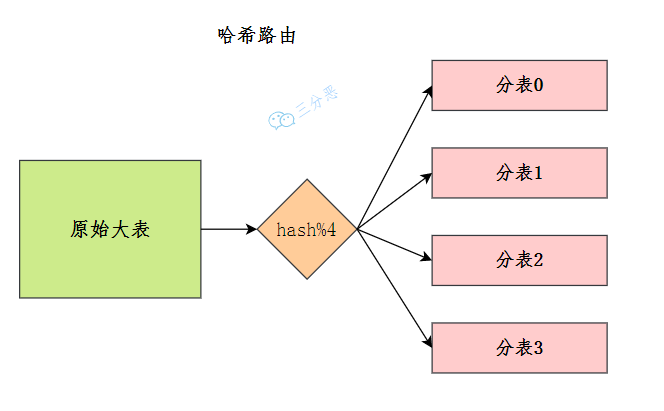

Hash 路由设计的复杂点主要体现在初始表数量的选取上，表数量太多维护比较麻烦，表数量太少又可能导致单表性能存在问题。而用了 Hash 路由后，增加子表数量是非常麻烦的，所有数据都要重分布。Hash 路由的优缺点和范围路由基本相反，Hash 路由的优点是表分布比较均匀，缺点是扩充新的表很麻烦，所有数据都要重分布。

######### 配置路由
配置路由就是路由表，用一张独立的表来记录路由信息

同样以订单 id 为例，我们新增一张 order_router 表，这个表包含 orderjd 和 tablejd 两列 , 根据 orderjd 就可以查询对应的 table_id

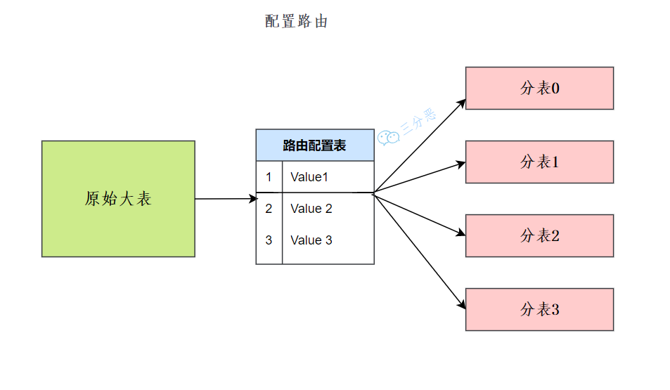

配置路由设计简单，使用起来非常灵活，尤其是在扩充表的时候，只需要迁移指定的数据，然后修改路由表就可以了

配置路由的缺点就是必须多查询一次，会影响整体性能；而且路由表本身如果太大（例如，几亿条数据） ，性能同样可能成为瓶颈，如果我们再次将路由表分库分表，则又面临一个死循环式的路由算法选择问题

### 不停机扩容
实际上，不停机扩容，实操起来是个非常麻烦而且很有风险的操作，当然，面试回答起来就简单很多

#### 实现
##### 步骤一：在线双写，查询走旧库
建立好新的库表结构，数据写入旧库的同时，也写入拆分的新库
数据迁移，使用数据迁移程序，将旧库中的历史数据迁移到新库
使用定时任务，新旧库的数据对比，把差异补齐

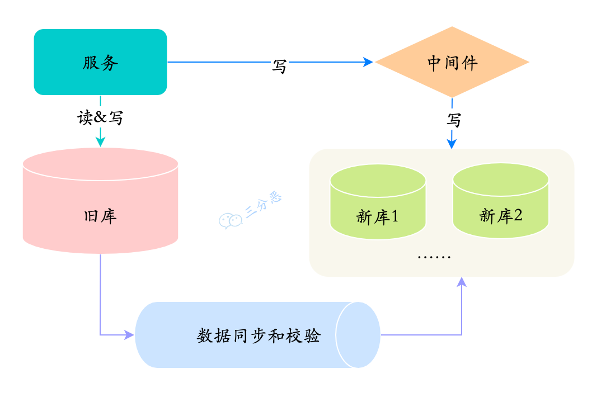

##### 步骤二：在线双写，查询走新库
把对数据的读切换到新库

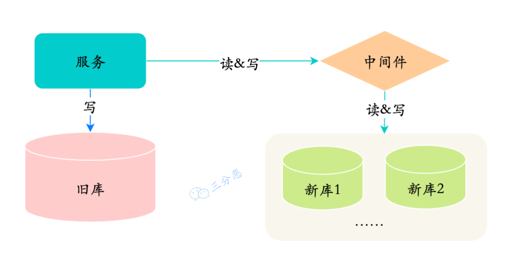

##### 步骤三：旧库下线
旧库不再写入新的数据，经过一段时间，确定旧库没有请求之后，就可以下线旧库

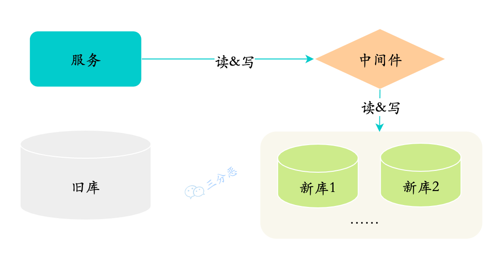

