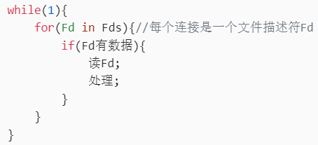
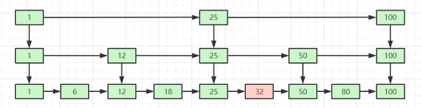
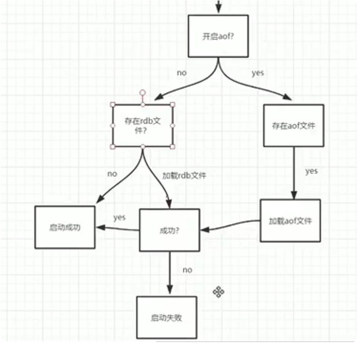
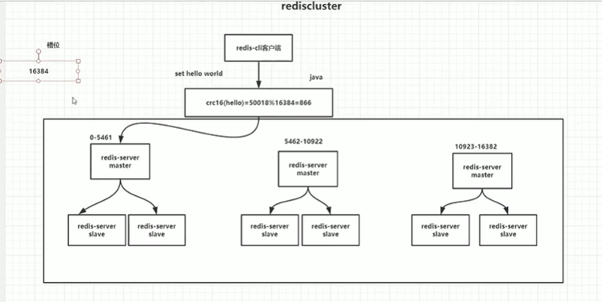
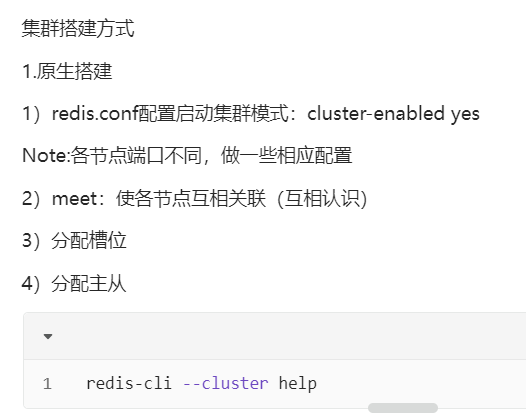
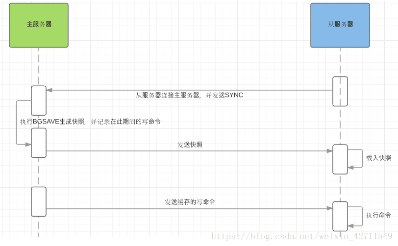
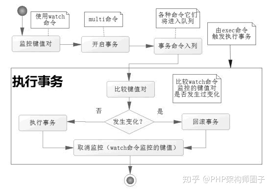
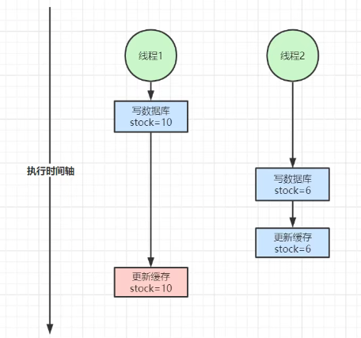
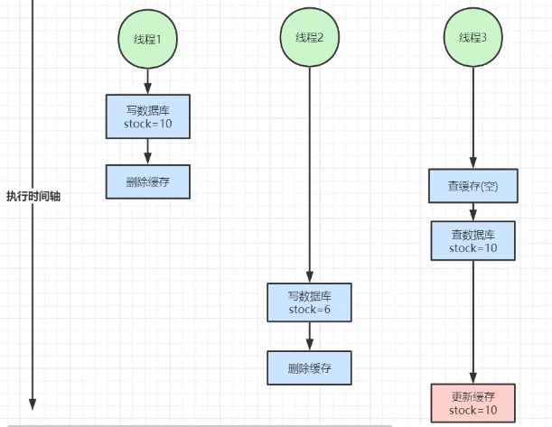
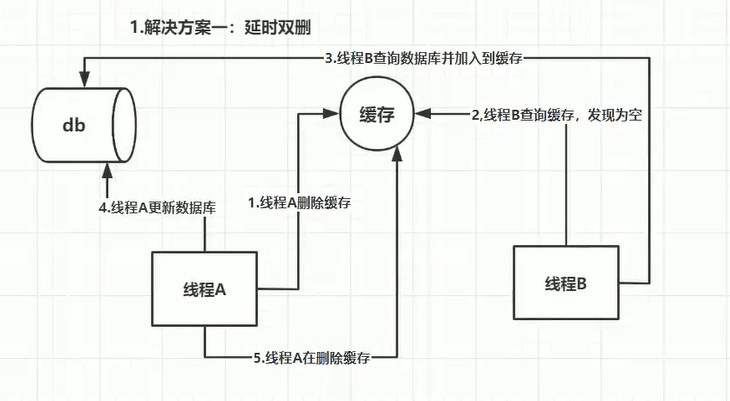

# Redis
## Redis为什么快
基于内存运行

c语言实现，更接近底层操作

源码精湛简短

数据结构专门设计，底层做了优化

### Redis是单线程（worker线程始终是单线程）
Redis5.x版本及之前是单线程的工作机制，worker既处理IO又处理计算，按顺序串行执行。

Redis6.0版本之后，推出了多线程概念，多个IO子线程处理IO读写，worker仅处理计算，性能提高。

#### 单线程与多线程适用场景
一个请求处理很快，但这个请求数量很多，适合用单线程。eg.redis存取key；nginx请求转发。

业务处理复杂，一个请求过来需要处理很长时间，适合用多线程。

### IO多路复用（非阻塞IO）
IO多路复用，针对单线程，可以让单线程高效的处理多个网络连接请求，尽量减少网络IO的时间消耗。

内部实现采用epoll。epoll自己实现了简单的事件框架。epoll中的读、写、关闭、连接都转化成了事件，然后利用epoll的多路复用特性，绝不在IO上浪费一点时间。

#### IO多路复用
##### 内核态判断是否有数据，没数据时阻塞。

基于连接轮询机制：把连接收集到服务端，一个个轮询。有些连接只是建立，没有发数据，会出现空轮询。
###### DMA控制器

####### select
bitmap

1024位大小

####### poll
结构体

大小不限

##### epoll
基于事件驱动

epoll_create：创建selector
epoll_ctl：把事件注册进来
epoll_wait：监听事件（有返回值，为事件的个数）

分配一个内存块，创建一个事件收集器selector，注册所有的事件，selector会返回一个事件数组，由redis进行处理；如果没数据，selector处于阻塞状态。

## 5种基础数据结构
### 整体存储结构：全局哈希表
key：都是唯一的，都是字符串

value：不同数据结构的差异体现在此

### 5种
#### string  字符串
##### 用途
缓存

分布式锁

###### 计数器
计数器生成分布式唯一ID

计数器统计网站访问量

##### 底层结构
###### 字符数组（类似Java的ArrayList）
动态字符串，是可以修改的字符串，采用预分配冗余空间的方式来减少内存的频繁分配

##### 命令
键值对：set/get/exists/del
批量键值对:mset/mget
设置过期时间:expire/setex
计数(value是整数):incr/incrby

#### 容器型数据结构

create if not exists / drop if no elements
##### list  列表
###### 用途
队列/消息队列/异步队列

####### 链表
微博关注人时间轴列表

###### 底层结构
双向链表（类似Java的LinkedList）

###### 命令
llen/lpop/rpush/rpop/lindex/lrange/ltrim

##### hash  字典
###### 用途
####### 用户信息
可以对每个字段单独存储，可以进行部分获取

###### 底层结构
"数组+链表"二维结构，采用渐进式rehash策略（类似Java的HashMap）

###### value特点
只能是字符串

##### set  集合
###### 用途
####### 去重集合
点赞

踩

共同好友

###### 底层结构
（类似Java的HashSet）

###### value特点
无序，唯一

##### zset  有序集合
###### 用途
排行榜

Redis最有特色的数据结构

###### 底层结构
####### 跳跃列表
跳表将有序链表改造为支持“折半查找”算法，类似于折半查找，可以进行快速的插入、删除、查找操作。
跳跃列表相当于在链表上建了索引层，每2个元素往上建一个索引层。
以空间换时间，空间多了1倍多，但性能明显变好

查找：eg查32，先在第1层找在25-100范围内，在第二层找在25-50范围内，在第三层找到32

###### value特点
有序，唯一

## 持久化机制
what：内存写入磁盘

why：内存数据库，在内存中操作，所以速度相当快，但仅在内存中，宕机时数据会丢失，所以需要持久化

### how
#### RDB  全量数据的快照
##### 文件
dump.rdb

文件位置和AOF一致，均是在redis.conf里配置的dir的路径，自己配置要写绝对路径

##### 原理
fork一个子进程（与主进程一模一样），先将数据写入临时文件，再用临时文件替换旧的持久化文件。
Note:fork系统调用用于创建一个新进程，称为子进程，可以理解为fork子进程即创建子进程。

RDB持久化，为什么要fork子进程？
异步持久化，不会阻塞主进程（redis是单线程的），确保高性能

##### 区别
会fork子进程
启动redis时，从磁盘加载持久化数据非常快
有可能会丢失最后一次之后写入的数据
不安全，性能好

##### 触发机制（4项）
1.shutdown时（关机时），如果没有开启AOF，会触发

###### 2.配置文件中默认的快照配置，匹配任意一项就会触发
#指定在多长时间内，有多少次更新操作，就执行RDB
save 900 1	#900秒（15分钟）内有1个更改
save 300 100 #300秒（5分钟）内有100个更改
save 60 10000 #60秒内有10000个更改
#如果想禁用RDB持久化策略，只要不设置任何save命令，或给save传入一个空字符串参数也可以
save ""

3.执行命令save或bgsave
save：使用主进程进行快照操作，全部阻塞（同步方式）
bgsave：使用子进程后台异步进行快照操作，同时可以响应客户端的请求（异步方式）
Note：其他方式触发的实际上也是调用了bgsave命令

4.执行flushall命令
清空内存，写入磁盘

#### AOF  追加日志
##### 文件
appendonly.aof

文件位置和RDB一致，均是在redis.conf里配置的dir的路径，自己配置要写绝对路径

##### 原理
以日志追加方式写入文件，读操作不记录
AOF由主进程处理，只要开启AOF，就会有个缓冲区（默认1M，可配置），主进程接到命令，把命令写入缓冲区，有定时任务从缓冲区写到磁盘。

##### 区别
AOF不会fork子进程，AOF重写会fork子进程
启动redis时，从磁盘加载持久化数据没RDB快
最多丢失不会超过2秒的数据
安全，性能不好

##### 触发机制
可在配置文件里指定定时任务更新任务条件，如下三个可选值：
no：缓冲区满了同步（效率快，不安全）
always：每次变更同步（效率慢，安全）
everysec：每秒同步（默认值，折中方案，很快，但可能丢失1秒内的数据）

同步策略（每秒同步，每修改同步，不同步）

##### 为什么会出现AOF
解决RDB丢失数据太多的问题（临时宕机，1，3，4不会触发RDB，且在没有匹配到2触发RDB的情况下，2中配置的间隔时间内的数据均会丢失）
RDB的save 1 1 和AOF默认每秒同步，有区别吗？
有区别，RDB太频繁，每次fork子进程，影响性能

##### AOF的重写
目的：减少AOF文件的体积
fork一个子进程，rewrite会去掉过程性操作，进行压缩，用rdb存储重写后的结果，更节约空间
redis4.0之后有了混合持久化，是对重写的进一步优化

##### 开启AOF
#redis.conf配置文件
appendonly yes

### 性能建议
#### 1.两种持久化机制同时开启。如果两个同时开启，优先使用AOF持久化机制

2.需要fork子进程的尽量减少频率
因为RDB文件只用作备份恢复，只要15分钟备份一次就够了，只保留save 900 1这条规则。
只要硬盘许可，应该尽量减少AOF rewrite的频率，AOF重写的基础大小默认值64M太小了，可以设到5G。

## 过期键删除策略
Redis同时使用了惰性过期和定期过期两种过期策略

### 策略
#### 惰性过期
访问时才判断key是否过期

内存不友好，CPU友好

#### 定期过期
每隔一段时间扫描一定数量的key

折中

#### 定时过期
定时器，一到时间，实时删除key

内存友好，CPU不友好

## 内存淘汰机制（逐出算法）
当内存不足以容纳新写入数据时,触发内存淘汰机制

### 分类
noeviction：报错

#### 键空间中
allkeys-lru：键空间中，移除最近最少使用key

allkeys-random：键空间中，移除随机key

#### 设置了过期时间的键空间中
volatile-lru：设置了过期时间的键空间中，移除最近最少使用key

volatile-random：设置了过期时间的键空间中，移除随机key

volatile-ttl：设置了过期时间的键空间中，移除更早过期key

## 集群方案
演变：单机版-->Redis主从复制-->Redis哨兵模式-->Redis Cluster

### 方案
#### 单机版
核心技术：持久化

持久化是最简单的高可用方法（有时甚至不被归为高可用手段）

#### Redis主从复制
复制是高可用Redis的基础。实现了多机备份，读操作负载均衡，简单的故障恢复，读写分离，提高吞吐量

缺陷：故障恢复无法自动化；写操作无法负载均衡；存储能力受到单机的限制

#### Redis哨兵模式
哨兵实现自动化的故障恢复

缺陷：写操作无法负载均衡；存储能力受到单机的限制

基于主从模式，自动故障迁移
哨兵机制选举大会
角色：1主节点2从节点3哨兵（Note:哨兵必为奇数个）
主从节点向哨兵发送心跳。
一个哨兵收不到主节点的心跳，主观下线
两个哨兵收不到主节点的心跳，客观下线
3个哨兵中选1个leader，有半数以上(2票)就是leader
由leader决定哪个从节点当主节点，然后进行故障迁移

#### Redis Cluster
解决了写操作无法负载均衡和存储能力受到单机的限制的问题，实现了较为完善的高可用方案

有多个主从模式（至少3个主节点）组成的大集群，故障迁移时不需要依赖哨兵，但有哨兵的功能，从节点可自动切换为主节点

通过把key哈希取模映射到16384个槽位（Note:16384=16*1024是redis写死的一个数），这16384个槽位被集群中主节点划分（即多个主节点瓜分16384个槽位，可以按区间，也可间插着分），进而定位到其中一个主节点（Note：槽位不是用来存数据的，只是用来分片的）

redis官方客户端才有重定向功能，jedis没有重定向功能

Redis Cluster：服务端做分片
Redis Sharding：客户端做分片

## 主从复制（全量复制&增量复制）
主从刚刚连接的时候，进行全量同步；全同步结束后，进行增量同步。当然，如果有需要，slave 在任何时候都可以发起全量同步。redis 策略是，无论如何，首先会尝试进行增量同步，如不成功，要求从机进行全量同步。

Redis全量复制一般发生在Slave初始化阶段，这时Slave需要将Master上的所有数据都复制一份。具体步骤如下： 
　　1）从服务器连接主服务器，发送SYNC命令； 
　　2）主服务器接收到SYNC命名后，开始执行BGSAVE命令生成RDB文件并使用缓冲区记录此后执行的所有写命令； 
　　3）主服务器BGSAVE执行完后，向所有从服务器发送快照文件，并在发送期间继续记录被执行的写命令； 
　　4）从服务器收到快照文件后丢弃所有旧数据，载入收到的快照； 
　　5）主服务器快照发送完毕后开始向从服务器发送缓冲区中的写命令； 
　　6）从服务器完成对快照的载入，开始接收命令请求，并执行来自主服务器缓冲区的写命令； 

什么时候需复制？（选择：看从节点复制了多少）
1）从服务器掉线重连（增量复制）
2）新增节点（全量复制）
3）主服务器id变了（全量复制）
4）复制偏移量<积压缓冲区（增量复制）
5）复制偏移量>积压缓冲区（全量复制）

数据的一致性问题：同步复制与异步复制

## 事务实现
对事务的支持ACID ：watch命令

Redis使用WATCH命令来决定事务是继续执行还是回滚，那就需要在MULTI之前使用WATCH来监控某些键值对，然后使用MULTI命令来开启事务，执行对数据结构操作的各种命令，此时这些命令入队列。
当使用EXEC执行事务时，首先会比对WATCH所监控的键值对，如果没发生改变，它会执行事务队列中的命令，提交事务；如果发生变化，将不会执行事务中的任何命令，同时事务回滚。当然无论是否回滚，Redis都会取消执行事务前的WATCH命令。

## 缓存雪崩、缓存穿透与缓存击穿
### 缓存雪崩
#### 概念
大量的Redis缓存在同一时间全部失效，导致大量请求全打到数据库，导致数据库挂掉

#### 解决
随机设置过期时间
定时任务，失效前重置过期时间
集群部署，热点key分布在不同节点上

### 缓存击穿
#### 概念
一个热点key的缓存失效，一瞬间大量请求打到数据库上，导致数据库挂掉

#### 解决
设置热点key永不过期
使用分布式锁（单体使用互斥锁）

### 缓存穿透
#### 概念
常见于黑客攻击缓存和数据库都没有的数据，导致数据库挂掉，eg.请求id为-1的数据

#### 解决
对参数进行校验
使用布隆过滤器
就算数据库查出为空，也缓存到redis里（可能换参数）
把ip拉黑（可能换ip）

##### 布隆过滤器
底层是二进制数组，多个哈希函数映射到数组上，都是1可能存在，有0则一定不存在
增和查是一样的原理，删除不好删
优：占空间小；速度快，O(k)，k为哈希函数个数（按hash算出来的值找下标）；保密性安全性好
缺：很难删除；存在误判，只能减小误判的概率
参数误判率设置越小，需要的哈希函数也就越多，计算时间越长，性能越差，不能设置太小。

## 如何保证Redis和Mysql数据一致
### 一致性分类
#### 强一致性：加分布式锁或读写锁
加分布式锁，更新mysql，同时更新或删除redis缓存，保证期间不会有其他线程进入

加读写锁，写-写与读-写互斥，读-读不互斥，保证一个线程写时，其他线程不会进入

最终一致性：定时任务同步；mq异步发消息。

### 不一致的场景
#### 1.先更新数据库，再更新缓存，但缓存更新失败。缓存中是旧数据。
2.先更新数据库，再更新缓存。A,B线程先后进行更新操作，顺序为：线程A更新数据库，线程B更新数据库，
线程B更新缓存，线程A更新缓存。缓存中是旧数据。
Note：一般选删除缓存（等下次用到了从数据库取），而不是更新缓存

#### 3.先删除缓存，再修改数据库。A线程进行更新操作，B线程进行查询操作，顺序为：线程A删除缓存，线程B查询缓存为空，线程B查数据库加入缓存，线程A更新数据库。缓存中是旧数据。
4.先修改数据库，再删除缓存。线程1更新数据库并删除缓存，线程3查缓存为空进而查数据库，线程2更新数据库并删除缓存，线程3更新缓存。

### 解决方案
#### 延时双删
在更新数据库前后均执行删除缓存操作（或两次删除都在更新数据库之后），第二次是在更新数据库之后sleep(50秒)再删除缓存

这种方案能解决一部分问题，但不能彻底解决，而且让写请求sleep一段时间，使得写请求吞吐量下降

#### 内存队列
原理就是同一个key的增删改查都放到一个队列里依次执行（类似于RocketMQ顺序队列的实现）

实现起来比较繁杂，而且容易出问题

#### 读写锁
（Redisson里的读写锁）

能解决读多写少的场景，80%都会是读多写少

## 使用
安装

配置文件解析（要想性能调优，就要了解redis.conf里的主要配置）

持久化

删除策略

事务

发布订阅

java客户端操作（jedis）

