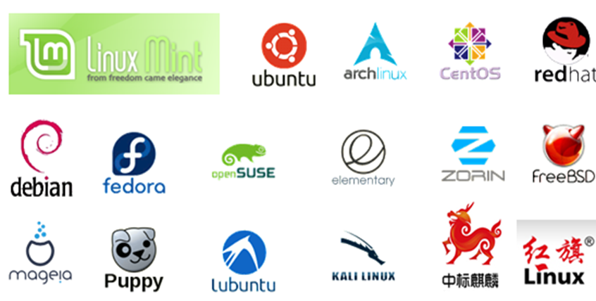
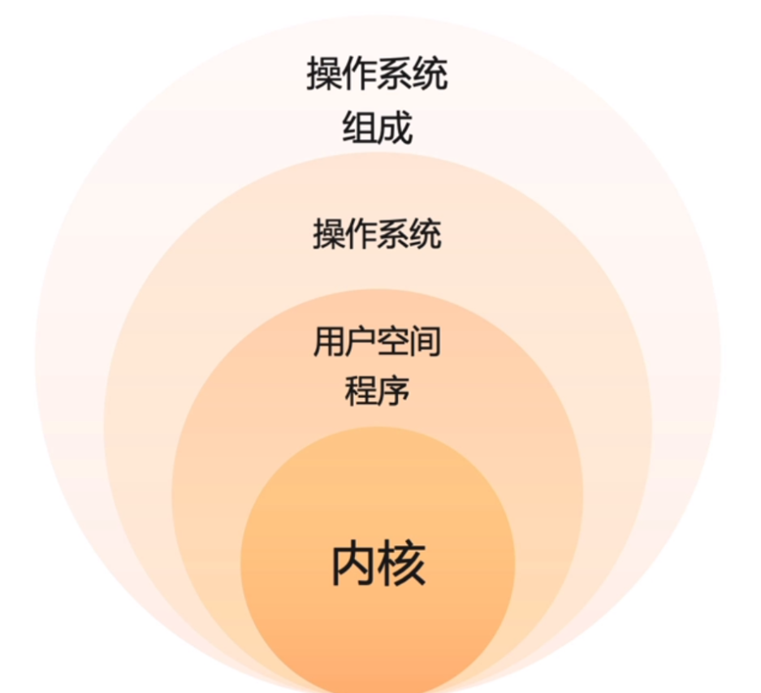
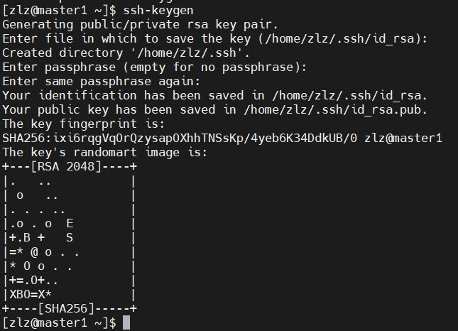
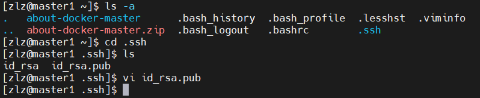
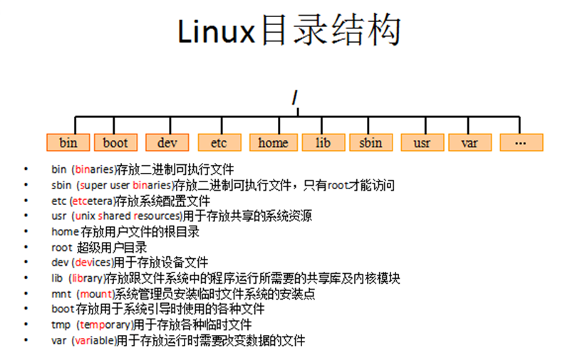
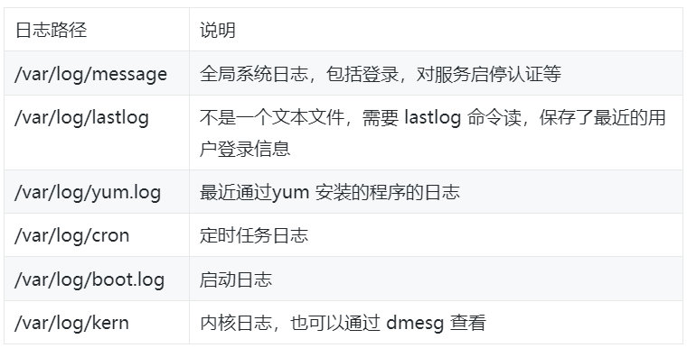

# Linux
## Linux概述
Linux系统中“一切皆文件”

### 虚拟机
一台虚拟的电脑

#### 虚拟机软件
##### VirtualBox（免费）
Oracle开发的开源的虚拟化软件

键盘上有2个ctrl键，右侧的ctrl键用于在虚拟机和真机之间鼠标的切换

###### 教程：VirtualBox安装CentOS
https://blog.csdn.net/qq_43726042/article/details/105913613

https://www.ppmy.cn/news/626128.html?action=onClick

##### VmWare（收费）
一种商业的虚拟化软件

##### WSL（Windows Subsystem fot Linux，Windows的Linux子系统）
它并非一个完全的虚拟机，而是提供了一种机制让Windows系统可以直接运行Linux的二进制可执行文件

微软开发的

#### 关系
##### VMware是安装虚拟机的软件；CentOS是系统；Linux是系统内核
通过VMware安装CentOS(目前主流版本是CentOS 7 )，VMware是CentOS的容器，CentOS需要在VMware中运行；CentOS就是虚拟机，CentOS与Red Hat（也是一种虚拟机，需要收费）的核心就是Linux；

### Linux版本（分为内核版本和发行版本）
#### 常见Linux发行版

. Ubuntu  
. Debian  
. RHEL  
. Centos  
. Fedora  
. Arch  
. Gentoo  
. Alibaba Cloud Linux  

##### 一般来说著名的Linux发行版基本上分两大类
###### RedHat系列
使用yum作为包管理器
eg.
yum install maven #安装maven
yum install git #安装git 

如RHEL（Red Hat Enterprise Linux），CentOS，Fedora等

###### Debian系列
使用apt-get作为包管理器
eg.
apt-get install maven #安装maven
apt-get install git #安装git 

Debian和Ubuntu是最为常见的使用apt-get作为默认包管理器的Linux系统

##### 所有的发行版不管是RedHat、CentOS还是Ubuntu，其内核都是来自Linux内核官网（www.kernel.org），不同发行版之间的差别在于软件管理的不同，所以不管使用哪一个发行版，只要理解其原理之后，各类发行版的区别其实不大。
Linux发行版在内核之外，加上了用户空间程序，操作系统等

### Linux特点
#### 免费开源
Linux是一款完全免费的操作系统，任何人都可以从网络上下载到它的源代码，并可以根据自己的需求进行定制化的开发，而且没有版权限制。

#### 模块化程度高
Linux的内核设计分成进程管理、内存管理、进程间通信、虚拟文件系统、网络5部分，其采用的模块机制使得用户可以根据实际需要，在内核中插入或移走模块，这使得内核可以被高度的剪裁定制，以方便在不同的场景下使用。

#### 广泛的硬件支持
得益于其免费开源的特点，有大批程序员不断地向Linux社区提供代码，使得Linux有着异常丰富的设备驱动资源，对主流硬件的支持极好，而且几乎能运行在所有流行的处理器上

#### 安全稳定
Linux采取了很多安全技术措施，包括读写权限控制、带保护的子系统、审计跟踪、核心授权等，这为网络环境中的用户提供了安全保障。实际上有很多运行Linux的服务器可以持续运行长达数年而无须重启，依然可以性能良好地提供服务，其安全稳定性已经在各个领域得到了广泛的证实。

#### 多用户，多任务
多用户是指系统资源可以同时被不同的用户使用，每个用户对自己的资源有特定的权限，互不影响。多任务是现代化计算机的主要特点，指的是计算机能同时运行多个程序，且程序之间彼此独立，Linux内核负责调度每个进程，使之平等地访问处理器。由于CPU处理速度极快，从用户的角度来看所有的进程好像在并行运行。

#### 良好的可移植性
Linux中95%以上的代码都是用C语言编写的，由于C语言是一种机器无关的高级语言，是可移植的，因此Linux系统也是可移植的。

### 扩展：SSH登录方式
SSH 全称 Secure Shell,是一种加密的网络传输协议；
可以创建安全的隧道用于客户端与服务器连接；
可以使用非对称加密进行验证从而提升整个连接的安全性；

#### 实操生成密钥
生成密钥：输入 ssh-keygen 命令（Note：命令中没有空格）→选择使用默认的路径→输入密码生成一个新的 ssh 密钥→借助 ssh 密钥登陆到服务器，进行非对称加密，使连接更安全

→输入 ls -a 查看所有目录→输入 cd .ssh 进入到 ssh 目录→执行 ls 可以看到在目录下有一个文件记录了授权的信息→使用 nano 加上文件名来编辑这个文件（如果没有 nano 也可以使用 vi 来进行文件的编辑）

#### 配置 SSH
使用 cd /etc/ssh进入ssh目录→执行 ls 可以查看配置文件（最为重要的是 sshd_config 文件，记录了一些 ssh 的具体配置项目，比较重要的包括 port）
编辑sshd_config文件：sudo vi sshd_config ， 按字母i进入编辑模式，修改完后，按Esc退出编辑模式，输入:wq退出。  
Note：需要有root权限才可以修改/etc下的文件，如果是非root用户，需要在命令前加sudo获取root权限。  
→修改 Port 使 ssh 监听除了22以外的其他端口，（这样可以使用自己定义的端口从而避免被他人爆破（爆破：暴力破解）)  
→将 PermitRootLogin 设置为 yes（表明默认允许使用 Root 用户登录）.  
注意：在实际生产环境，我们推荐大家默认禁止使用 Root 用户登录，而使用其他权限更低的用户登录进行日常操作，仅在必要时刻选择使用 Root 用户  
→ PasswordAuthentication 为密码验证，这里设置为 no 是一种比较安全的方式，如果设置为 yes，则允许用户通过密码进行登录，将其设置为 no 则需要通过证书进行登录，证书更为安全，在设置完成之后，保存并重启服务使配置生效，通过修改端口号、配置证书登录等方式就可以提升 ssh 登录的安全性。

## Linux in Windows
### windows类Linux命令
#### 设置环境变量
set LLM_API_KEY="sk-..."

#### 查看特定环境变量
set LLM_API_KEY

#### 查看所有环境变量
set

## Linux目录结构

### 熟悉
#### /
根目录

#### /etc（editable text configurationChest）
系统范围的配置文件

#### /root
管理员用户（root 用户）的home目录（home,家）

#### /home
普通用户的home目录，个人用户的配置

/home/test     为test用户的home目录

#### /usr
Unix Software Resource 绝大多数的程序和应用工具安装在这里，结果和/非常相似

##### /usr/src
源代码存放路径，如Linux 内核源码

#### /var（variable）
在程序运行中内容不断变化的文件，比如日志

##### var/log
####### 存放日志

### 了解
#### /bin（binary）
可执行文件，比如 ls 命令

#### /sbin（superuser binary）
系统的可执行文件，init ，mount 等

#### /boot
引导程序文件，内核，以及 initrd 等文件

#### /dev（device）
设备文件，比如磁盘设备

#### /mnt
临时挂载点

#### /opt（optional application software packages）
可选的应用包，一般用于存放一些直接提供二进制程序的非开源包

#### /tmp（temporary）
临时文件系统，重启后内容丢失

### 扩展
#### /media
可移除的媒体，cd-rom 等的挂载点

#### /run
存放一些 pid 和 socket 文件

#### /sys
非FHS保准，但是大部分发行版都有，虚拟文件系统，用来对内核和设备驱动做设置

## Linux命令的组成
### command [option] [arguments]
command：命令主体

option：命令选项，说明对命令的要求，用连字符“-”后跟一个字母进行表示。不设置选项时，命令将采用默认的方式执行。当使用单词或数个字母来表示选项时，连接符为“--”

arguments：命令的参数，描述命令作用的对象，一般为目录或文件

### 管道 |
将一个命令的标准输出作为另一个命令的标准输入。也就是把几个命令组合起来使用。

例：grep -r "close" /home/* | more       在home目录下所有文件中查找，包括close的文件，并分页输出。  
ls --help | more  分页查询帮助信息  
ps –ef | grep java  查询名称中包含java的进程  

ifconfig | more  
cat index.html | more  
history | less  查看命令历史使用记录并通过less分页显示  
ps –ef | grep aio  

