# Linux命令
## Linux常用命令（面试重点）
### 通用命令管理命令
#### 查看一个命令的用法
##### whatis

##### man（manual）
命令不会用了，找男人  如：man ls

帮助手册，很全，且有例子

##### --help
可缩写为-h，但如果-h作为选项被占用，那就得用--help

ls --help

告诉一些常用参数

##### info
info ls

#### 退出当前命令（彻底退出）
ctrl+c

#### 查看用过的命令列表
##### history
history           显示执行过的命令
history 10      显示最新10条执行过的命令
history -c       清除历史记录

##### hash
还显示执行的次数

##### 上下方向键可翻阅历史命令

#### 查看命令列表
compgen -c

#### 使用超级管理员身份执行命令/获取root权限
sudo

#### 对命令重命名
alias  
如：alias showmeit="ps -aux" ，另外解除使用unaliax showmeit

#### 自动补全
tab键

#### 命令行全屏显示
ctrl+alt+F1

#### 清屏（清空屏幕）
clear

ctrl+l

#### 通配符
##### ？
可替代单个字符

##### *
可替代任意多个字符

##### 方括号“[charset]”可替代 charset 集中的任何单个字符，如[a-z]，[abABC]

### 文件管理命令
#### 切换目录命令
##### cd（change directory）

cd /			根目录
cd ~			当前用户主目录
cd -			上一次访问的目录
cd ..			上一级目录
cd ../..              上两层目录

##### 路径与目录
###### 当前目录
.

###### 上级目录
..

###### 主目录/用户home目录
~

在root用户登录时，命令cd、cd ~和cd /root执行效果相同

#### 查看当前路径
pwd（print working directory）

#### 列出目录和文件
##### ls（list）
###### 参数
a（all） 所有文件，包括隐藏文件

l（list）详细信息

R  递归遍历目录下文件

###### 变体

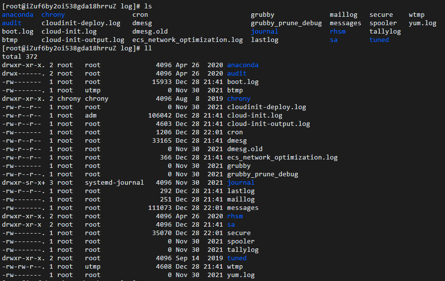

ls          查看目录中的文件
ls -l （等价于 ll）  显示文件和目录的详细资料
ls -a     列出全部文件，包含隐藏文件
ls -al    列出全部文件的详细信息

###### ll
ls -l 的缩写

#### 查看指定目录或文件的详细信息
stat

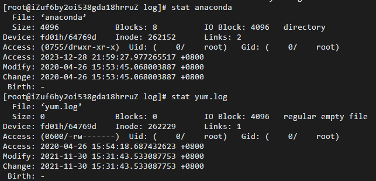

#### 将目录/文件移动或改名 mv（move）
##### 命令
mv  a.txt  ../   将a.txt文件移动到上一层目录中
mv  a.txt  b.txt    将a.txt文件重命名为b.txt   
mv	bbbb usr/bbb  将bbbb移动并改名为bbb

同一目录下，前后名称不一致，则为重命名

不同目录下，前后名称一致，则为移动

不同目录下，前后名称不一致，则为移动且重命名

##### 参数
-f ：force强制的意思，如果目标文件已经存在，不会询问而直接覆盖
-i ：若目标文件已经存在，就会询问是否覆盖
-u ：若目标文件已经存在，且比目标文件新，才会更新

f（force）强制

##### cp和mv一样，如果不写文件名，用原来的文件名；如果写了文件名，用新的文件名

#### 复制目录/文件
##### cp（copy）
###### 参数
-a ：将文件的特性一起复制
-p ：连同文件的属性一起复制，而非使用默认方式，与-a相似，常用于备份（除复制文件的内容外，还把修改时间和访问权限也复制到新文件中）
-i ：若目标文件已经存在时，在覆盖时会先询问
-f：覆盖已经存在的目标文件而不给出提示
-r ：递归持续复制，用于目录的复制行为
-u ：目标文件与源文件有差异时才会复制

###### 【cp source dest】
cp a.txt b.txt    将a.txt复制为b.txt文件
cp a.txt ../        将a.txt文件复制到上一层目录中

cp -r sourceFolder targetFolder     递归复制整个文件夹

###### cp和mv一样，如果不写文件名，用原来的文件名；如果写了文件名，用新的文件名

###### 远程拷贝
scp sourecFile romoteUserName@remoteIp:remoteAddr

#### 删除目录/文件
##### rm（remove）
###### 参数

-r ：递归删除，可删除子目录和文件
-f （force）：无需确认，强制删除
-i ：互动模式，删除前逐一询问确认

###### 命令
rm a.java                删除a.java文件
rm -r hello	       递归删除hello目录（会询问）
rm -f a.java	       强制删除a.java文件
rm -rf a*		       强制递归删除当前目录下以a开头的所有文件；
rm -rf *		       强制递归删除当前目录下所有文件（慎用）；
rm -rf /*                 自杀，删库跑路（慎用）

#### 删除空目录
##### rmdir（remove directory）
rmdir hello   删除hello空目录

#### 创建目录
##### mkdir（make directory）
###### 参数
p（parent）若无父目录，则创建

###### 命令
mkdir hello               在当前目录下创建hello目录
mkdir -p hello/test   在当前目录下级联创建hello和test目录

#### 文件操作
##### 创建文件
###### touch
touch a.txt

创建空文件

###### echo
- 创建带有内容的文件
    - 覆盖
        - echo "This is a test text">test.txt
            - 如果文件已存在，将会覆盖文件内容，如果不存在则创建
            - 其中>符号表示输出重定向
    - 追加
        - echo "my love">>test.txt
            - 其中>>符号表示输出追加重定向
            - 如果文件已存在，则追加；如果不存在则创建

- 在终端输出字符串或变量
    - 输出字符串
        - echo "hello world"
    - 输出变量（变量前要加$符号）
        - export name="Tom"   // 定义变量，注意name后没有空格
        - echo $name // 输出变量
    - 输出命令执行结果（命令要放在$()的括号里或放在``引号（Esc下的引号）里）
        - echo $(pwd)

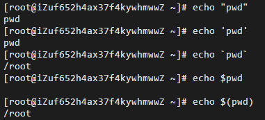

##### 查看或修改文件（其实只要向一个不存在的文件输出，都会创建文件）
###### vi/vim
编辑方式查看，可修改；没有文件则创建文件

三种模式：命令行模式、插入模式、底行模式
- 切换到命令模式（Command mode）：按Esc键
    - 使用命令vim filename后进入编辑器视图后，默认模式就是命令模式
        - vim hello.txt
    - 在命令模式中控制光标移动和输入命令，可对文本进行复制、粘贴、删除和查找等工作
    - 命令模式下快捷操作
        - dd     快速删除一行
        - yy     复制当前行
        - nyy   从当前行向后复制几行（3yy表示复制3行）
        - p       粘贴
        - yyp   复制光标所在行，并粘贴
 
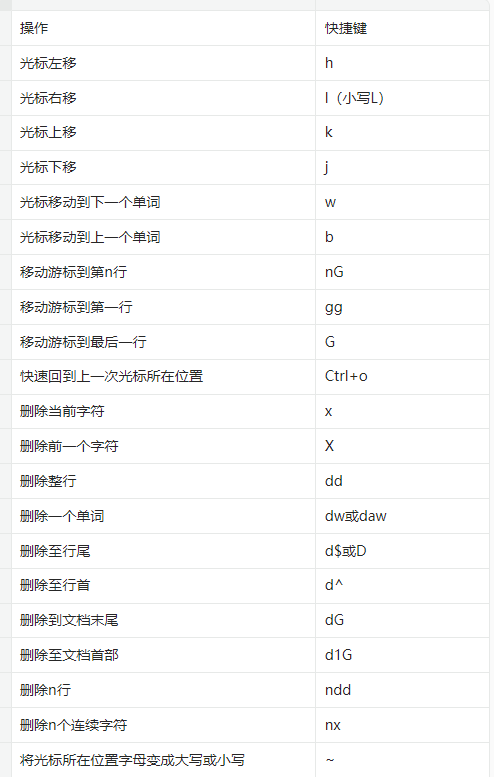

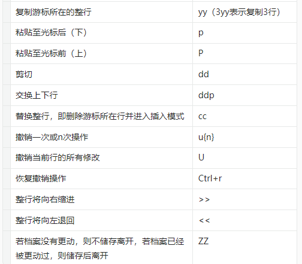

- 切换到插入模式（Insert mode）：按 i 键
    - i 在当前位置前插入
    - I 在当前行首插入
    - a 在当前位置后插入
    - A 在当前行尾插入
    - o 在当前行之后插入一行
    - O 在当前行之前插入一行

- 切换到底行模式/底线命令模式（Last line mode）：按 :（冒号）
    - :q                      退出
    - :q!                     强制退出
    - :wq                   保存并退出
    - :set number     显示行号
    - :set nonumber  隐藏行号
    - :/apache            在文档中查找apache 按n跳到下一个，shift+n上一个

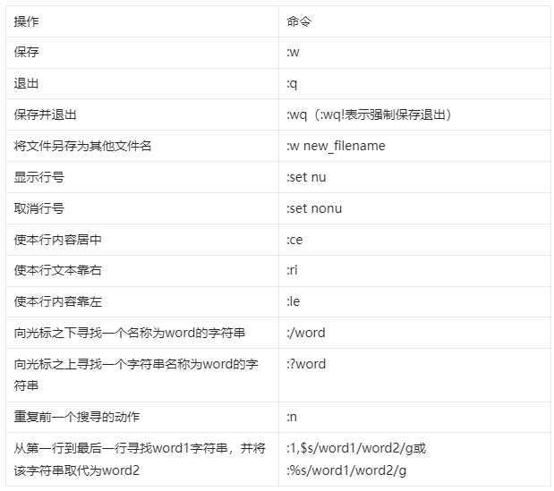

##### 查看文件内容/查看日志
###### cat（concatenate，连接文件并显示输出）

显示全部文件内容，通常可用管道与more和less一起使用

- cat file1 从第一个字节开始正向查看文件的内容
- tac file1 从最后一行开始反向查看一个文件的内容
- cat -n file1 标示文件的行数
- more file1 查看一个长文件的内容
- head -n 2 file1 查看一个文件的前两行
- tail -n 2 file1 查看一个文件的最后两行
- tail -n +1000 file1 从1000行开始显示，显示1000行以后的
- cat filename | head -n 3000 | tail -n +1000 显示1000行到3000行
- cat filename | tail -n +3000 | head -n 1000 从第3000行开始，显示1000(即显示3000~3999行)

通过管道将命令”cat file_name.txt” 和 ’more’ 连接在一起可以实现这个
- [root@localhost ~]# cat file_name.txt | more

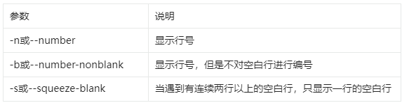

###### tail
动态查看，仅查看尾部，还可以指定行数

- tail -f example.log
    - 动态查看，会自动显示新增内容，屏幕只显示10行内容的（可设置）
- tail -n 10 example.txt
    - 查看文件最后10行
- tail -f -n 5 /var/log/messages  ｜ tail -n 5 -f /var/log/messages ｜ tail -5f  /var/log/messages
    - 查看/var/log/messages系统日志文件的最新10行，并保持实时刷新
    - 按ctrl+c键退出文本实时查看界面
    - 反例：
        - tail -5 -f file
        - tail -f -5 file

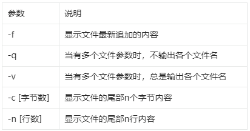

###### head
仅查看头部，还可以指定行数

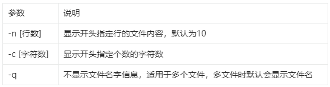

head -n 2 file # 查看前两行文件内容
head -2 file  # 与上行一样

###### 分页显示
- more
    - 分页显示文件内容
        - 一页页地查看一个大文件的内容
    - 操作
        - 按空格键显示下一个画面
        - 回车显示下一行内容
        - 按 q 键退出查看

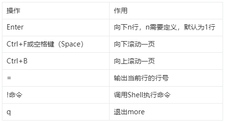

- less
    - 与more类似，不同的是less可以通过PgUp、PgDn键来上下翻页

参数

操作

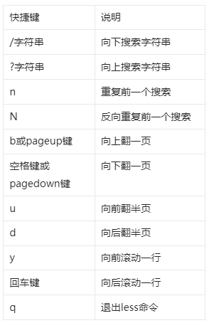

##### 文件内容统计
###### wc（Word Count）
参数：- c 统计字节数 - l 统计行数 - w 统计字数

wc -l /etc/passwd   统计/etc/passwd文件的行数

##### 查看文件类型
###### file
####### file test1.txt

##### 比较文件差异
###### diff
对比结果中的3c3表示两个文件在第3行有不同，5,6d4表示2.log文件相比1.log文件在第4行处开始少了1.log文件的第5和第6行

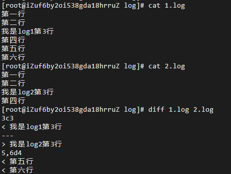

#### 搜索
##### 文本搜索
###### grep（global regular expression print，全局正则表达式打印）
是一种强大的文本搜索工具，它能使用正则表达式搜索文本，并把匹配的行打印出来。

命令格式：grep [参数] [正则表达式] [文件]

####### 查询不包括
grep -v  str file

####### grep Aug /var/log/messages            在文件 '/var/log/messages'中查找关键词"Aug"
grep ^Aug /var/log/messages          在文件 '/var/log/messages'中查找以"Aug"开始的词汇
grep [0-9] /var/log/messages           选择 '/var/log/messages' 文件中所有包含数字的行

grep 'ntp[0-9].aliyun.com' /etc/ntp.conf  使用正则表达式匹配httpd配置文件中异常状态码响应的相关配置
grep -r *.sh /etc   以递归的方式查找etc目录下含有关键字"*.sh"的文件

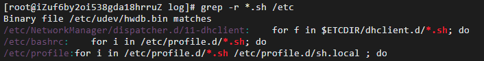

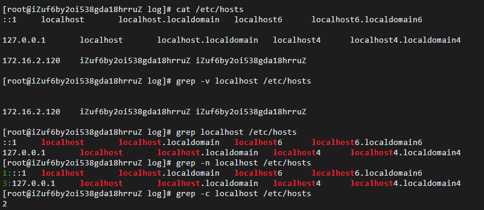

####### 参数

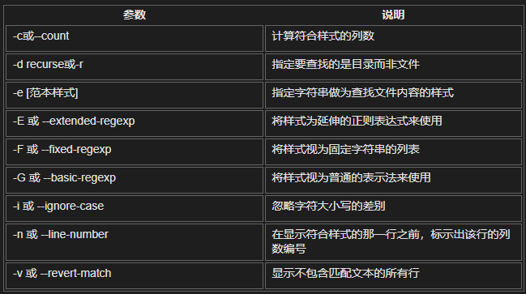

##### 文件搜索
###### find
find <指定目录> <指定条件> <指定动作>

find / -name 'b'        查询根目录下（包括子目录），名为b的目录和文件； 
find / -name 'b*'	查询根目录下（包括子目录），名为b开头的目录和文件；
find . -name "*.log" -ls           在当前目录查找以.log结尾的文件，并显示详细信息 
find / -user user1 搜索属于用户 'user1' 的文件和目录

find . -type d | sort              查找当前所有目录并排序
find . -type f -name "*.log"       查找当目录，以.log结尾的普通文件
find /usr/bin -type f -atime +100 搜索在过去100天内未被使用过的执行文件
find /usr/bin -type f -mtime -10 搜索在10天内被创建或者修改过的文件

find /root/ -perm 600              查找/root/目录下权限为600的文件

find . -size +100M                 查找当前目录大于100M的文件

###### 
whereis 加参数与文件名
whereis halt 显示一个二进制文件、源码或man的位置

locate 只加文件名

###### which
which halt 显示一个二进制文件或可执行文件的完整路径

### 权限管理命令（文件权限修改）
#### 通过ll（或ls -l）命令可查看文件权限信息
##### 
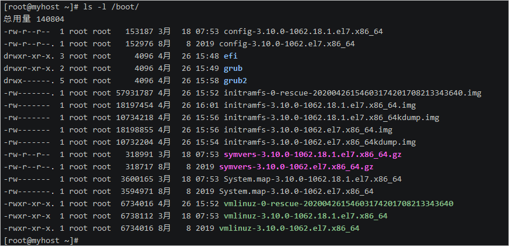

###### 第一列是文件权限信息，共10位字符
● 第1位表示存档类型，d表示目录，-表示一般文件。

● 第2~4位表示当前用户的权限（属主权限）。

● 第5~7位表示同用户组的用户权限（属组权限）。

● 第8~10位表示不同用户组的用户权限（其他用户权限）。

第三列是文件的属主（user）

第四列是文件的属组（group）

#### chmod（change mode）
##### 文件权限
###### 属主（user）
属组（group）
其他用户（other）

####### r  4
可读

####### w 2
可写

####### x  1
可执行

变更文件或目录的权限

##### 方式1
chmod 777 file.java   # 所有用户都有file.java的所有权限
chmod 755 a.txt          # 对于a.txt，user有所有权限，group和other可读可执行，但不可写

##### 方式2
u表示属主（user），g表示属组（group），o表示其他（other），a表示所有用户（all）

使用 "+" 添加权限，使用 "-" 取消权限，使用“=”赋值权限

chmod u+x a.txt  #a.txt的user添加执行权限
chmod u=rwx,g=rx,o=rx a.txt        # 对于a.txt，user有所有权限，group和other可读可执行，但不可写
chmod ugo+rwx directory1  所有用户有所有权限
chmod go-rwx directory1 删除群组(g)与其他人(o)对目录的读写执行权限

#### 改变文件所有者
##### chown（change owner）
###### chown user1 file1 改变一个文件的所有人属性
chown -R user1 directory1 改变一个目录的所有人属性并同时改变改目录下所有文件的属性
chown user1:group1 file1 改变一个文件的所有人和群组属性
新建一个文本文件test.txt，用ll命令可以看到该文件的属主和属组是root。whoami命令可以查看当前Shell环境登录的用户名

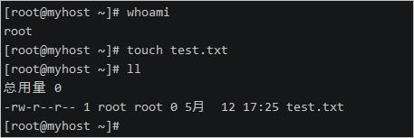

####### 创建两个用户:test和admin
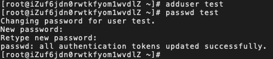

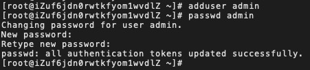

修改test.txt文件的属主用户为test

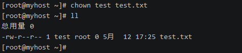

修改test.txt文件的属主和属组为admin

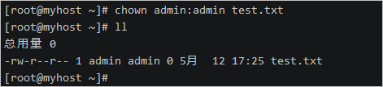

#### 改变文件所属用户组
##### chgrp（change group）
###### chgrp group1 file1 改变文件的群组
将test.txt文件的属组改为root

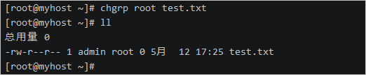

### 进程管理命令
#### 查看当前进程
##### ps（Processes Status，进程状态）
###### 显示所有进程/查看所有正在运行的进程
ps -ef

###### 查看指定进程/查看一个程序是否运行
ps -ef|grep tomcat     查看所有有关tomcat的进程（会查出grep本身）
ps -ef | grep sshd       查找指定ssh服务进程（会查出grep本身）
ps -ef | grep sshd | grep -v grep   查找指定服务进程，排除gerp本身(推荐) 

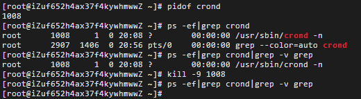

 
ps -ef | grep sshd -c               查找指定进程个数

###### 参数

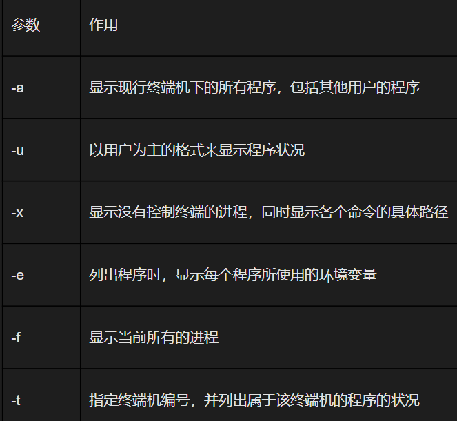

-A ：所有的进程均显示出来
-a ：不与terminal有关的所有进程
-u ：有效用户的相关进程
-x ：一般与a参数一起使用，可列出较完整的信息
-l ：较长，较详细地将PID的信息列出

##### pidof
查询指定服务进程的PID值

pidof crond //查询出crond服务下的所有进程ID

##### 动态显示各进程资源占用情况（类似于windows的任务管理器）/动态显示当前耗费资源最多进程信息
###### top
####### 实时监视进程活动和系统资源
######## 输出结果分为两个区域，统计信息区和进程信息区
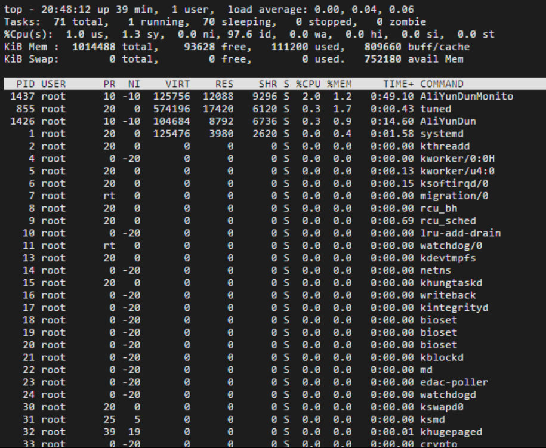

######### 统计信息区
第一行信息依次为：系统时间、运行时间、登录终端数、系统负载（三个数值分别为1分钟、5分钟、15分钟内的平均值，数值越小意味着负载越低）。

第二行信息依次为：进程总数、运行中的进程数、睡眠中的进程数、停止的进程数、僵死的进程数。

第三行信息依次为：用户占用资源百分比、系统内核占用资源百分比、改变过优先级的进程资源百分比、空闲的资源百分比等。

第四行信息依次为：物理内存总量、内存使用量、内存空闲量、作为内核缓存的内存量。

第五行信息依次为：虚拟内存总量、虚拟内存使用量、虚拟内存空闲量、预加载内存量。

######### 进程信息区
########## PID
进程ID

########## USER
进程所有者的用户名

########## PR
进程优先级

########## NI
nice值。负值表示高优先级，正值表示低优先级

########## VIRT
进程使用的虚拟内存总量，单位kb

########## RES
进程使用的、未被换出的物理内存大小，单位kb

########## SHR
共享内存大小，单位kb

########## S
进程状态D：不可中断的睡眠状态R：正在运行S：睡眠T：停止Z：僵尸进程

########## %CPU
上次更新到现在的CPU时间占用百分比

########## %MEM
进程使用的物理内存百分比

########## TIME+
进程使用的CPU时间总计，单位1/100秒

########## COMMAND
命令名

按 q 键退出监控页面

###### htop
更友好的进程监视器

##### 查看java进程
###### jps
jps(Java Virtual Machine Process Status Tool)是JDK 1.5提供的一个显示当前所有java进程pid的命令，简单实用，非常适合在linux/unix平台上简单察看当前java进程的一些简单情况。

#### 终止进程
##### kill（用pid杀进程）
kill 2868  杀死2868编号的进程（pid：进程号/线程号）
kill -9 2868   强制杀死2868编号的进程

###### 参数
####### 9
强制关闭

##### killall（用进程名称杀进程）
killall命令用于终止指定名称的服务对应的全部进程

killall crond  //删除crond服务下的所有进程

#### 进程状态
D 不可中断 Uninterruptible（usually IO）
R 正在运行，或在队列中的进程
S 处于休眠状态
T 停止或被追踪
Z 僵尸进程
X 死掉的进程

### 网络通讯命令
#### 主机名配置
hostname  查看主机名

##### hostname xxx    修改主机名，重启后无效
如果想要永久生效，可以修改/etc/sysconfig/network文件

#### 查看ip地址（查看网卡信息）
##### ifconfig
ifconfig | more

###### 
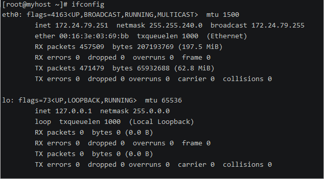

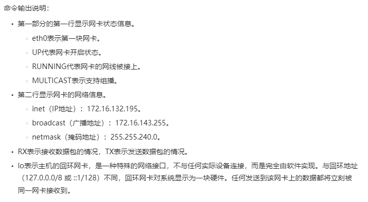

##### 修改ip地址
ifconfig eth0 192.168.12.22 修改ip地址

如果想要永久生效
修改 /etc/sysconfig/network-scripts/ifcfg-eth0文件

#### 配置域名
在/etc/hosts中添加

#### 防火墙设置
防火墙根据配置文件/etc/sysconfig/iptables来控制本机的”出”、”入”网络访问行为。
service iptables status 查看防火墙状态
service iptables stop 关闭防火墙
service iptables start 启动防火墙
chkconfig  iptables off 禁止防火墙自启

#### 端口相关
##### netstat（显示网络状态信息）
###### 查看进程端口号
netstat -tunlp|grep 8080

###### 查看端口占用情况
netstat -tln | grep 8080 查看端口8080的使用情况

###### 搜索指定端口
netstat -an | grep 8080

###### 查看当前系统端口
netstat -an

##### 查看端口属于哪个程序
lsof -i :8080

#### 网络监测（查看与某台机器的连接情况）
ping

### 用户管理命令
#### 查看当前用户
##### whoami
Note：每个用户的home目录是不一样的

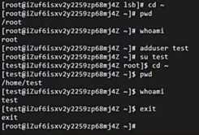

#### 切换用户
##### su（switch user）
su test   切换到test用户

#### 添加用户
##### useradd
 useradd test  添加test用户

#### 删除用户
##### userdel
userdel test  删除test用户

#### 退出当前登录用户
exit

#### 显示所有在线登录用户/查看当前谁在使用该主机
who

#### 显示用户最近登录信息
##### last
由于这些信息都是以日志文件的形式保存在系统中，黑客可以很容易地对内容进行篡改，所以该命令输出的信息并不能作为服务器是否被入侵的依据

### 系统管理命令
#### 参数
-r             关机重启

-h             关机不重启

#### 关机
shutdown -h now 立刻关机
poweroff               立刻关机
init 0      关闭系统
telinit 0    关闭系统
shutdown -h hours:minutes & 按预定时间关闭系统（shutdown -h 5          5分钟后关机）
shutdown -c 取消按预定时间关闭系统
halt               关机

#### 重启

shutdown -r now 立刻重启
reboot 立刻重启
shutdown -r 5          5分钟后重启

logout 注销

#### uptime
##### 查看系统的负载信息

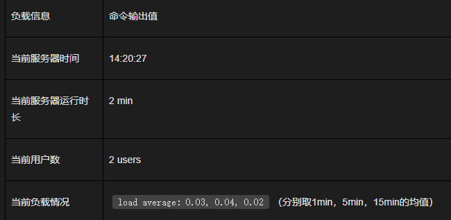

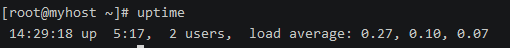

#### uname
##### 查看系统内核与系统版本等信息
###### 完整系统信息（-a）
uname -a

主机名称

操作系统名称

操作系统发行编号

硬件架构

#### 显示内存使用情况
##### free
free -h  显示当前系统中内存的使用量信息

###### 参数

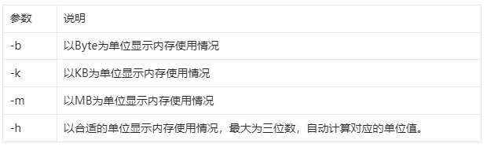

###### 结果分析

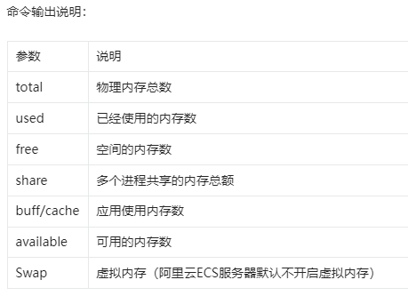

## Linux不常用命令
### 磁盘管理
#### df与du通用参数
##### a（all）
列出所有的

##### h
以GBytes、MBytes、KBytes为单位，返回容量

##### k
以KBytes为单位，返回容量

##### m
以MBytes为单位，返回容量

#### df
查看磁盘空间使用情况

##### df          查看磁盘空间使用情况
df -i      以inode模式来显示磁盘使用情况
df -h     带有单位显示磁盘使用情况（以GBytes、MBytes、KBytes等格式显示各文件系统容量）
df -aT   显示系统内的所有特殊文件格式、名称及磁盘使用情况

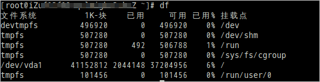

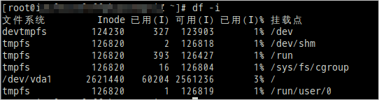

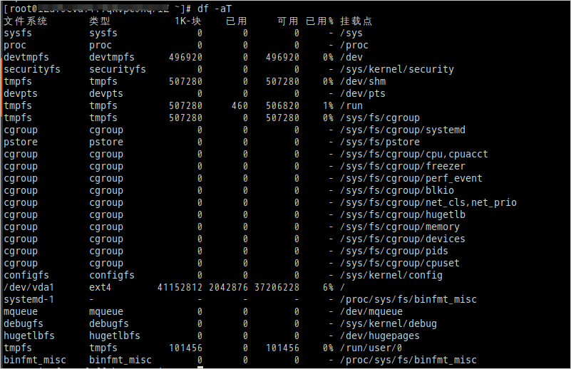

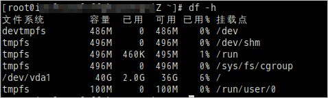

##### 参数
###### H
以M=1000K取代M=1024K的进位方式显示各文件系统容量

###### T
显示文件系统类型

###### i
显示inode信息

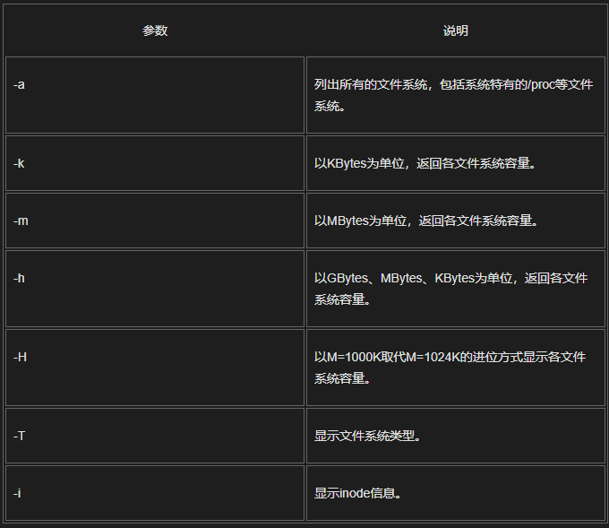

#### du（disk usage）
查看当前目录下磁盘的使用空间

##### du                     列出当前目录下的所有文件夹的容量
du -a                列出当前目录下的所有文件夹和文件的容量
du -h /home    带有单位显示目录的磁盘使用情况信息
du -ah              列出当前目录下的所有文件夹和文件的容量，并以G、M、K格式显示容量
du -sm /*         列出根目录底下每个目录所占用的容量，并以MBytes单位显示容量

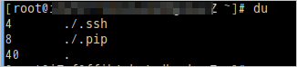

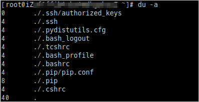

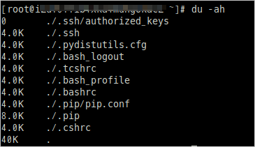

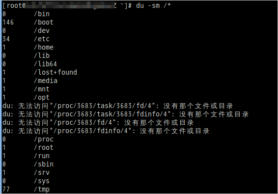

##### 参数
###### s
列出总量

###### S
列出不包括子目录下的总量

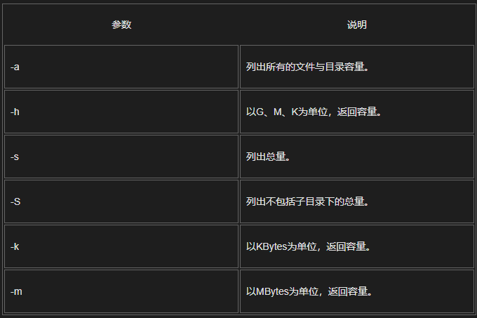

#### fdisk
用于磁盘分区

### 打包、压缩和解压命令
#### tar（tape archive，打包归档）
##### 参数
c 创建一个新tar文件

v（view）显示压缩或解压缩过程信息

f 指定文件名

t 查看压缩文件的内容

x 解开tar文件

###### 进行压缩
z 调用gzip进行压缩

j 调用bzip2进行压缩

##### 打包，不进行压缩
tar –cvf abc.tar ./*                                 将当前目录下所有文件打包，命名为abc.tar
tar -cvf start.tar a.java b.java	       将当前目录下a.java、b.java打包，命名为start.tar

##### 打包，并且压缩

tar -zcvf start.tar.gz a.java b.java	   将当前目录下a.java、b.java打包并用gzip压缩为start.tar.gz
tar -zcvf start.tar.gz ./*		                   将当前目录下的所有文件打包并用gzip压缩为start.tar.gz

tar -jcvf /home/abc.tar.bz2 /home/abc      打包，并用bzip2压缩

##### 解压
如果想解压缩，就直接替换上面的命令  tar -cvf  / tar -zcvf  / tar -jcvf 中的“c” 换成“x” 就可以了

tar -xvf start.tar				//解压start.tar压缩包，到当前文件夹下；
tar -xvf start.tar -C usr/local 		//解压start.tar压缩包，到/usr/local目录下；

tar -zxvf start.tar.gz			         //解压start.tar.gz压缩包，到当前文件夹下；
tar -zxvf start.tar.gz -C usr/loca            	//解压start.tar.gz压缩包，到/usr/local目录下；

##### 列出压缩文件列表
tar -tzf test.tar.gz

#### zip与unzip
##### zip 压缩
zip lib.zip tomcat.jar					//将单个文件压缩(lib.zip)
zip -r lib.zip lib/					//将目录进行压缩(lib.zip)
zip -r lib.zip tomcat-embed.jar xml-aps.jar		//将多个文件压缩为zip文件(lib.zip)

##### unzip 解压
unzip file1.zip  					//解压一个zip格式压缩包
unzip -d /usr/app/com.lydms.test.zip			//将`test.zip`包，解压到指定目录下`/usr/app/`

### 查看各类环境变量
#### env
查看所有 env
查看某个，如 home： env $HOME

### 后台任务命令
#### 执行睡眠（挂起当前进程 fg 恢复后台）
ctrl+z

#### 使命令后台运行
一般都是使用 & 在命令结尾来让程序自动运行。(命令后可以不追加空格)

#### 查看后台任务
job -l

#### 把后台任务调到前台执行
fg（foreGround）

#### 把停下的后台任务在后台执行起来/将挂起的进程放在后台执行
bg（background）

### 服务管理
#### 服务的基本概念
服务的英文为 service ，服务顾名思义是就是能为系统或者用户提供某种特殊的服务的程序，只不过一般这种程序是常驻后台，不是直接运行的，这种程序一般叫做守护进程daemon

#### 常见的服务
SSH 用于能随时连接到服务器，提供这个服务的程序是 sshd

cron 提供定时任务的服务，提供这个服务的程序是 crond

#### systemctl命令（以crond服务为例）

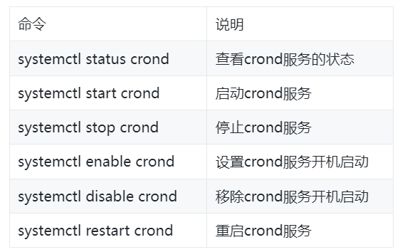

### wget
#### 下载文件
##### wget -P /root/static/img/ http://img.alicdn.com/tfs/TB1.R._t7L0gK0jSZFxXXXWHVXa-2666-1500.png
下载一张图片到路径/root/static/img/中

##### wget https://mirrors.tuna.tsinghua.edu.cn/apache/maven/maven-3/3.8.4/binaries/apache-maven-3.8.4-bin.tar.gz
下载maven

#### 参数
-P 指定目录。如不指定路径，默认是当前路径

## 专业术语
ECS（Elastic Compute Service）：云服务器

