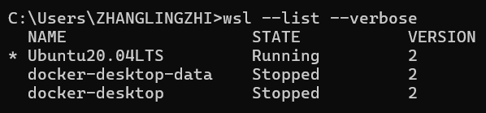
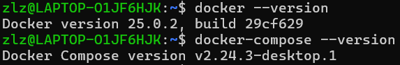

# WSL2
## 查看wsl版本
wsl --list --verbose

Note：wsl 命令通常是在 Windows 命令提示符或 PowerShell 中运行的，而不是在 WSL 内部运行的

## 在wsl中使用docker和docker-compose
### 打开Docker Desktop
Note:每次使用docker，都要先打开Docker Desktop

### 核对设置
在 "General" 选项卡中，确保选中 "Use the WSL 2 based engine"

在 "Resources" -> "WSL Integration" 选项卡中，确保启用了你想要在其中使用 Docker 的 WSL 发行版（例如 Ubuntu20.04LTS）。

### 验证
docker --version
docker-compose --version

