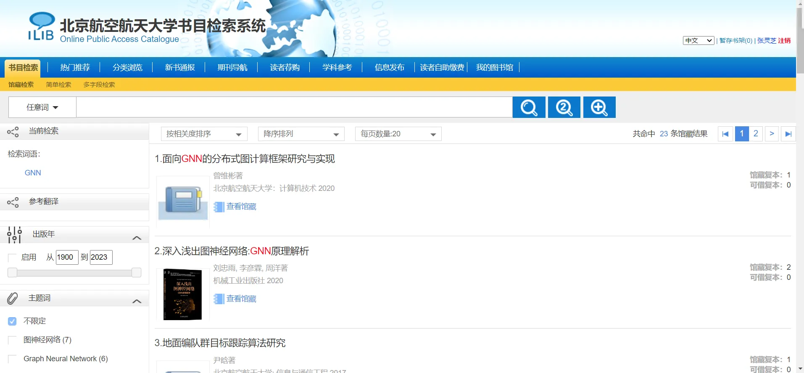

# 文献调研

# 文献调研的重要性与意义

## 充分利用已有资源：推动社会进步与发展

## 提高创新能力：提高自学能力，培养创新人才

信息检索能力是研究生应该具备的一种重要的信息素养之一

具备了这种能力，就可以说具备了终身学习的能力基础， 它可以帮助人们解决在一生的学习和工作中可能遇到的各种疑难问题

## 提供研究思路、节约研究时间

一定要重视学术文献的查阅和利用，学会站到巨人的肩膀上，不重复造轮子

## 量变到质变

## 提高研究起点：继承和借鉴前人成果，避免重复研究

**这个课题是如何提出来的，前人在此方面已经做了什么工作，是如何做的，有和成果和经验、教训，还存在什么问题**

**开题报告必须回答上述几个问题+你打算怎么做**

文献调研是开展科研工作的第一步，也是最为关键的一步

# 文献调研的原则、方法与步骤

## 文献调研原则

## 文献调研方法

## 文献调研步骤

### A课题、任务分析

课题：基于图神经网络的日志异常检测研究

学科：计算机，AI

语种：中文，英文

年代范围：

近3-5年文献至少10篇

近2年内文献至少1篇

所需信息数量：

文献至少30篇

外文文献至少15篇

中文文献至少1篇

教材不应列为参考文献，不太建议，但不禁止

### B确定检索词

中文检索词：异常检测、日志、GNN、图

英文检索词：**Anoma、Fault、Diagnos、Detect、graph、GNN**

**异常检测惯用表达：Anomaly Detection**

Note：

1、检索词可参考其他论文里的关键词

2、根据检索反馈，反复调整检索词，直到得到相对满意的检索结果

3、扩检与缩检

4、截词检索

### C选择数据库：见【文献搜集】

### D阅读分析检索结果：见【文献管理和利用】

# 文献搜集

## 文献搜集渠道

### 校图书馆

[北航图书馆](https://lib.buaa.edu.cn/)

[北航图书馆文献检索](https://lib.buaa.edu.cn/db/)

[北航图书馆书目检索](https://d.buaa.edu.cn/http/77726476706e69737468656265737421ffe7409f693c6152300a9cad991b2631269d68bb/opac/search_adv.php#/index)

### CCF常识普及

[https://www.ccf.org.cn](https://www.ccf.org.cn/)

CCF，即中国计算机学会(China Computer Federation)，是专攻计算机领域的

一般来说ABC类都是指的CCF所推荐的高水平会议期刊，也就是CCF A、CCF B、CCF C。是计算机专业领域的权威人士对CCF的一些期刊会议的评级。

[中国计算机学会推荐国际学术会议和期刊目录-2019.pdf](https://www.yuque.com/attachments/yuque/0/2023/pdf/22983971/1685065877106-4e101292-f0a9-41d4-a92e-04d056030b57.pdf)

### ICSE&FSE

导师说：ICSE 2022/2021、FSE 2022/2021的technical track的论文也最好看下

| 会议简称 | 出版社 | 网址 |
| --- | --- | --- |
| FSE | ACM | http://dblp.uni-trier.de/db/conf/sigsoft/ |
| ICSE | ACM/IEEE | http://dblp.uni-trier.de/db/conf/icse/ |

**异常检测惯用表达：Anomaly Detection**

搜索关键词：**Anoma、Localiz、Fault、Diagnos、Detect**

### 找不到可用方法

researchgate

### 谷歌搜索

1、谷歌学术搜索

可看被引次数

可限定年份

2、检索pdf（一般都会加这个）

在论文题目或关键词前加"[pdf]"或在后加":pdf"在谷歌中搜索

关键词检索（基本检索&高级检索）：高级检索里查PDF文件

### 百度搜索

1、百度学术

2、百度文库，选择PDF，进行搜索

### 杂七杂八

goggle  谷歌

aws  亚马逊

国家统计局

[http://www.stats.gov.cn/](http://www.stats.gov.cn/)

官方平台，数据资源十分丰富，涵盖了经济、工业、全国普查、生产资料、就业人员平均工资等情况的数据。

国家数据

[https://data.stats.gov.cn/](https://data.stats.gov.cn/index.htm)

数据可视化，很多数据指标都以图表呈现，有助于查询者更直观地了解一些统计指标。

[小木虫期刊搜索](http://muchong.com/journal.php)

CSDN

[https://www.socolar.com/](https://www.socolar.com/)

arXiv 没有经过同业评审，找论文出处要尽量避免此

## 文献类型查找渠道

### 最新进展，研究动向：期刊论文、会议论文、专利、学位论文

### 中国知网

[https://www.cnki.net/](https://www.cnki.net/)

目前国内查找学术文献比较齐全的网站，核心期刊和专业期刊一般都能找到

### 维普网

[https://www.cqvip.com/](http://www.cqvip.com/)

### 万方数据知识服务平台

[https://www.wanfangdata.com.cn/](https://www.wanfangdata.com.cn/)

### 人大复印报刊资料库

[https://www.rdfybk.com/](https://www.rdfybk.com/)

精选了国内期刊、报纸，汇集了自改革开放以来国内报刊公开发表的数千种人文社科学术研究成果的精萃，对文科类的同学来说简直就是宝藏

### Nature

[https://www.nature.com/](https://www.nature.com/)

全球著名的科技期刊之一。Nature及相关出版物具有极高的影响因子，内容涵盖生命科学、临床和物理科学等领域。想找国外文献资料的同学不妨试试这个网站

### 权威，系统：图书、专著

### 中国国家图书馆·中国国家数字图书馆

[http://www.nlc.cn/](http://www.nlc.cn/)

图书资源十分丰富，内容规范，权威性强

### 鸠摩搜书

[https://www.jiumodiary.com/](https://www.jiumodiary.com/)

一个电子书狂热爱好者自建的搜索平台，虽然主页看上去不够高大上，但这一点都不影响它的实用性。

### Library Genesis

[http://www.libgen.is/](http://www.libgen.is/)

这是一个非常有名的外文书籍下载网站，支持书籍、论文、杂志等查找和下载，可提供多种版本。

该网站还支持equb、azw等格式阅读，对于喜欢kindle的同学来说很友好。

# 文献管理和利用

## 文献管理

文献可靠性甄别

文献阅读

文献摘录

多文献组织编排

## 关注独特数据

1、作者和机构

跟踪和了解相关作者和机构的研究成果及动态

2、参考文献

顺着找更多文献，找到最新进展，找到信息源头

3、出版年份，出版来源，学科类别，文献类型

## 文献阅读

