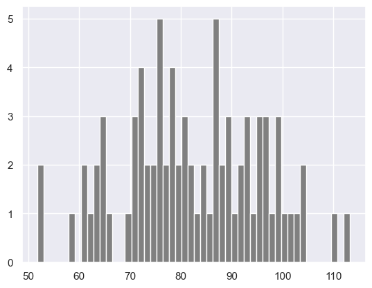

# Python受欢迎的第三方包
  - 1. Numpy
  - 2. Pandas
  - 3. Requests
  - 4. Flask
  - 5. 更多
<!-- more -->
## 1. Numpy
numpy, called numeric python. It is one of the most popular packages in machine learning and data science community. It contains among other things:a powerful N-dimensional array objectsophisticated (broadcasting) functionstools for integrating C/C++ and Fortran codeuseful linear algebra, Fourier transform, and random number capabilities
### 1.1. Install
```
pip install numpy
```
### 1.2. Import&Version&Help
```
# 导入
import numpy
# 查看版本
print('numpy:', np.__version__)
# 查看可用方法
print(dir(np))
```
### 1.3. Create

```
""" array """
# np.array
np.array(sequence) # 不设定类型
np.array(sequence,dtype) # 设定类型
Note:
sequence可以是list,可以是tuple
dtype取值类型：int,float,bool,str
创建后类型为n维数组：numpy.ndarray

# 值全为0的array
# np.zeros(shape,dtype)
numpy_zeros = np.zeros((3,3),dtype=int)

# 值全为1的array
# np.ones(shape,dtype)
numpy_ones = np.ones((3,3),dtype=int)

# 值全为n的array
numpy_ns = numpy_ones * n

# numpy.arange(start, stop, step)  类似python的内置函数range
odd_numbers = np.arange(1, 20, 2)

""" matrix """
four_by_four_matrix = np.matrix(np.ones((4,4), dtype=float))
```

示例
```
# exp1
python_list = [1,2,3,4,5]
numpy_array_from_list = np.array(python_list, dtype=float)
print(type (numpy_array_from_list))   # <class 'numpy.ndarray'>    
print(numpy_array_from_list) # [1., 2., 3., 4., 5.]

# exp2
python_tuple = (1,2,3,4,5)
numpy_array_from_tuple = np.array(python_tuple)
print(type (numpy_array_from_tuple)) # <class 'numpy.ndarray'>
print('numpy_array_from_tuple: ', numpy_array_from_tuple) # numpy_array_from_tuple:  [1 2 3 4 5]

# exp3
four_by_four_matrix = np.matrix(np.ones((4,4), dtype=float))
print(type(four_by_four_matrix))
print(four_by_four_matrix)
```

### 1.4. Convert
```
# array转list
np_to_list=numpy_array.tolist()
```
### 1.5. Dtype
```
# 数据类型：str, int, float, complex, bool, list, None
# numpy_array所有元素都是同一类型

# 查看数据类型
numpy_array.dtype

# 转换数据类型
str_array = numpy_array.astype('str')
str_array = numpy_array.astype('float').astype('str')
```

示例
```
int_lists = [-3, -2, -1, 0, 1, 2,3]
int_array = np.array(int_lists)
print(int_array.dtype) # int64
```
### 1.6. Shape&Reshape
```
# numpy_array的形状：每个维度的大小
numpy_array.shape

# 改变形状:reshape & flatten
first_shape  = np.array([(1,2,3), (4,5,6)])
reshaped = first_shape.reshape(3,2)
flattened = reshaped.flatten()
```
示例
```
nums = np.array([1, 2, 3, 4, 5])
print('shape of nums: ', nums.shape) # shape of nums:  (5,)

three_by_four_array = np.array([[0, 1, 2, 3],
    [4,5,6,7],
    [8,9,10, 11]])
print(three_by_four_array.shape) # (3, 4)
```
### 1.7. Size
```
# 所有元素之和
numpy_array.size
```

示例
```
numpy_array_from_list = np.array([1, 2, 3, 4, 5])
two_dimensional_list = np.array([[0, 1, 2],[3, 4, 5],[6, 7, 8]])
print('The size:', numpy_array_from_list.size) # The size: 5
print('The size:', two_dimensional_list.size)  # The size: 9
```
### 1.8. Math Operation
```
1、numpy_array与数字：
无需循环，会对每个元素生效

2、numpy_array与numpy_array：
相同位置进行运算
```

示例
```
numpy_array = np.array([1, 2, 3, 4, 5])
a = numpy_array_from_list  + 10
print(a) # [11 12 13 14 15]
b = numpy_array_from_list - 10
print(b) # [-9 -8 -7 -6 -5]
c = numpy_array_from_list * 10
print(c) # [10 20 30 40 50]
d = numpy_array_from_list / 10
print(d) # [0.1 0.2 0.3 0.4 0.5]
e = numpy_array_from_list % 3
print(e) # [1 2 0 1 2]
f = numpy_array_from_list // 10
print(f) # [0 0 0 0 0]
g = numpy_array_from_list  ** 2
print(g) # [ 1  4  9 16 25]

np_list_one = np.array([1,2,3])
np_list_two = np.array([4,5,6]) 
print(np_list_one + np_list_two) # [5 7 9]
print(np_list_one * np_list_two) # [4 10 18]
```
### 1.9. 切片 Slice
```
# 行
numpy_array[0] # 第1行
numpy_array[1] # 第2行
numpy_array[2] # 第3行

# 列
numpy_array[:,0] # 第1列
numpy_array[:,1] # 第2列
numpy_array[:,2] # 第3列

# 元素
numpy_array[1,1] = 55

# 前2行，前2列
numpy_array[0:2,0:2]

# 翻转
numpy_array[::-1,::-1]
```
示例
```
    numpy_array = np.array([[1,2,3],[4,5,6], [7,8,9]])
    numpy_array[::-1,::-1]

""" result：
    array([[9, 8, 7],
           [6, 5, 4],
           [3, 2, 1]])
"""
```
### 1.10. 连接 hstack&vstack
```
1、水平连接（按行）h=Horizontal：np.hstack((np_list_one,np_list_two))
2、垂直连接（按列）v=Vertical ：
np.vstack((np_list_one,np_list_two))
```

```
a = np.array((1,2,3))
b = np.array((4,5,6))
print(np.hstack((a,b))) 
"""
[1 2 3 4 5 6]
"""
print(np.vstack((a,b)))
"""
[[1 2 3]
 [4 5 6]]
"""
a = np.array([[1],[2],[3]])
b = np.array([[4],[5],[6]])
print(np.hstack((a,b)))
"""
array([[1, 4],
       [2, 5],
       [3, 6]])
"""
```
### 1.11. Statistic
- Numpy Functions
  - Min np.min()
  - Max np.max()
  - Mean np.mean()
  - Varience
  - Percentile
  - Standard deviation np.std()
### 1.12. Random
```
1、float
random_float = np.random.random()
2、float array
random_floats = np.random.random(5)
3、int（start,end）左闭右开
random_int = np.random.randint(0, 11)
4、int array （start,end,size）左闭右开
random_int = np.random.randint(2,10, size=4)
random_int = np.random.randint(2,10, size=(3,3))
5、normal array （均值mu,标准差sigma,size）
normal_array = np.random.normal(79, 15, 80)
```

示例
```python
normal_array = np.random.normal(79, 15, 80)
print(normal_array)
import matplotlib.pyplot as plt
import seaborn as sns
sns.set()
plt.hist(normal_array, color="grey", bins=50)

"""normal_array 结果
80个元素的数组，服从均值为79，标准差为15的正态分布
"""
array([ 92.69419484, 100.90522098,  75.66676723,  51.85288324,
        58.93456584,  86.8882653 ,  77.85232879,  80.65229762,
        75.29982406,  61.37092068,  92.2196512 ,  81.4621436 ,
        75.60624329,  78.8313502 ,  95.1988703 ,  71.61367817,
        76.53464648,  79.79467471,  84.64456654,  60.45380126,
        86.26484877,  89.34976733,  76.31257666,  73.19016742,
        87.32942795,  89.14391161, 104.4921231 ,  93.81488786,
        75.73943026,  65.22710178,  92.4933286 ,  91.04748818,
        88.43185823,  71.7591173 ,  76.58885905,  70.56334243,
        96.84237334,  80.68069405,  78.58849189,  74.96428085,
        70.93466647,  65.15164539,  73.95878663,  99.15939347,
        63.39133723,  78.79097971,  85.53327827, 101.79255722,
        63.52833828,  86.50269085, 104.36624717,  89.25578975,
        79.45701012,  81.03987345,  72.25460386,  95.33397222,
        95.60863274,  82.27517837,  83.72772366,  71.53024163,
       109.75087739,  97.12307579,  92.74977091,  69.97209205,
        96.37927411,  91.41644221,  72.94486545, 113.25565357,
        99.60227425,  98.44423374,  98.68006829,  62.1570979 ,
       102.71289562,  87.29671601,  71.36173083,  88.64526558,
        52.90835334,  84.34055885,  64.30992424,  65.63687458])

"""plt.hist结果
array 的第一个元素：50个元素，是每个分桶的高度
array 的第二个元素：51个元素，是区间范围。此处是等宽分组。
从头到尾,每个区间范围的宽度是非常固定的约为0.76。

在默认情况下，plt.hist() 函数使用的是等宽分组
区间间隔一致的是等宽分组
区间间隔不一致，使每个区间内数据数量大致相同的是等频分组。

第一组(51.85 ~ 53.08 )有2个值落在这个范围内。
第二组(53.08 ~ 54.31 )有0个值落在这个范围内。
第三组(54.31 ~ 55.54 )有0个值落在这个范围内。
依此类推。
"""

(array([2., 0., 0., 0., 0., 1., 0., 2., 1., 2., 3., 1., 0., 0., 1., 3., 4.,
        2., 2., 5., 2., 4., 2., 3., 2., 1., 2., 1., 5., 2., 3., 1., 2., 3.,
        1., 3., 3., 1., 3., 1., 1., 1., 2., 0., 0., 0., 0., 1., 0., 1.]),
 array([ 51.85288324,  53.08093864,  54.30899405,  55.53704946,
         56.76510486,  57.99316027,  59.22121568,  60.44927108,
         61.67732649,  62.9053819 ,  64.1334373 ,  65.36149271,
         66.58954812,  67.81760352,  69.04565893,  70.27371434,
         71.50176974,  72.72982515,  73.95788056,  75.18593596,
         76.41399137,  77.64204678,  78.87010219,  80.09815759,
         81.326213  ,  82.55426841,  83.78232381,  85.01037922,
         86.23843463,  87.46649003,  88.69454544,  89.92260085,
         91.15065625,  92.37871166,  93.60676707,  94.83482247,
         96.06287788,  97.29093329,  98.51898869,  99.7470441 ,
        100.97509951, 102.20315491, 103.43121032, 104.65926573,
        105.88732113, 107.11537654, 108.34343195, 109.57148735,
        110.79954276, 112.02759817, 113.25565357]),
 <BarContainer object of 50 artists>)
```



## 2. Pandas
pandas, an open source, BSD-licensed library providing high-performance, easy-to-use data structures and data analysis tools for the Python programming language.

[pandas使用](https://github.com/Asabeneh/30-Days-Of-Python/blob/master/25_Day_Pandas/25_pandas.md)

## 3. Requests
Requests(HTTP 请求)

requests: is a package which we can use to send requests to a server(GET, POST, DELETE, PUT)
We will see get, status_code, headers, text and json methods in requests module:
- get(): to open a network and fetch data from url - it returns a response object
- status_code: After we fetched data, we can check the status of the operation (success, error, etc)
- headers: To check the header types
- text: to extract the text from the fetched response object
 For txt, html, xml and other file formats we can use text.
- json: to extract json data Let's read a txt file from this website

```
# example 1
import requests # importing the request module
url = 'https://www.w3.org/TR/PNG/iso_8859-1.txt' # text from a website
response = requests.get(url) # opening a network and fetching a data
print(response)
print(response.status_code) # status code, success:200
print(response.headers)     # headers information
print(response.text) # gives all the text from the page

# example 2
import requests
url = 'https://restcountries.eu/rest/v2/all'  # countries api
response = requests.get(url)  # opening a network and fetching a data
print(response) # response object
print(response.status_code)  # status code, success:200
countries = response.json()
print(countries[:1])  # we sliced only the first country, remove the slicing to see all countries
```

## 4. Flask
web框架的一种前提：设置虚拟环境

[virtual_environmentpython_web](https://github.com/Asabeneh/30-Days-Of-Python/blob/master/26_Day_Python_web/26_python_web.md)

## 5. 更多

