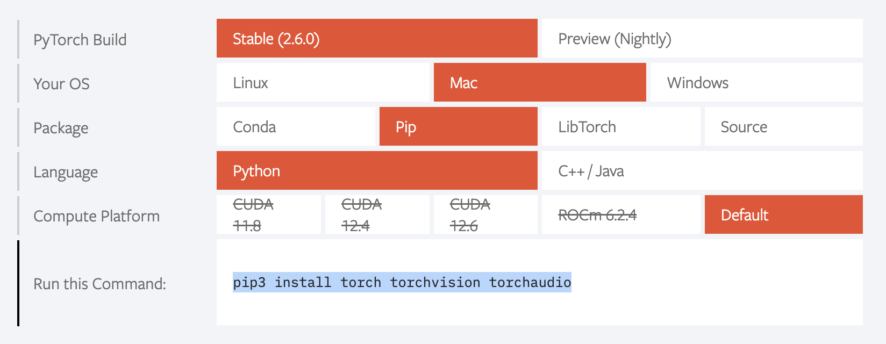

# 主流深度学习框架

## PtTorch与TensorFlow
Tensorflow面向工业界一些，Pytorch面向学术界一些。这是大家认为得比较多的说法。做研究还是用Pytorch的比较多，上手比较快，而且编写代码更轻量级一些，方便调试。如果你是初学的话，可以两个都试试，写写就能发现其中的异同，再做出选择。

- PyTorch: 适合实验室型项目，不适合工业界。简单好用易上手，Facebook加持。PyTorch支持动态计算图，追求尽量少的封装，代码简洁易读，应用十分灵活，接口沿用Torch，具有很强的易用性，同时可以很好的利用主语言Python的各种优势
- TensorFlow Google加持。缺：学习成本高，相当于学习一门新语言。框架本身的语言设计来讲，TensorFlow是比较不友好的，与Python等语言差距很大，有点像基于一种语言重新定义了一种编程语言，并且在调试的时候比较复杂。每次版本的更新，TensorFlow的各种接口经常会有很大幅度的改变，这也大大增加了对其的学习时间

## 安装PyTorch
### 安装
官网获取安装命令在命令行中进行安装（看是否要用虚拟环境）：https://pytorch.org/



### 安装后验证
1. 输入pip list，查看torch是否存在
```
pip list
```
2. 进入python输入如下，看是否正确输出
```
import torch
x = torch.rand(5, 3)
print(x)
```