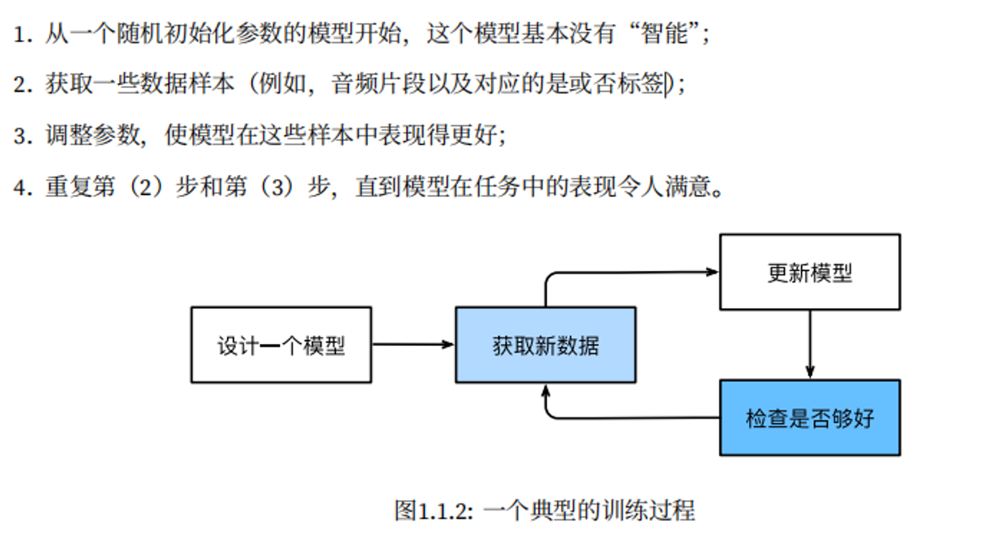
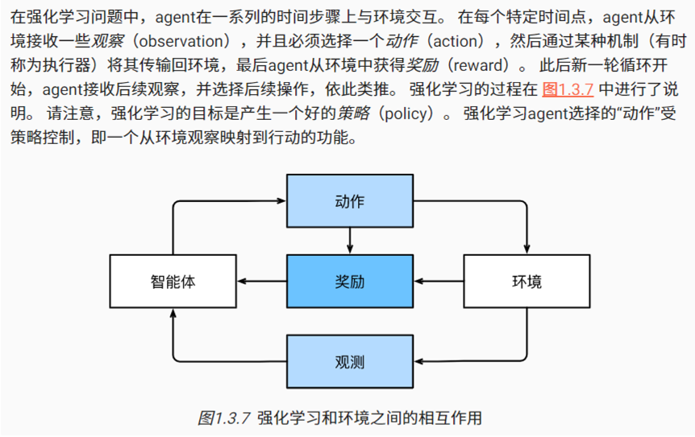
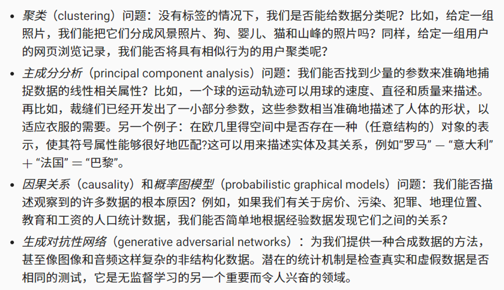
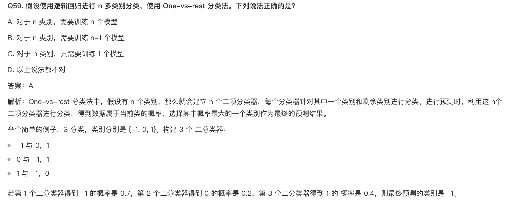
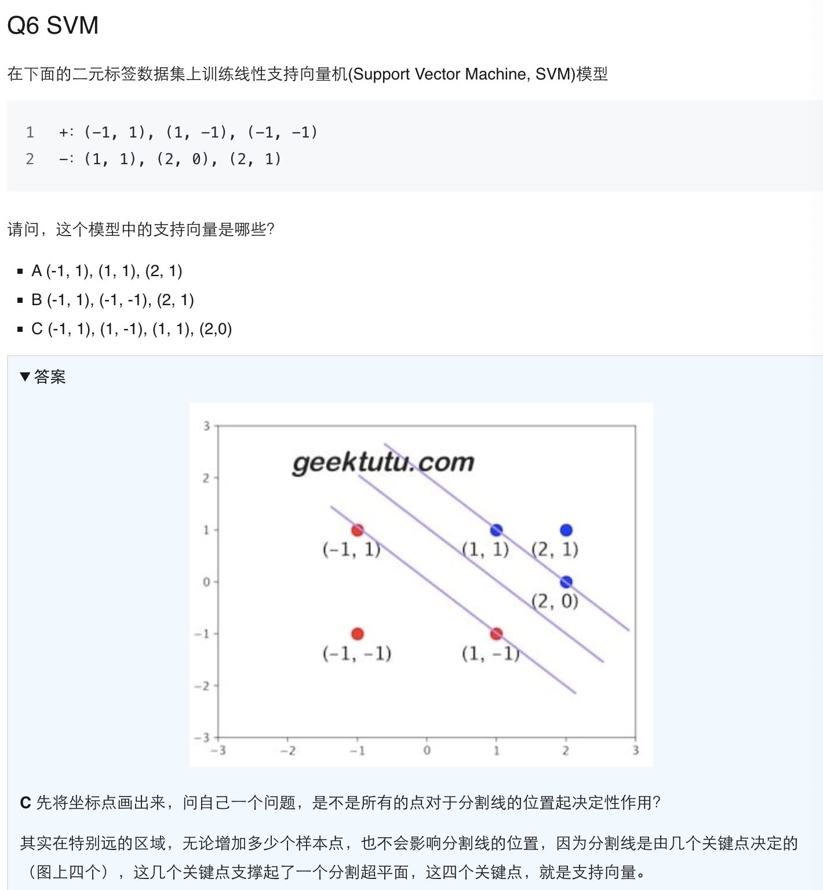
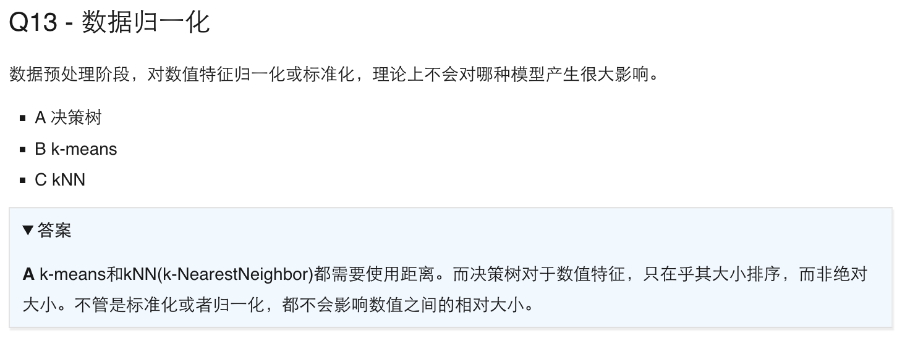
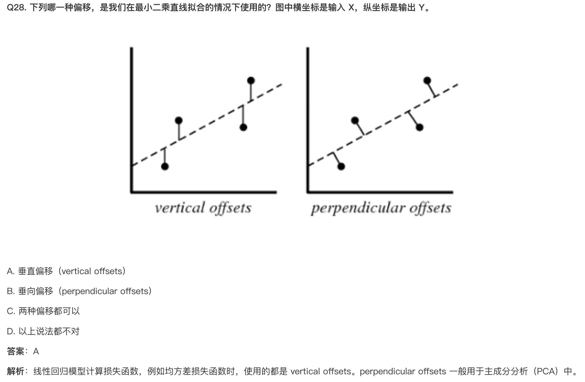
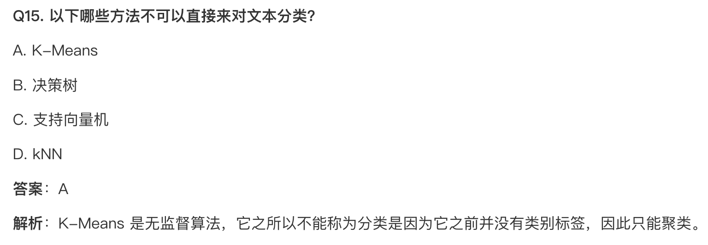

# 人工智能概念解读
  - 1. 机器学习、深度学习与强化学习
  - 2. 有监督学习、半监督学习、无监督学习
  - 3. 在线学习和离线学习
  - 4. 回归，分类与多标签分类
  - 5. 推荐与搜索
<!-- more -->
## 1. 机器学习、深度学习与强化学习
简而言之：
- 机器学习是根据数据提取知识的通用方法。
- 深度学习是机器学习中一个强大的-子集，它侧重于利用神经网络。
- 强化学习则侧重于在决策过程中通过反馈来优化智能体的行为。

### 1.1. 机器学习
机器学习研究计算机系统如何利用经验（通常是数据）来提高特定任务的性能。

用数据来调整模型参数，从而确定程序行为（输⼊-输出映射）。

参数可以被看作旋钮，旋钮的转动可以调整程序的⾏为。

任⼀调整参数后的程序被称为模型（model）。

使⽤数据集来选择参数的元程序被称为学习算法（learning algorithm）。

我们不需要设计“明确的”系统逻辑，只需要定义一个灵活的程序算法，其输出由许多参数（parameter）决定，然后使用数据集来确定当下的“最佳参数集”。

在机器学习中，学习（learning）是⼀个训练模型的过程。通过这个过程，我们可以发现正确的参数集， 从⽽使模型强制执⾏所需的⾏为。换句话说，我们⽤数据训练（train）模型。

这种“通过⽤数据集来确定程序⾏为”的⽅法可以被看作⽤数据编程（programming with data）。

### 1.2. 机器学习中的四大关键组件
- 数据（数据集）data : 可以用来学习的数据
- 模型 model ：如何转换数据的模型
- 目标函数 objective function （损失函数，loss/cost function） ： 量化模型的有效性
- 优化算法（梯度下降,gradient descent）： 调整模型参数以优化目标函数的算法

### 1.3. 深度学习
深度学习是机器学习的一个子集，它使用了一类称为神经网络的算法。深度学习模型特别是卷积神经网络（CNNs）和循环神经网络（RNNs），能够在大量的数据中自动发现表示层次，从而学习数据的高层抽象。深度学习在图像识别、语音识别、自然语言处理等领域表现出色，成为当今很多复杂问题的首选方法。
### 1.4. 强化学习reinforcement learning与环境交互
强化学习是一种与众不同的范式，它关注的是智能体（agent）如何在环境中采取行动，以最大化某种累计奖励。不同于大多数机器学习方法中数据是静态提供的，强化学习强调的是学习与环境之间的交互。智能体通过试错（trial and error）和收获奖励来学习最优策略。

## 2. 有监督学习、半监督学习、无监督学习
 有监督学习（supervised learning）：每个数据样本都有相应标签

 

 半监督学习：部分数据样本有标签或仅采用部分数据样本的标签

 无监督学习（unsupervised learning）：数据样本没有标签

 
## 3. 在线学习和离线学习
离线学习（offline learning）：数据时预先准备好的，固定的

在线学习（online learning）：数据是实时的，变化的
## 4. 回归，分类与多标签分类
### 4.1. 回归regression
在回归中，我们训练一个回归函数，它的输出为预测的数值。

回归问题：任何有关“多少”的问题很可能就是回归问题。标签是任意数值。

### 4.2. 分类classification
分类问题：任何有关“哪一个”的问题很可能就是分类问题。

在分类中，我们训练一个分类器，它的输出为预测的类别。

我们可以试着用概率语言来理解模型。给定一个样本，模型为每个类别分配一个概率。eg.猫狗分类器，输出一个图像是猫的概率是0.9。可以理解为，分类器90%确定图像描绘的是一只猫。

预测类别的概率的大小传达了一种模型的不确定性。
- 单标签分类：类别间相互排斥。
  - 二分类：只有两种类别，最简单的分类问题。
  - 多分类：两个以上的类别。如识别手写数字。
- 多标签分类：也称为标记问题，不相互排斥的类别问题。
### 4.3. 多标签分类 multi-label classification
类别之间不相互排斥。

比如，一张图中有人，汽车，房子等多个物体。一篇博客文章有“机器学习”、“编程语言”、“AI”等多个标签。

## 5. 推荐与搜索
### 5.1. 搜索
如今，搜索引擎使用机器学习和用户行为模型来获取网页相关性得分

谷歌搜索引擎依靠一个简单的相关性过滤来识别一组相关条目，然后根据PageRank对包含查询条件的结果进行排序

### 5.2. 推荐
目标是向特定用户进行“个性化”推荐。

## 常见模型和算法以及用途
- 决策树
  - 分类
- K-means
  - 聚类
- kNN (k-NearestNeighbor)
- 主成分分析(Principal Component Analysis，PCA)
  - 降维
  - 作用于无标签数据
  - PCA的原理是，通过正交变换将一组可能存在相关性的变量转换为一组线性不相关的变量，转换后的这组变量叫主成分
- 线性判别分析(Linear Discriminant Analysis, LDA)
  - 降维
  - 作用于带标签数据
  - LDA的原理是，将带上标签的数据（点），通过投影的方法，投影到维度更低的空间中，使得投影后的点，会形成按类别区分，一簇一簇的情况，相同类别的点，将会在投影后的空间中更接近
- 深度学习SparseAutoEncoder
  - 降维
- 矩阵奇异值分解SVD 
  - 降维
- 逻辑回归(Logistic Regression, LR)
  - 分类
  - Logistic回归虽然名字里带“回归”，但是它实际上是一种分类方法，主要用于两分类问题
- 支持向量机 SVM
  - 分类
  - 优化目标是最大化间隔（margin），又称最大间隔分类器，是一种典型的线性分类器。（使用核函数可解决非线性问题）
- 随机森林
  - 分类
  - 随机森林是一个包含多个决策树的分类器
  - 随机森林是一个包含多个决策树的分类器，并且其输出的类别是由个别树输出的类别的众数而定。随机森林的随机性体现在每颗树的训练样本是随机的，树中每个节点的分裂属性集合也是随机选择确定的。有了这2个随机的保证，随机森林就不会产生过拟合的现象了。
  - 随机森林是用一种随机的方式建立的一个森林，森林是由很多棵决策树组成的，每棵树所分配的训练样本是随机的，树中每个节点的分裂属性集合也是随机选择确定的。

聚类和分类的区别
- 聚类和分类最大的不同在于，分类的目标是事先已知的，而聚类则不一样，聚类事先不知道目标变量是什么，类别没有像分类那样被预先定义出来，所以，聚类有时也叫无监督学习。聚类分析试图将相似的对象归入同一簇，将不相似的对象归为不同簇

生成式模型和判别式模型
- 生成式模型
  - 朴素贝叶斯
  - 混合高斯模型
  - 隐马尔科夫模型(HMM)
  - 贝叶斯网络
  - Sigmoid Belief Networks
  - 马尔科夫随机场(Markov Random Fields)
  - 深度信念网络(DBN)
- 判别式模型
  - K近邻(KNN)
  - 线性回归(Linear Regression)
  - 逻辑回归(Logistic Regression)
  - 神经网络(NN)
  - 支持向量机(SVM)
  - 高斯过程(Gaussian Process)
  - 条件随机场(CRF)
  - CART(Classification and Regression Tree)

