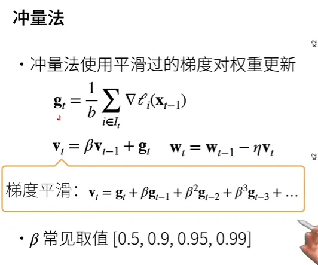

# 神经网络训练要点解读
  - 1. 整体目标
  - 2. 损失函数：量化模型的有效性
  - 3. 优化算法（梯度下降,gradient descent）：调整模型参数以优化目标函数的算法
  - 4. Schedule
  - 5. 超参数
  - 6. 训练整体流程
<!-- more -->

## 1. 整体目标
用数据不断调整神经网络模型的参数，使得模型行为更符合预期。

## 2. 损失函数：量化模型的有效性
|场景|	最常见损失函数|	特点|
|---|---|---|
|回归|	平方误差SE，squared error，即预测值与实际值之差的平方|	很容易被优化|
|分类|	交叉熵cross-entropy</br>最小化错误率，即预测与实际情况不符的样本比例|难以直接优化，通常会优化替代目标|

## 3. 优化算法（梯度下降,gradient descent）：调整模型参数以优化目标函数的算法
梯度下降（gradient descent）， 这种方法几乎可以优化所有深度学习模型。 它通过不断地在损失函数递减的方向上更新参数来降低误差。

梯度，是对每一个特征求偏导组成的向量

梯度下降最简单的用法是计算损失函数（数据集中所有样本的损失均值） 关于模型参数的导数（在这里也可以称为梯度）。 但实际中的执行可能会非常慢：因为在每一次更新参数之前，我们必须遍历整个数据集。 因此，我们通常会在每次需要计算更新的时候随机抽取一小批样本， 这种变体叫做**小批量随机梯度下降**（minibatch stochastic gradient descent）。

梯度下降：对每个样本求梯度

随机梯度下降：随机找一个样本求梯度

小批量随机梯度下降：随机找b个样本求梯度，然后再求平均值

批量很小：收敛快，计算慢

批量很大：相反

批量要取合适的大小，不能太小，也不能太大

冲量法：使用平滑过的梯度对权重更新

冲量法会将之间时刻的梯度也给一定权重，也就是不完全考虑当前时刻的梯度，会考虑之前时刻的梯度



beta取值越小，之前时刻的梯度权重越小；取值越大，之前时刻的梯度权重越大

0.5大概看过去2-3个的样子

0.99大概看以前的50个梯度做平均，如果样本量大也可以用

Adam

sgd+moment效果也挺好了，可以不用adam，因为adam不一定比sgd+moment效果好

但是adam最好的一点是，对学习率没那么敏感，它做了非常多的平滑，可以认为是一个非常非常平滑的sgd，一旦平滑了，对学习率就没那么敏感了

如果没有太多时间调参的话，用adam是一个不错的选项

## 4. Schedule

模型训练中的scheduler（调度器）用于调整优化器的学习率或其他超参数，以便在训练过程中更有效地优化模型参数。学习率是优化算法中的一个重要超参数，它控制着参数更新的步长，对模型的收敛速度和性能有着重要影响。

调度器的主要作用是**在训练过程中动态地调整学习率**或其他超参数，以适应模型训练的不同阶段或遇到的问题。常见的调度策略包括：

1. **学习率衰减（Learning Rate Decay）**：随着训练的进行，逐渐减小学习率，以便在接近最优解时更加精细地调整参数。
2. **学习率步骤调度（Learning Rate Step Schedule）**：在预定的训练步数或 epoch 之后，将学习率降低一个预定的因子。
3. **学习率余弦退火（Learning Rate Cosine Annealing）**：以余弦函数的形式调整学习率，在训练过程中逐渐减小学习率，以实现更平滑的优化过程。
4. **自适应调整（Adaptive Adjustment）**：根据模型的性能指标或其他因素动态地调整学习率或其他超参数。
5. **指数衰减（Exponential Decay）**：以指数函数的形式衰减学习率，通常用于快速收敛到一个较低的学习率。

通过使用调度器，可以使模型在训练过程中更加稳健地收敛，并且能够更好地适应不同的数据分布或训练目标。

## 5. 超参数
|B|表示每个小批量中的样本数，这也称为**批量大小**（batch size）。

η表示*学习率*（learning rate）。

批量大小和学习率的值通常是手动预先指定，而不是通过模型训练得到的。 这些可以调整但不在训练过程中更新的参数称为**超参数**（hyperparameter）。 

**调参**（hyperparameter tuning）是选择超参数的过程。 超参数通常是我们根据训练迭代结果来调整的， 而训练迭代结果是在独立的**验证数据集**（validation dataset）上评估得到的。

深度学习实践者很少会去花费大力气寻找这样一组参数，使得在**训练集**上的损失达到最小。 事实上，更难做到的是找到一组参数，这组参数能够在我们从未见过的数据上实现较低的损失， 这一挑战被称为**泛化**（generalization）。

## 6. 训练整体流程
```python
# 步骤1：准备数据集
train_loader
validate_loader
test_loader

# 步骤2：定义模型
class MyModel(nn.Module):
		def __init__(self):
			pass			
		def forward(self, x):
			pass	
			
# 步骤3：定义损失函数和优化器
model = MyModel()
criterion = nn.CrossEntropyLoss()
optimizer = optim.Adam(model.parameters())

# 步骤4：定义训练函数
def train(model, loader, optimizer, criterion):
		pass

# 步骤5：定义评估函数
def evaluate(model, loader, criterion):
		pass

# 步骤6：定义训练循环
for epoch in range(epochs):
    train_loss, train_acc = train(model, train_loader, optimizer, criterion)
    validate_loss, validate_acc = evaluate(model, validate_loader, criterion)
    print(f'Epoch [{epoch+1}/{epochs}], Train Loss: {train_loss:.4f}, Train Acc: {train_acc:.4f}, '
          f'Validate Loss: {validate_loss:.4f}, Validate Acc: {validate_acc:.4f}')

# 步骤7：测试模型
test_loss, test_acc = evaluate(model, test_loader, criterion)
print(f'Test Loss: {test_loss:.4f}, Test Acc: {test_acc:.4f}')
```

完整案例
```python
import torch
import torch.nn as nn
import torch.optim as optim
from torch.utils.data import DataLoader
from torchvision.datasets import MNIST
from torchvision.transforms import ToTensor
from torch.utils.data import random_split
from sklearn.metrics import precision_score, recall_score, f1_score, roc_auc_score

# 步骤1：准备数据集
# 加载MNIST数据集并进行预处理
dataset = MNIST(root='./data', train=True, download=True, transform=ToTensor())
train_set, validate_set = random_split(dataset, [50000, 10000])  # 划分训练集和验证集
test_set = MNIST(root='./data', train=False, download=True, transform=ToTensor())
train_loader = DataLoader(train_set, batch_size=32, shuffle=True)
validate_loader = DataLoader(validate_set, batch_size=32)
test_loader = DataLoader(test_set, batch_size=32)

# 步骤2：定义模型
class SimpleNN(nn.Module):
    def __init__(self):
        super(SimpleNN, self).__init__()
        self.flatten = nn.Flatten() # 将图片展平
        self.fc1 = nn.Linear(28 * 28, 512) # 第一个全连接层，输入维度为28*28，输出维度为512
        self.relu = nn.ReLU() # ReLU激活函数
        self.dropout = nn.Dropout(0.2) # Dropout层，用于防止过拟合
        self.fc2 = nn.Linear(512, 10) # 第二个全连接层，输入维度为512，输出维度为10，对应10个类别

    def forward(self, x):
        x = self.flatten(x) # 展平输入
        x = self.fc1(x) # 第一个全连接层
        x = self.relu(x) # ReLU激活
        x = self.dropout(x) # Dropout层
        x = self.fc2(x) # 第二个全连接层
        return x

# 步骤3：定义损失函数和优化器
model = SimpleNN() # 实例化模型
criterion = nn.CrossEntropyLoss() # 交叉熵损失函数
optimizer = optim.Adam(model.parameters()) # Adam优化器

# 步骤4：定义训练函数
def train(model, loader, optimizer, criterion):
    model.train() # 切换到训练模式
    running_loss = 0.0
    correct = 0
    total = 0
    for inputs, labels in loader:
        optimizer.zero_grad() # 梯度清零
        outputs = model(inputs) # 前向传播
        loss = criterion(outputs, labels) # 计算损失
        loss.backward() # 反向传播
        optimizer.step() # 更新参数

        running_loss += loss.item() # 记录损失
        _, predicted = torch.max(outputs, 1) # 获取预测结果
        total += labels.size(0) # 计算样本总数
        correct += (predicted == labels).sum().item() # 计算预测正确的样本数

    return running_loss / len(loader), correct / total # 返回平均损失和准确率

# 步骤5：定义评估函数
def evaluate(model, loader, criterion):
    model.eval() # 切换到评估模式
    running_loss = 0.0
    correct = 0
    total = 0
    predictions = []
    actuals = []
    with torch.no_grad():
        for inputs, labels in loader:
            outputs = model(inputs) # 前向传播
            loss = criterion(outputs, labels) # 计算损失

            running_loss += loss.item() # 记录损失
            _, predicted = torch.max(outputs, 1) # 获取预测结果
            predictions.extend(predicted.tolist())
            actuals.extend(labels.tolist())
            total += labels.size(0) # 计算样本总数
            correct += (predicted == labels).sum().item() # 计算预测正确的样本数
		
		precision = precision_score(actuals, predictions, average='macro')
    recall = recall_score(actuals, predictions, average='macro')
    f1 = f1_score(actuals, predictions, average='macro')
    roc_auc = roc_auc_score(actuals, predictions)
    
    # 计算特异性
    conf_matrix = confusion_matrix(actuals, predictions)
    TN, FP, FN, TP = conf_matrix.ravel()
    specificity = TN / (TN + FP)
    
    return running_loss / len(loader), correct / total, precision, recall, specificity, f1, roc_auc

# 步骤6：定义训练循环
epochs = 10
for epoch in range(epochs):
    train_loss, train_acc = train(model, train_loader, optimizer, criterion) # 训练模型
    validate_loss, validate_acc, _, _, _, _, _ = evaluate(model, validate_loader, criterion) # 在验证集上评估模型
    print(f'Epoch [{epoch+1}/{epochs}], Train Loss: {train_loss:.4f}, Train Acc: {train_acc:.4f}, '
          f'Validate Loss: {validate_loss:.4f}, Validate Acc: {validate_acc:.4f}')

# 步骤7：测试模型
test_loss, test_acc, test_precision, test_recall, test_specificity, test_f1, test_roc_auc = self.evaluate(self.test_loader) # 所有轮次的训练结束后，用test数据集进行评估
logger.info(f'[Test] Loss: {test_loss:.4f}, Accuracy: {test_acc:.4f}, Precision: {test_precision:.4f}, '
            f'Recall: {test_recall:.4f}, Specificity: {test_specificity:.4f}, F1_Score: {test_f1:.4f}, ROC_AUC: {test_roc_auc:.4f}')
```