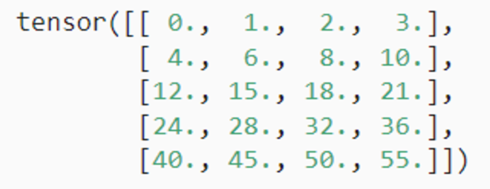
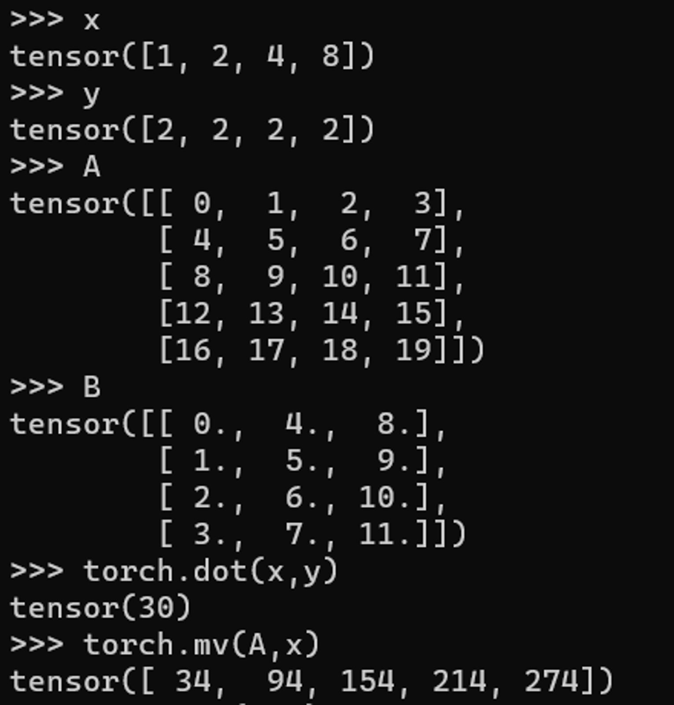
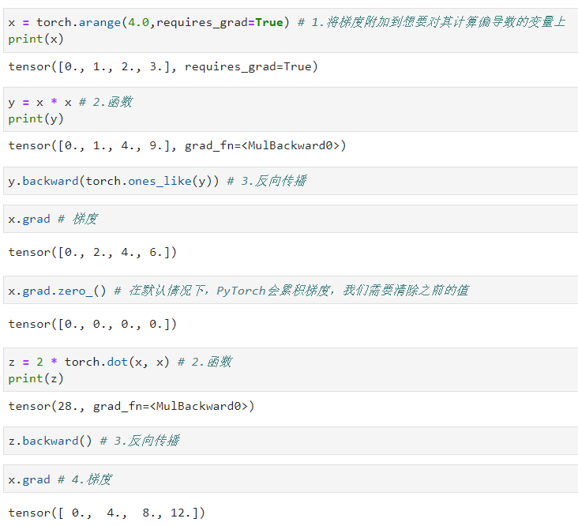

# 张量Tensor操作
  - 1. 标量，向量，矩阵与张量
  - 2. 初始化张量
  - 3. 张量的属性
  - 4. 张量的基本运算
  - 5. 求和与求平均值
  - 6. 求乘积
  - 7. 求向量的模/范数
  - 8. 求梯度
<!-- more -->

## 1. 标量，向量，矩阵与张量

标量是零阶张量，向量是一阶张量，矩阵是二阶张量

标量、向量、矩阵和张量是线性代数中的基本数学对象，分别具有零、一、二和任意数量的轴
### 1.1. 张量（tensor，n维数组）
深度学习存储和操作的数据主要是张量（n维数组） 。它提供了各种功能，包括基本数学运算、广播、索引、切片、内存节省和转换其他Python对象。

### 1.2. 标量
标量scalar：仅包含一个数值，

标量由只有一个元素的张量表示

```python
import torch

x = torch.tensor(3.0) # 标量
y = torch.tensor(2.0)

x + y, x * y, x / y, x**y
```
### 1.3. 向量
向量：由标量值组成的列表，每个标量值称为向量的元素element或分量component

向量由一维张量表示

向量的长度通常称为向量的*维度*（dimension）
```python
x = torch.arange(4) # 向量
x[3] # 访问任一元素
```
### 1.4. 矩阵
矩阵：表示为具有两个轴的张量
```python
A = torch.arange(20).reshape(5, 4) # 矩阵
B = A.clone()  # 通过分配新内存，将A的一个副本分配给B
A # 矩阵
A.T # 矩阵的转置
A + B # 矩阵的加法
A * B # 矩阵的乘法
a = 2
X = torch.arange(24).reshape(2, 3, 4)
a + X, (a * X).shape # 不会改变张量的形状，张量的每个元素都将与标量相加或相乘
```

## 2. 初始化张量
```python
import torch # 虽然它被称为PyTorch，但是代码中使用torch而不是pytorch

# 初始化张量
x = torch.arange(12) # 创建一个行向量，元素是从0开始的前12个整数
torch.arange(12, dtype=torch.float32) # arange默认创建为整数，也可指定创建类型为浮点数
A = torch.arange(20, dtype=torch.float32).reshape(5, 4) # 5行4列的形状
B = A.clone()  # 通过分配新内存，将A的一个副本分配给B
Y = torch.tensor([[2, 1, 4, 3], [1, 2, 3, 4], [4, 3, 2, 1]]) # 为每个元素赋予确定值。在这里，最外层的列表对应于轴0，内层的列表对应于轴1。
torch.zeros((2,3,4)) # 形状为（2,3,4）且元素全为0的张量
torch.zeros_like(Y) # 形状和Y一致，元素值全为0
torch.ones((2,3,4)) # 形状为（2,3,4）且元素全为1的张量
torch.randn(3, 4) # 形状为（3,4）且元素为标准正态分布的随机采样的张量
```
## 3. 张量的属性
```python
# 向量或轴的维度被用来表示向量或轴的长度，即向量或轴的元素数量。
    # 然而，张量的维度用来表示张量具有的轴数。 在这个意义上，张量的某个轴的维数就是这个轴的长度。
x.shape # 张量的形状，列出了张量沿每个轴的长度
x.numel() # 张量中元素的总数
len(x) # 张量的长度，0轴的长度
x = x.reshape(3,4) # 改变一个张量的形状而不改变元素数量和元素值
x = x.reshape(-1,4) # 我们不需要通过手动指定每个维度来改变形状
x = x.reshape(3,-1) # -1会自动计算该维度
id(x) # 提供了内存中引用对象的确切地址
type(x) # python对象类型
```

## 4. 张量的基本运算
```python
x = torch.tensor([1.0, 2, 4, 8])
y = torch.tensor([2, 2, 2, 2])
X = torch.arange(12, dtype=torch.float32).reshape((3,4))
Y = torch.tensor([[2.0, 1, 4, 3], [1, 2, 3, 4], [4, 3, 2, 1]])
Z = torch.zeros_like(Y)
a = torch.arange(3).reshape((3, 1))
b = torch.arange(2).reshape((1, 2))

# 同一形状的张量，按元素运算
    # 算术运算（+、-、*、/和**）其中**运算符是求幂运算
    x + y, x - y, x * y, x / y, x ** y
    # 比较运算
    X == Y
    X > Y
    X < Y
# 不同形状张量的运算：广播机制
    # a和b分别是3*1和1*2矩阵,相加时，会将两个矩阵广播为一个更大的3*2矩阵
    # 矩阵a将复制列， 矩阵b将复制行，然后再按元素相加
    a + b

# 指数运算
torch.exp(x)
# 所有元素求和
X.sum()
# 连结concatenate
     # dim=0,按行连结（轴-0，形状的第一个元素）
     # dim=1,按列连结（轴-1，形状的第二个元素）
torch.cat((X, Y), dim=0) # 结果为6*4矩阵
torch.cat((X, Y), dim=1) # 结果为3*8矩阵

# 索引和切片
    # 第一个元素的索引是0，最后一个元素索引是-1
    # 冒号:左右没有值，代表取所有
    # X[raw]
    # X[raw,colume]
    # X[startRaw:endRaw]
    # X[startRaw:endRaw,startColume:endColume]（左闭右开，下标从0开始）
    X[-1] # 0轴最后一个元素
    X[1:3] # 0轴第2个和第3个元素
    X[1,2] = 9 # 0轴第2个，1轴第3个的元素
    X[0:2,:] = 12 # 0轴第1个和第2个，1轴所有的元素

# 节省内存
    Y = X + Y #会导致为新结果分配内存，浪费内存
    id(Y) # 提供了内存中引用对象的确切地址

    # 如果后续不再使用X，可以使用X[:] = X + Y或X += Y来减少操作的内存开销
    Z[:] = X + Y #执行原地操作；使用切片表示法将操作的结果分配给先前分配的数组
    X[:] = X + Y
    X += Y

#类型转换，转为其它python对象
    # 将深度学习框架定义的张量转换为NumPy张量（ndarray）很容易，反之也同样容易。
    #
    type(X) # python对象类型
    A = X.numpy()
    B = torch.tensor(A)
    type(A), type(B)
    a = torch.tensor([3.5])
    a, a.item(), float(a), int(a) # 将大小为1的张量转换为Python标量，我们可以调用item函数或Python的内置函数
```

## 5. 求和与求平均值
### 5.1. 降维求和与降维求平均值
A = torch.arange(20).reshape(5, 4)

**求和sum，求平均值mean均可沿指定轴降低张量的维度**

降维求和：
```python
A.sum() # 所有元素求和
A.sum(axis=[0, 1])  # 所有元素求和 # axis均可用dim替换
A.sum(axis=0) # 0轴降维求和，原本5行4列，每列的各行相加，现在变成1个轴，也就是1维数组，长度为4
A.sum(axis=1) # 1轴降维求和，原本5行4列，每行的各列相加，现在变成1个轴，也就是1维数组，长度为5
```
降维求平均值：
```python
A.mean() # 所有元素求平均值
A.sum() / A.numel() # 所有元素求平均值   ps.  A.numel() 张量中元素的总数
A.mean(axis=0) # 0轴降维求平均值
A.sum(axis=0) / A.shape[0] # 0轴降维求平均值
```
### 5.2. 非降维求和（累积求和）
```python
sum_A = A.sum(axis=1, keepdims=True) # 原本5行4列,依旧保持2个轴，现在变成5行1列
A / sum_A # A是5行4列，sum_A是5行1列，通过广播将A除以sum_A
```
调用cumsum函数，沿某个轴计算A元素的累积总和，此函数不会沿任何轴降低输入张量的维度
```python
A.cumsum(axis=0)
A.cumsum(dim=0) # 用axis和dim都行
```
结果如下：每行是上一行和本行的求和结果



## 6. 求乘积

### 6.1. 向量*向量（点积，dot product）
当权重为非负数且和为1时，点积表示加权平均

将两个向量规范化得到单位长度后，点积表示它们夹角的余弦
```python
torch.dot(x,y) # 点积
torch.sum(x*y) # 另一种点积求法：按元素乘法，然后进行求和
```
### 6.2. 矩阵*向量（matrix-vector product）
```python
torch.mv(A, x) # 矩阵-向量积
```
### 6.3. 矩阵*矩阵（matrix-matrix multiplication）
```python
torch.mm(A, B) # 矩阵-矩阵乘法
```
### 6.4. 张量*张量

```python
torch.matmul()
```
可以利用python中的广播机制，处理一些维度不同的tensor结构进行相乘操作
## 7. 求向量的模（又称：向量的长度/向量的范数norm）
### 7.1. 向量每个元素的平方和的平方根（又称，L<sub>2</sub>范数）

```python
u = torch.tensor([3.0, -4.0])
torch.norm(u)  # 结果为：tensor(5.)
```
深度学习中更经常用L<sub>2</sub>范数的平方。
### 7.2. 向量每个元素的绝对值之和（又称，L<sub>1</sub>范数）
```python
torch.abs(u).sum() # 结果为：tensor(7.)
```
## 8. 求梯度

### 8.1. 微积分
微分和积分是微积分的两个分支，前者可以应用于深度学习中的优化问题。

导数可以被解释为函数相对于其变量的瞬时变化率，他也是函数曲线的切线的斜率。

梯度是一个向量，其分量是多变量函数相对于其所有变量的偏导数。
 
链式法则使我们能够对复合函数进行微分。

### 8.2. 自动微分
在深度学习中，我们经常需要进行梯度下降优化。这就需要我们计算梯度，也就是函数的导数。在PyTorch中，我们可以使用自动求导机制（autograd）来自动计算梯度。

在PyTorch中，我们可以设置tensor.requires_grad=True来追踪其上的所有操作。完成计算后，我们可以调用.backward()方法，PyTorch会自动计算和存储梯度。这个梯度可以通过.grad属性进行访问。

我们首先将梯度附加到想要对其计算偏导数的变量上。然后我们记录目标值的计算，执行它的反向传播函数，即可得到变量的梯度。

实际中，根据我们设计的模型，系统会构建一个**计算图**（computational graph），来跟踪计算是哪些数据通过哪些操作组合起来产生输出。 自动微分使系统能够随后反向传播梯度。 这里，**反向传播**（backpropagate）意味着跟踪整个计算图，填充关于每个参数的偏导数。


这里需要注意：

- 将变量设置`requires_grad=True`来跟踪它的操作，以便后续进行梯度计算。
- `grad_fn`属性代表了张量的梯度函数，当你创建一个Tensor并且设置requires_grad=True，PyTorch会记录所有创建和操作这个Tensor的函数，以便之后进行梯度计算。每当对Tensor进行一个操作，比如加、减、乘、除等，PyTorch会创建一个新的Tensor，并且这个新的Tensor会有一个grad_fn属性。这个属性是一个Function对象，表示了这个Tensor是如何从其他Tensor操作得来的。如果这个Tensor是用户直接创建的（而非由其他Tensor操作得来的），它的grad_fn是None。
- 当调用`.backward()`方法时，pytorch会自动计算梯度，并将它们存储在对应张量的.grad属性中。当你调用.backward()方法进行反向传播时，PyTorch会沿着这个grad_fn链回溯，自动计算梯度。通过这个链条，PyTorch能够知道每个Tensor是如何计算得出的，并计算对应的梯度。这种自动追踪和构建计算图的过程，是PyTorch自动微分（autograd）系统的核心。
- **标量**调用backward()方法进行反向传播时不用传任何参数。backward()等同于backward(torch.tensor(1.))。
- **非标量**调用backward()方法进行反向传播时，需要传一个gradient参数，这个参数是与你调用backward()的张量形状相同的权重张量。如y.backward(torch.ones_like(y))，这表示对y中每个元素求微分。如`v=torch.tensor([0.1, 1.0, 0.5, 0.0001], dtype=torch.float)` ,`y.backward(v)`,`x.grad`得到的结果为`tensor([0.0000e+00, 2.0000e+00, 2.0000e+00, 6.0000e-04])
`,表示求出y中每个元素的微分与对应权重的乘积。
- 用相同x变量计算多个函数时，注意要**清除**上一个函数计算的梯度。