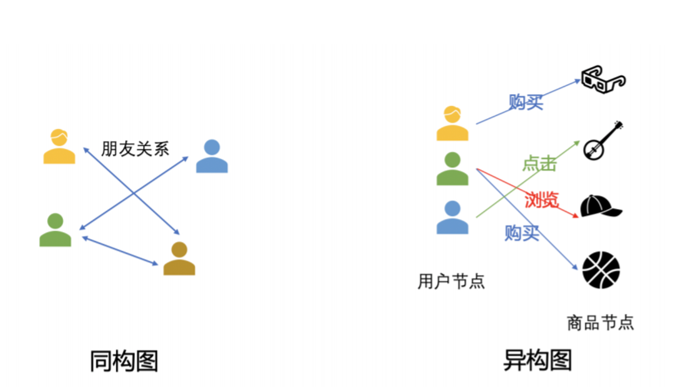
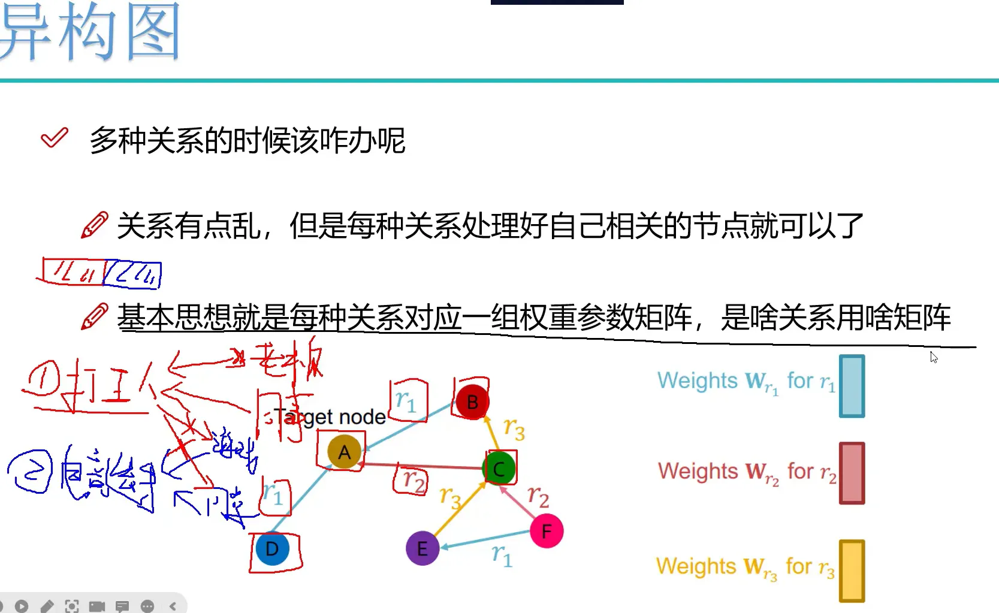
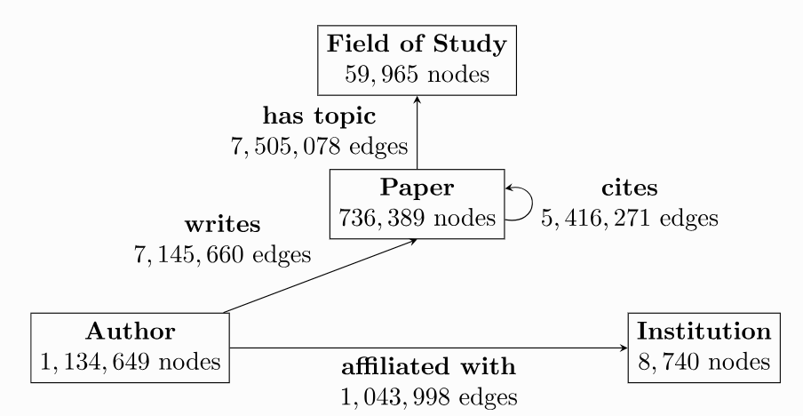

# PyG Heterogeneous Graph Practice
## 1. GNN和transformer的关系
transformer没有先验知识，会算每个与其他的关系

而GNN有人定义的关系，有先验知识，只会算相连的关系
## 2. 同构图与异构图

同构图和异构图解决的问题都是一样的，都是提取Node的特征

图的每个Node要考虑相连的Node，如Node2与Node1和Node5相邻，Node2自身占比0.5，Node1占比0.3，Node5占比0.2，共同组成Node2的特征
### 2.1. 同构图
不区分节点和边的类型，节点和边都只有一种类型

点类型+边类型=2

例如，在社交网络中，可以想象node只有‘人’这一个种类，edge只有‘认识’这一种连接。而人和人要么认识，要么不认识。

### 2.2. 异构图
点的类型或边的类型超过一种

点类型+边类型>2

现实世界中，大多数图都是异构图，表示了关于不同类型实体及其不同类型关系的信息。不同类型的点和边的特征表示类型和维度可以不相同。

多种关系，各自是各自的特征矩阵，把每种关系的特征进行拼接

做拼接或做加法都行，大框架固定，细节任意

不同类型点的特征维度不同，通过embedding映射到相同维度，embedding就是把点的特征给做出来

#### 2.2.1. 元路径 meta-path
元路径是异质图里的概念

按照什么样的关系，找什么样的邻居

不同的元路径做加权
## 3. 图神经网络框架
### 3.1. PyG
[PyG异构图指南](https://pytorch-geometric.readthedocs.io/en/latest/notes/heterogeneous.html?highlight=Heterogeneous#creating-heterogeneous-gnns)
### 3.2. DGL
[DGL异构图指南](https://docs.dgl.ai/en/1.1.x/guide_cn/graph-heterogeneous.html)

## 4. 案例

这个异构图有1939743个节点，分为4种类型：作者author, 论文paper, 机构institution，研究领域field of study。
有21111007个边，也分为4种类型：
- 写writes：一位作者[写]一篇特定的论文
- 隶属于affiliated with：一位作者[隶属于]一个特定的机构
- 引用cites：一篇论文[引用]另一篇论文
- 涉及主题has topic：一篇论文[涉及]特定领域的[主题]

## 5. 邻居加载
https://pytorch-geometric.readthedocs.io/en/latest/tutorial/neighbor_loader.html

